# Software Engineering

&nbsp;[Bidur Sapkota](https://www.bidursapkota.com.np/)


## Table of Contents

1. [Introduction](#1-introduction)
2. [The Software Process](#2-the-software-process)
3. [Software Requirements Engineering](#3-software-requirements-engineering)
4. [Architectural Design](#4-architectural-design)
5. [System Modeling](#5-system-modeling)
6. [Coding and Testing](#6-coding-and-testing)
7. [Software Quality, Assurance, Maintenance](#7-software-quality-assurance-maintenance)
8. [Software Configuration Management](#8-software-configuration-management)
9. [Recent Trends](#9-recent-trends)
10. [Software Requirements Specification](#software-requirements-specification)

---

## 1. Introduction

## 1.1 Software and Software Engineering

> **Explain how modern software engineering practices helped overcome the software crisis. [3 marks] (2082 Bhadra - IOE - Old Syllabus Relevant)**

Software is:

(1) instructions (computer programs) that when executed provide desired features, function, and performance

(2) data structures that enable the programs to adequately manipulate information

(3) descriptive information in both hard copy and virtual forms that describes the operation and use of the programs.

Software Engineering (IEEE definition): The application of a systematic, disciplined, quantifiable approach to the development, operation, and maintenance of software; that is, the application of engineering to software.

Software engineering is a layered technology built on four layers (bottom to top):

1. **Quality focus:** It is the bedrock that represents an organizational commitment to continuous quality improvement (e.g., TQM, Six Sigma). Main Goals is to Reduce defects, Improve customer satisfaction, Ensure reliability and maintainability, and Continuously improve development practices. A company may review coding standards regularly, track defect rates, perform quality audits.

2. **Process:** It is the foundation that defines a framework for management control, milestones, and change management. It answers What activities should be done?, In what order?, Who is responsible?, How is progress tracked?

3. **Methods:** They provide the technical how-to's, including communication, requirements analysis, design modeling, construction, testing, and support. This layer answers “How do we actually create the software?”. Examples UML diagrams for design, Object-oriented analysis and design, Database modeling, Unit testing techniques, Design patterns.

4. **Tools:** They provide automated or semi-automated support for process and methods (CASE tools). A team may use Git for source control, Jira for task management, Jenkins for automated deployment, Selenium for testing.

Modern software engineering emerged to address recurring problems: late delivery, cost overruns, unreliable software, and difficulty maintaining existing systems.

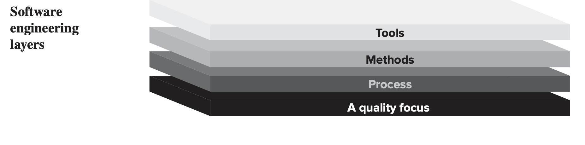

**Software Engineering vs. Computer Science**

1. **Computer Science:**

Focuses on the theories, algorithms, and fundamentals of how computers and programming languages work, often independent of business constraints.

2. **Software Engineering:**

Focuses on the practicalities of developing, delivering, and maintaining useful software systems within constraints (e.g., time, budget, customer needs).

---

## 1.2 Nature and Characteristics of Software

> **Define software and list typical software characteristics. [4 marks] (2078 Bhadra - IOE - Old Syllabus Relevant)**
>
> **What are the characteristics of good software? [2 marks] (2081 Bhadra - IOE - Old Syllabus Relevant)**
>
> **Justify: "Software doesn't wear out like hardware components." [5 marks] (2082 Bhadra - IOE - Old Syllabus Relevant)**

Software is a logical element, not a physical one. Its key characteristics that distinguish it from hardware:

**Software is developed or engineered; it is not manufactured:**

Software is not manufactured in the classical sense. Although similarities exist between software development and hardware manufacturing, the two activities are fundamentally different. Software quality is achieved through good design, not through production control.

**Software doesn't "wear out":**

Hardware follows a "bathtub curve" with a high early failure rate (infant mortality), then a steady-state, then increasing failures due to wear. Software has no physical wear. Its failure curve is idealized as a high initial failure rate (undiscovered defects) that drops and flattens as defects are corrected. However, software deteriorates because each change introduces new errors, causing failure rate spikes. Over time, the baseline failure rate rises.

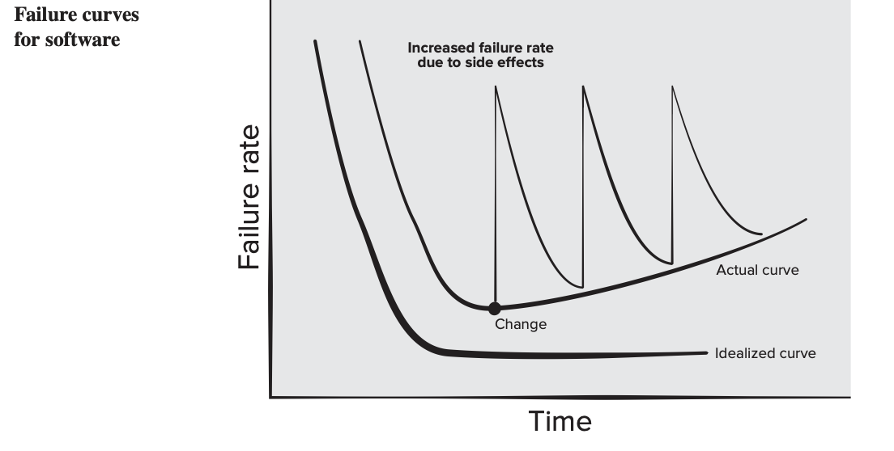

**Software has no spare parts:**

Every failure indicates a design error. Unlike hardware where a worn-out component is replaced with a spare, software maintenance involves fixing design flaws, which is inherently more complex.

**Most software is custom-built:**

It is not assembled from standard components, although the industry is moving toward component-based construction and reuse.

**Characteristics of good software** (quality attributes):

1. **Functionality:**
   The software delivers the required features.
2. **Reliability:**
   The software performs without failure under stated conditions.
3. **Usability:**
   The software is easy for the intended users to learn and operate.
4. **Efficiency:**
   The software makes optimal use of system resources.
5. **Maintainability:**
   The software is easy to modify, correct, and improve.
6. **Portability:**
   The software can operate across different environments.

---

## 1.3 Software Application Domains

Seven broad categories of computer software:

1. **System software:**
   It consists of programs that service other programs (e.g., compilers, OS components, drivers, networking software). It processes complex information structures, often with indeterminate input/output.
2. **Application software:**
   It consists of standalone programs that solve specific business needs (e.g., payroll, inventory). It processes business or technical data for decision making.
3. **Engineering/scientific software:**
   It consists of "number-crunching" programs for scientific computation (e.g., CAD, weather forecasting, stress analysis, data science applications).
4. **Embedded software:**
   It resides within a product or system to control features and functions (e.g., fuel control in automobiles, microwave oven key pad, braking systems).
5. **Product-line software:**
   It is composed of reusable components, designed for use by many customers (e.g., word processors, spreadsheets, inventory control products).
6. **Web/mobile applications:**
   They are network-centric software spanning browser-based apps, cloud computing, service-based computing, and mobile device software.
7. **Artificial intelligence software:**
   Artificial intelligence (AI) software is software designed to simulate human intelligence and make decisions or solve problems that are difficult to solve using normal step-by-step algorithms. AI software can learn from data, recognize patterns, make predictions, reason and decide. It uses heuristics to solve complex problems not amenable to regular computation (e.g., robotics, machine learning, pattern recognition, game playing, decision-making systems).

---

## 1.4 Legacy Software

Legacy software refers to older programs, often developed decades ago, that have been continually modified to meet changing business requirements and computing platforms.

**Characteristics:**

1. It often supports core business functions and is indispensable.
2. It is costly to maintain and risky to evolve.
3. It may have poor quality by modern standards, including inextensible designs, convoluted code, poor or absent documentation, no archived test cases, and poorly managed change history.

**Maintaining / Evolving:**

1. Must be adapted to new computing environments or technology.
2. Must be enhanced to meet new business requirements.
3. Must be extended to work with modern systems or databases.
4. Must be re-architected to remain viable in an evolving environment.

If a legacy system meets users' needs and runs reliably, it does not need to be fixed. But when evolution is needed, it must be reengineered for future viability.

**Lehman’s Laws of Software Evolution:**

When maintaining or evolving legacy systems (or any software), Lehman's laws describe how the system behaves:

1. **Law of Continuing Change:**

A system must be continually adapted, or it becomes progressively less useful.

2. **Law of Increasing Complexity:**

As a system evolves, its structure degrades and complexity increases unless work is done to maintain or simplify it.

---

## 1.5 Software Crisis

> **What is software crisis? Explain with an example. [5 marks] (2068 Chaitra - IOE - Old Syllabus Relevant)**
>
> **What factors have contributed to the software crisis? Suggest possible solutions. [3+3 marks] (2075 Ashwin - IOE - Old Syllabus Relevant)**

The software crisis is a term coined in the late 1960s (at the 1968 NATO conference) to describe the chronic problems in software development, specifically the inability to produce useful, reliable software on time and within budget as systems grew in complexity.

**Causes of the software crisis:**

1. **Increasing complexity:**
   Software requirements grew rapidly in complexity while tools and techniques remained primitive.
2. **Rising demand:**
   The demand for new software outpaced the industry's ability to produce it.
3. **Inadequate techniques:**
   Informal development techniques could not scale to large systems. Early software development was mostly: “Code-first” (start writing code without proper design), Informal (little documentation or planning), Individual-based (dependent on a few programmers’ knowledge).
4. **Poor management:**
   Project management lacked standardized engineering methodologies. Unrealistic Deadlines, Inadequate Quality Assurance.
5. **Maintenance challenges:**
   The cost of maintenance often exceeded the initial development cost.
6. **Shortage of practitioners:**
   There were not enough trained software practitioners to meet the demand.
7. **Poor communication:**
   Poor communication between stakeholders, developers, and users resulted in software that did not actually meet the business requirements.

**Manifestations:**

1. Projects running significantly over budget and past deadlines.
2. Delivered software failing to meet customer requirements.
3. Software that was error-prone, unreliable, and poorly documented.
4. Large projects becoming unmanageable or being cancelled entirely.

**Historical examples:**

1. **IBM OS/360 (1963–65):** It experienced massive delays and cost overruns in creating a unified OS.
2. **Therac-25 (1985–87):** It had software-based safety failures in a radiation therapy machine that caused patient fatalities.
3. **Denver Airport Baggage System (1995):** It suffered from automated baggage system software glitches that delayed airport opening for 16 months.
4. **Ariane 5 Rocket (1996):** It crashed 37 seconds after launch due to an integer overflow in control software.

**Solutions:**

1. Adoption of systematic software engineering practices (process models, methods, tools).
2. Better requirements gathering and management.
3. Use of formal reviews, inspections, and testing strategies.
4. Standards and quality assurance frameworks.
5. Training and education in software engineering principles.

---

## 1.6 Software Myths

Software myths are widely held but false beliefs that lead to mismanagement, unrealistic expectations, and project failures. They are classified into three categories:

### 1. Management Myths

**Myth:** "We already have a book full of standards and procedures for building software. Won't that provide my people with everything they need to know?"
**Reality:** Standards may exist but are often incomplete, outdated, or not actually used. Having a book does not mean the practice is adequate or that practitioners follow it.

**Myth:** "If we get behind schedule, we can add more programmers and catch up."
**Reality:** Adding people to a late project makes it later (Brooks' Law). New staff need time to learn the system, and communication overhead increases quadratically with team size.

**Myth:** "If I decide to outsource the software project, I can just relax and let the vendor build it."
**Reality:** If an organization cannot manage and control software internally, it will invariably struggle when outsourcing. Oversight and involvement remain essential.

### 2. Customer Myths

**Myth:** "A general statement of objectives is sufficient to begin writing programs. We can fill in the details later."
**Reality:** Ambiguous requirements are the primary cause of failed projects. A formal and detailed requirements specification is essential to minimize rework and miscommunication.

**Myth:** "Software requirements continually change, but changes can be easily accommodated because software is flexible."
**Reality:** While software is inherently malleable, the cost of change increases dramatically as development progresses. A change made during design can be 1.5–6× more costly than during requirements; during testing, 60–100× more costly.

### Practitioner (Developer) Myths

**Myth:** "Once we write the program and get it to work, our job is done."
**Reality:** 60–80% of total effort is expended after the first delivery, during maintenance (bug fixing, enhancements, adaptation).

**Myth:** "Until I get the program running, I have no way of assessing its quality."
**Reality:** Quality can be assessed from inception through formal technical reviews, design analysis, and inspections, long before a single line of code is compiled.

### Practitioner (Developer) Myths

**Myth:** "The only deliverable for a successful project is the working program."
**Reality:** Documentation, models, test plans, and design specifications are equally critical deliverables for long-term maintainability and success.

**Myth:** "Software engineering will make us create voluminous and unnecessary documentation and will slow us down."
**Reality:** Software engineering is about creating quality; it often leads to reduced rework, which results in faster delivery.

---

## 1.7 Software Engineering Practice: Essence of Practice, General Principles

### The Essence of Practice

Based on George Polya's problem-solving approach (_How to Solve It_, 1945), software engineering practice follows four essential steps:

**1. Understand the problem** (communication and analysis)

- Collaborate with stakeholders to extract and analyze true requirements
- Who are the stakeholders?
- What are the unknowns? What data, functions, and features are required?
- Can the problem be decomposed into smaller, more manageable problems?
- Can the problem be represented graphically? Can an analysis model be created?

**2. Plan a solution** (modeling and software design)

- Have you seen similar problems before? Are there reusable patterns or existing software?
- Can subproblems be defined with readily apparent solutions?
- Can a design model be created that leads to effective implementation?

**3. Carry out the plan** (code generation)

- Does the solution conform to the design plan? Is the code traceable to the design model?
- Is each component provably correct? Has the code been reviewed?

**4. Examine the result for accuracy** (testing and quality assurance)

- Has a reasonable testing strategy been implemented?
- Does the solution produce results that conform to requirements?
- Has the software been validated against all stakeholder requirements?

### General Principles (Hooker's Seven Principles)

**1. The Reason It All Exists**

A software system exists to provide value to its users. All decisions should be made with this in mind. If something does not add real value, don't do it.

**2. KISS (Keep It Simple, Stupid!)**

All design should be as simple as possible, but no simpler. Simpler designs are easier to understand, maintain, and less error-prone. Simplicity takes thoughtful effort over multiple iterations.

**3. Maintain the Vision**

A clear architectural vision is essential for success. Without conceptual integrity, a system becomes a patchwork of incompatible designs. An empowered architect who holds and enforces the vision helps ensure success.

**4. What You Produce, Others Will Consume**

Always design, code, and document knowing someone else will have to understand and maintain your work. Making their job easier adds value to the system.

**5. Be Open to the Future**

Never design yourself into a corner. Build systems that solve the general problem, not just the specific one. Prepare for changing specifications and evolving platforms.

**6. Plan Ahead for Reuse**

Reuse saves time and effort. Planning for reuse reduces cost and increases the value of both the reusable components and the systems that incorporate them.

**7. Think!**

Clear, complete thought before action almost always produces better results. Thinking helps you recognize when you don't know something and need to research the answer. Applying the first six principles requires intense thought.

---

---

---

## 2. The Software Process

## 2.1 Process Framework and Umbrella Activities

> **Explain fundamental activities of the software process. [3 marks] (2082 Bhadra - IOE - Old Syllabus Relevant)**

A software process is a collection of activities, actions, and tasks performed when a work product is to be created. It is not rigid but adaptable to the problem, project, team, and organizational culture.

### Framework Activities

A generic process framework defines five framework activities applicable to all software projects regardless of size or complexity:

1. **Communication:** It involves collaborating with stakeholders to understand their objectives and gather requirements that define software features and functions.
2. **Planning:** It involves creating a software project plan that describes technical tasks, risks, resources, work products, and schedule (the project "road map").
3. **Modeling:** It involves creating models (sketches, UML diagrams, architectural representations) to understand requirements and the design that will achieve them.
4. **Construction:** It involves code generation (manual or automated) combined with testing to uncover errors in the code.
5. **Deployment:** It involves delivering the software (complete or as an increment) to the customer, who evaluates it and provides feedback.

These activities are applied iteratively. Each iteration produces a software increment that provides stakeholders with a subset of overall features until the software is complete.

### Process Flow

Process flow describes how framework activities are organized with respect to sequence and time. The choice of which process flow to adopt depends heavily on the project's specific requirements, their stability, and the development team's familiarity with the domain. Four types of process flow exist:

1. **Linear process flow:** It executes each activity in sequence.
2. **Iterative process flow:** It repeats one or more activities before proceeding to the next.
3. **Evolutionary process flow:** It executes activities in a "circular" manner. Each circuit leads to a more complete version of the software.
4. **Parallel process flow:** It executes one or more activities concurrently with others (e.g., modeling for one aspect while constructing another).

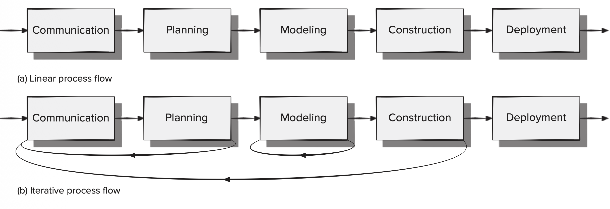

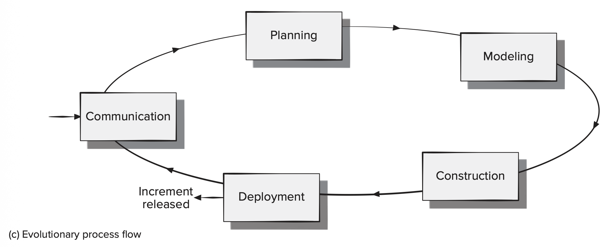

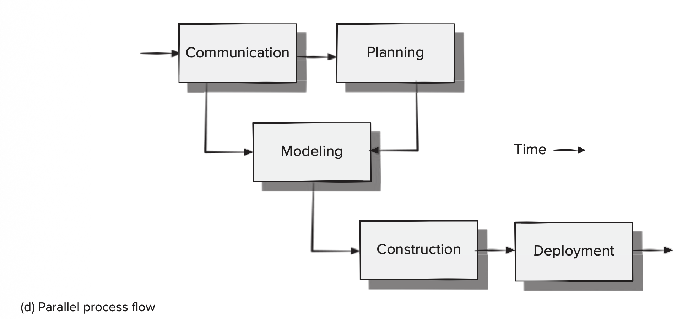

### Umbrella Activities

Umbrella activities are applied throughout the software process to manage and control progress, quality, change, and risk:

1. **Software project tracking and control:** It is used to assess progress against the project plan and take corrective action.
2. **Risk management:** It is used to assess risks that may affect the project outcome or product quality.
3. **Software quality assurance:** It involves defining and conducting activities to ensure software quality.
4. **Technical reviews:** They help uncover and remove errors before they propagate to the next activity.
5. **Measurement:** It involves collecting process, project, and product measures to help deliver software that meets stakeholders' needs.
6. **Software configuration management:** It is used to manage the effects of change throughout the process.
7. **Reusability management:** It involves defining criteria for work product reuse and establishing mechanisms for reusable components.
8. **Work product preparation and production:** It involves creating models, documents, logs, forms, and lists.

---

## 2.2 Traditional (Plan-Driven) Process Models

Traditional (prescriptive) process models define a predefined set of process elements and a predictable process workflow. They prescribe framework activities, software engineering actions, tasks, work products, quality assurance, and change control mechanisms. They strive for structure and order in software development.

### 2.2.1 Waterfall Model and Its Extensions

> **What is SDLC? Discuss the various stages of the waterfall process model. [2+3 marks] (2081 Baishakh - IOE - Old Syllabus Relevant)**
>
> **Discuss the advantages and disadvantages of the waterfall model. [4 marks] (2079 Bhadra - IOE - Old Syllabus Relevant)**
>
> **Explain why the waterfall model is not suitable when important functionalities need to be delivered in a short time period. [4 marks] (2073 Chaitra - IOE - Old Syllabus Relevant)**

The Software Development Life Cycle (SDLC) is a structured sequence of stages in software engineering to develop the intended software product. The waterfall model is the oldest and most classical SDLC paradigm.

The **waterfall model** (also called the linear sequential model), originally proposed by Winston Royce (1970), suggests a systematic, sequential approach to software development flowing through these stages:

1. **Communication:** It covers project initiation and requirements gathering from the customer.
2. **Planning:** It covers estimating, scheduling, and tracking the project.
3. **Modeling:** It covers analysis and design, including creating representations of the system.
4. **Construction:** It covers code generation and testing.
5. **Deployment:** It covers delivery, support, and feedback.

Each phase must be completed before the next phase begins, and there is little opportunity to revisit earlier phases.

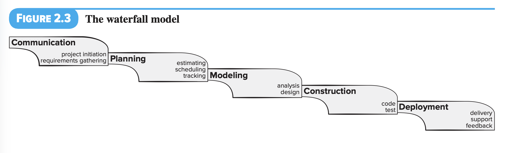

**Advantages:**

- Simple to understand and easy to plan.
- Works well for small, well-understood projects with stable requirements.
- Analysis and testing are straightforward.
- Clear milestones and deliverables at each phase.

**Disadvantages:**

- Real projects rarely follow a strictly sequential flow.
- Difficult for the customer to state all requirements explicitly at the beginning.
- A working version of the software is not available until late in the project.
- Major errors may not be detected until the working program is reviewed.
- Does not accommodate change well because the cost of change increases dramatically if discovered late.
- Testing occurs late in the process.
- Customer approval is only at the end.

**Why waterfall is unsuitable for rapid delivery?**

The waterfall model requires all phases to be completed sequentially. No working software is delivered until the construction phase is complete. If important functionalities must be delivered quickly, this model fails because it offers no mechanism for partial delivery or incremental release. The customer must wait for the entire system to be built before seeing any working functionality.

**Extensions of the Waterfall Model:**

1. **V-Model:** It associates a testing phase with each development phase (e.g., unit testing validates construction, system testing validates design).
2. **Waterfall with feedback:** It allows limited iteration between adjacent phases, partially addressing the rigidity of the pure waterfall.

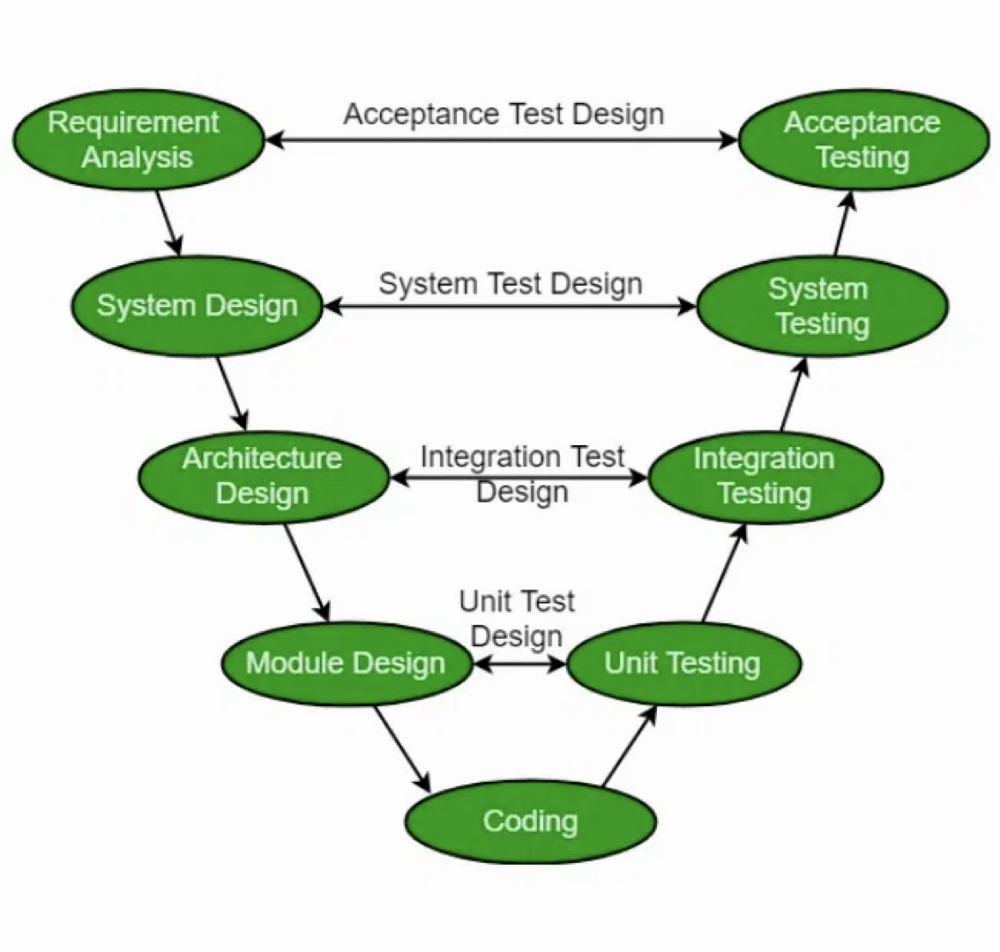

Figure: V-Model

### 2.2.2 Incremental Process Model

> **Explain the incremental model with its advantages and disadvantages. [4+3 marks] (2075 Chaitra - IOE - Old Syllabus Relevant)**
>
> **You are leading development of an e-commerce site using the incremental model. How do you implement it? [4 marks] (2082 Bhadra - IOE - Old Syllabus Relevant)**

The incremental model combines elements of linear and iterative flows. It delivers the software in a series of increments, each providing a portion of the overall functionality. The first increment is often a core product addressing basic requirements; subsequent increments add supplementary features.

- Requirements are gathered and prioritized.
- The system is divided into increments, each going through its own mini-waterfall cycle.
- Each increment delivers a working, usable product to the customer.
- Customer feedback from each increment informs the planning of the next.

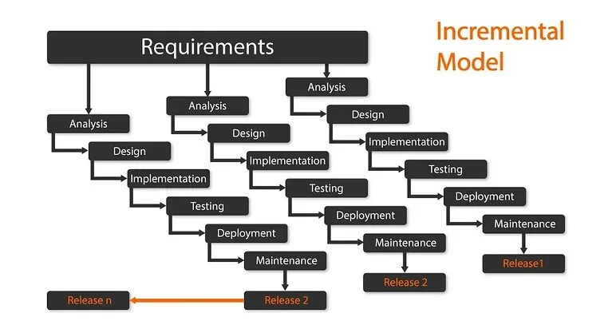

**Example of E-Commerce Site (Incremental Approach):**

**Increment 1:** It covers core functionality including user registration, product catalog browsing, and basic search.

**Increment 2:** It adds shopping cart, checkout process, and online payment integration.

**Increment 3:** It adds user reviews, recommendation engine, and order tracking.

**Increment 4:** It adds admin dashboard, analytics, inventory management, and promotional tools.

Each increment is fully functional, deployed, tested, and reviewed by stakeholders before proceeding to the next.

**Advantages:**

- Delivers working software early, providing value to the customer sooner.
- Customer feedback is incorporated after each increment, reducing risk of product rejection.
- Easier to test and debug smaller modules.
- Flexible and easier to accommodate changes in requirements between increments.
- Higher-risk features can be addressed in early increments.
- Lower initial delivery cost.

**Disadvantages:**

- Requires a clear understanding of the complete system to properly partition into increments.
- Requires careful planning and architectural foresight.
- Total cost may be higher than a single-pass model since each increment has its own full development cycle.
- Integration complexity increases as more increments are added.

### 2.2.3 Evolutionary Process Models (Prototyping, Spiral)

#### Prototyping Model

> **Explain the prototyping model with its advantages and disadvantages. [5+2 marks] (2076 Chaitra - IOE - Old Syllabus Relevant)**
>
> **In what types of projects can the prototype process model be used? Explain with an example. [5 marks] (2082 Baishakh - IOE - Old Syllabus Relevant)**

The prototyping model is used when requirements are fuzzy, incomplete, or poorly understood. A prototype is a preliminary version of the software that is built quickly to help stakeholders visualize and refine their requirements.

All stakeholders should agree upfront that the prototype is built to define requirements, not as the final product.

**Process:**

1. **Communication:** It involves meeting stakeholders to define overall objectives and identify known requirements, and outlining areas needing further definition.
2. **Quick Plan:** It involves planning a rapid prototyping iteration.
3. **Modeling (Quick Design):** It focuses on aspects visible to end users (e.g., UI layout, output formats).
4. **Construction of Prototype:** It involves building a working prototype quickly, possibly using existing program fragments or rapid application tools.
5. **Deployment and Feedback:** It involves delivering the prototype to stakeholders for evaluation and gathering feedback to refine requirements.
6. **Iteration:** It involves tuning the prototype based on feedback and repeating until requirements are sufficiently understood.

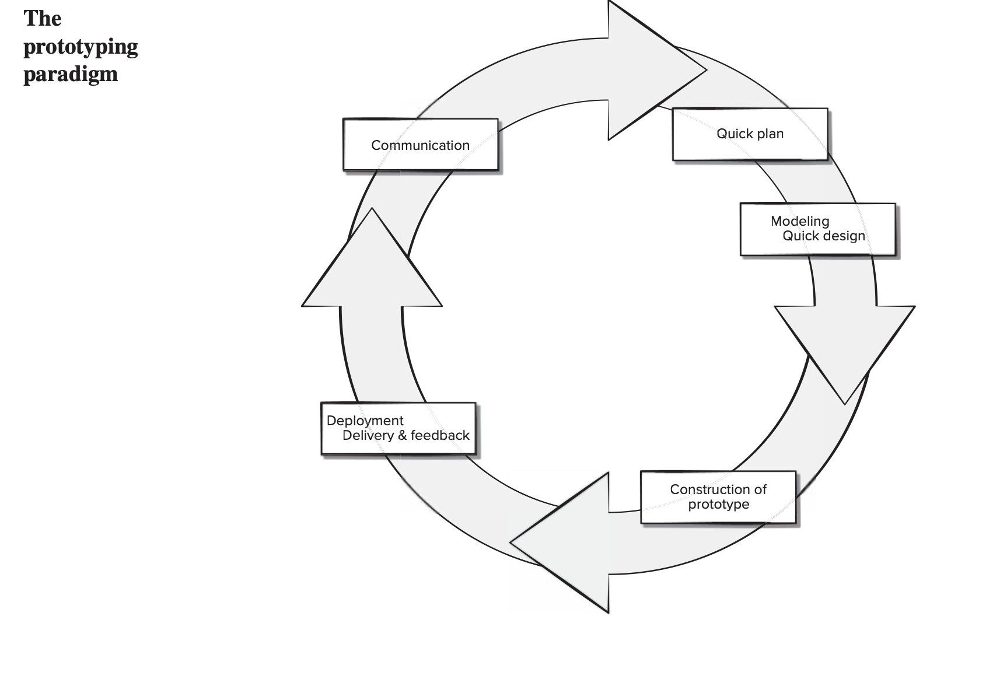

**When to use prototyping:**

1. When the customer has general objectives but cannot specify detailed requirements.
2. When the developer is unsure about the form of user interaction, algorithm efficiency, or system behavior.
3. For systems with heavy UI requirements where the user needs to "see and feel" before specifying details.

**Example:**

A travel agency needs a booking application but is unsure about the user interface design. A prototype allows the agency to interact with a preliminary UI, provide feedback on layout and workflow, and progressively refine the design until it meets expectations.

**Advantages:**

- Reduced impact of requirement changes because requirements are refined iteratively.
- Customer is involved early and often.
- Reduces likelihood of product rejection.
- Helps uncover misunderstandings between developers and stakeholders early.
- Works well for small to medium projects.

**Disadvantages:**

- Stakeholders may mistake the prototype for the finished product and expect immediate delivery.
- Developers may make implementation compromises (poor architecture, quick fixes) to get the prototype working, and these become embedded in the final system.
- Work is lost in a throwaway prototype.
- Hard to plan and manage because the number of iterations is unpredictable.

#### Spiral Model

> **Explain the spiral model with its advantages and disadvantages. [5 marks] (2068 Chaitra - IOE - Old Syllabus Relevant)**
>
> **How can both the waterfall model and prototyping model be accommodated in the spiral process model? [6 marks] (2078 Kartik - IOE - Old Syllabus Relevant)**
>
> **A travel agency needs software but is unsure about the UI. Would it be proper to use the spiral model? Justify. [6 marks] (2075 Ashwin - IOE - Old Syllabus Relevant)**

The spiral model, proposed by Barry Boehm (1988), is an evolutionary process model that couples the iterative nature of prototyping with the controlled, systematic aspects of the waterfall model. Its distinguishing feature is explicit risk analysis at every iteration.

Software is developed in a series of evolutionary releases by traversing a spiral path through five framework activities:

1. **Communication:** It involves determining objectives and constraints through effective interaction between the developer and customer.
2. **Planning / Risk Analysis:** It involves determining alternatives, estimating costs and schedule, evaluating alternatives, conducting risk analysis to identify and resolve risks, and creating prototypes to reduce uncertainty.
3. **Modeling:** It involves analysis and design, creating representations of the system that are progressively refined with each spiral iteration.
4. **Construction:** It involves developing and verifying the software (code + test).
5. **Deployment:** It involves delivering the software increment to the customer, assessing results, obtaining feedback, and planning the next iteration.

Each circuit (loop) around the spiral produces a progressively more complete version of the software. The first circuit might produce a product specification or proof-of-concept prototype; subsequent circuits produce increasingly refined and complete versions.

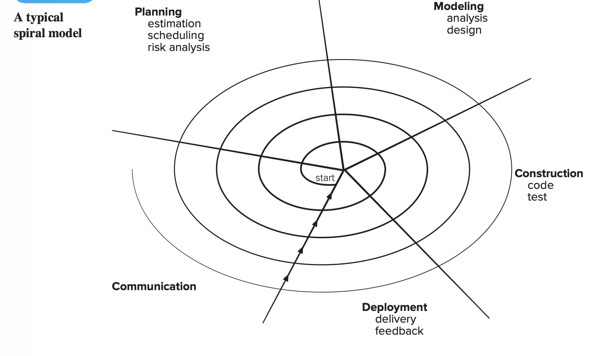

**Accommodating waterfall and prototyping within the spiral:**

The spiral model is a meta-model that can incorporate other process models. The first circuit can use a prototyping approach to explore uncertain requirements and refine the UI. Once requirements are stabilized, subsequent circuits can follow a more waterfall-like sequential flow within each loop. Thus, the spiral model uses prototyping for risk reduction and requirement exploration, while using waterfall-like discipline for well-understood portions. Each loop's approach is chosen based on the risk profile of that iteration.

**For the travel agency scenario (UI uncertainty):**

The spiral model is appropriate. The first loop would build a UI prototype to resolve the UI design uncertainty (a major risk). Stakeholder feedback would refine the UI requirements. Subsequent loops would address core booking logic, payment integration, and database design with progressively less risk. The risk-driven nature of the spiral ensures that the biggest uncertainty (the UI) is resolved first.

**Advantages:**

- Continuous customer involvement throughout the project.
- Development risks are explicitly managed at every iteration.
- Suitable for large, complex, high-risk projects.
- Works well for extensible products that evolve over time.
- Can be applied throughout the entire software lifecycle, including maintenance.

**Disadvantages:**

- Risk analysis failures can doom the project.
- May be difficult to convince customers that the evolutionary approach is controllable.
- Requires considerable risk assessment expertise.
- The project may be hard to manage due to evolving scope.
- Not suitable for small, low-risk projects (overhead is disproportionate).

---

## 2.3 Agile and Adaptive Process Models

### 2.3.1 Agile Manifesto and the 12 Principles

The Agile Manifesto (2001) was created by 17 software practitioners. It defines four core values:

1. Individuals and interactions over processes and tools.
2. Working software over comprehensive documentation.
3. Customer collaboration over contract negotiation.
4. Responding to change over following a plan.

_While items on the right have value, Agile values the items on the left more._

**The 12 Agile Principles:**

1. **Customer satisfaction** through early and continuous delivery of valuable software.
2. **Welcome changing requirements**, even late in development; agile processes harness change for the customer's competitive advantage.
3. **Deliver working software frequently**, from a couple of weeks to a couple of months, with a preference for the shorter timescale.
4. **Business people and developers must work together** daily throughout the project.
5. **Build projects around motivated individuals.** Give them the environment and support they need, and trust them to get the job done.
6. **Face-to-face conversation** is the most efficient and effective method of conveying information within a development team.
7. **Working software is the primary measure of progress.**
8. **Sustainable development** requires that sponsors, developers, and users maintain a constant pace indefinitely.
9. **Continuous attention to technical excellence** and good design enhances agility.
10. **Simplicity**, which is the art of maximizing the amount of work not done, is essential.
11. **The best architectures, requirements, and designs emerge from self-organizing teams.**
12. **At regular intervals, the team reflects** on how to become more effective, then tunes and adjusts its behavior accordingly.

### 2.3.2 Agile versus Plan-Driven Development

**Plan-driven (traditional) development:**

- Follows a predefined sequence of phases with detailed upfront planning.
- Emphasizes comprehensive documentation, formal reviews, and milestone-based tracking.
- Requirements are gathered completely before design and construction.
- Change is managed through formal change control processes.
- Works best when: requirements are stable and well-understood, the project is safety/mission-critical, the team is large and possibly distributed, and the organization has a strong process culture.

**Agile development:**

- Emphasizes adaptability, iterative delivery, and continuous feedback.
- Lightweight documentation; the focus is on working software as the primary deliverable.
- Requirements emerge and evolve through continuous customer collaboration.
- Change is embraced and accommodated through short iterations.
- Works best when: requirements are volatile or poorly understood, the team is small, co-located, and experienced, and rapid delivery is critical.

**Difference in the cost of change:**

In plan-driven development, the cost of change increases exponentially as the project progresses (a change during testing can be 60–100× more costly than during requirements). Agile processes aim to "flatten" this cost-of-change curve through continuous testing, incremental delivery, refactoring, and close customer collaboration.

In practice, many projects benefit from combining elements of both approaches, using agile principles for flexibility while retaining enough planning discipline for coordination and risk management.

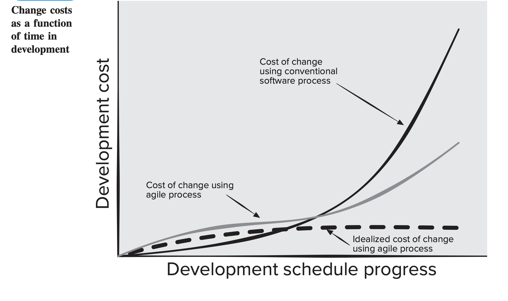

### 2.3.3 Scrum Framework (Roles, Artifacts, Ceremonies)

Scrum is the most widely used agile framework, conceived by Jeff Sutherland in the early 1990s and formalized by Ken Schwaber and Mike Beedle. Scrum is a lightweight framework in which work is done in time-boxed iterations called sprints (typically 2–4 weeks).

**Scrum Roles:**

1. **Product Owner:** This role represents the customer and stakeholders. The Product Owner manages and prioritizes the Product Backlog, defines the goals for each sprint, and is the sole person who decides whether to accept or reject an increment. The Product Owner maximizes the value of the product.
2. **Scrum Master:** This role serves as a facilitator and coach. The Scrum Master ensures the team follows Scrum practices, removes impediments that block the team's progress, leads the Daily Scrum, and helps the Product Owner manage the backlog effectively. The Scrum Master is not a project manager but a servant-leader.
3. **Development Team:** It is a small (3–9 people), self-organizing, cross-functional team that does the actual work of designing, building, and testing the software increment. The team collectively decides how to implement the selected backlog items.

**Scrum Artifacts:**

1. **Product Backlog:** It is a prioritized, evolving list of all features, functions, requirements, enhancements, and fixes needed in the product. The Product Owner orders items by business value. It is never complete while the product exists.
2. **Sprint Backlog:** It is the subset of Product Backlog items selected for the current sprint, plus the development team's plan for delivering them as a working increment. No new items are added once the sprint begins (unless the sprint is cancelled).
3. **Increment:** It is the sum of all completed Product Backlog items from the current sprint and all previous sprints. It must be in a usable, potentially releasable condition and meet the team's Definition of Done.

**Scrum Ceremonies (Events):**

1. **Sprint Planning:** It is held at the start of each sprint. The Product Owner presents the sprint goal and desired features. The development team selects items from the Product Backlog, estimates effort, and creates the Sprint Backlog. The team decides what can be delivered within the sprint time-box.
2. **Daily Scrum (Daily Stand-up):** It is a 15-minute daily meeting where each team member answers: (1) What did I do since the last meeting? (2) What will I do before the next meeting? (3) What obstacles am I facing? The Scrum Master facilitates and works to remove reported impediments.
3. **Sprint Review:** It is held at the end of the sprint (typically 4 hours for a 4-week sprint). The team demonstrates the completed increment to the Product Owner and stakeholders. The Product Owner accepts or rejects the increment. Feedback may result in new backlog items or reprioritization.
4. **Sprint Retrospective:** It is held after the Sprint Review and before the next Sprint Planning (typically 3 hours for a 4-week sprint). The team reflects on what went well, what could be improved, and commits to specific improvements for the next sprint. This drives continuous process improvement.

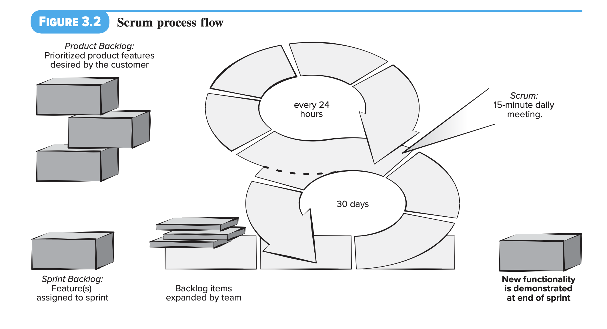

### 2.3.4 Extreme Programming (XP) Practices

Extreme Programming (XP), created by Kent Beck, is an agile methodology that takes proven software development practices to "extreme" levels. XP is organized around four framework activities: planning, design, coding, and testing.

The five core values of XP are Communication, Simplicity, Feedback, Courage, and Respect.

**XP Practices:**

1. **User Stories:** They are requirements captured as short, customer-written narratives describing desired features. Each story is assigned a business value (priority) by the customer and a cost estimate (in development weeks) by the team.
2. **Planning Game:** It is where customers and developers collaborate to decide which stories to include in the next release and in what order. Stories may be ordered by business value or by risk.
3. **Small Releases:** Software is released in small, frequent increments so that customers can evaluate working software early and often.
4. **Simple Design:** It follows the KIS (Keep It Simple) principle. Developers do not add functionality based on speculation about future needs.
5. **Pair Programming:** Two developers work together at one workstation. One writes code (driver), the other reviews each line in real-time (navigator). This provides continuous code review, facilitates knowledge sharing, and improves code quality.
6. **Test-Driven Development (TDD):** Unit tests are written before the code. The cycle is: (1) Red, write a failing test; (2) Green, write just enough code to pass the test; (3) Refactor, improve the code structure while keeping tests passing. This ensures the code is always testable and that developers focus on what must be implemented.
7. **Refactoring:** It means continuously improving the internal structure of existing code without changing its external behavior. This prevents code deterioration, reduces technical debt, and keeps the system maintainable.
8. **Continuous Integration:** Developers integrate their code into the shared repository frequently (multiple times a day). Automated builds and tests run immediately to detect integration errors early.
9. **Collective Code Ownership:** Any developer can change any part of the codebase, preventing knowledge silos and bottlenecks.
10. **Coding Standards:** The team follows agreed-upon coding conventions so the codebase reads as if written by a single person.
11. **Sustainable Pace (40-Hour Week):** XP discourages overtime because a rested team produces higher-quality work.
12. **On-Site Customer:** A customer representative is embedded with the team to answer questions, set priorities, and provide immediate feedback.
13. **Project Velocity:** It is the number of user stories completed per iteration, and it is used to estimate delivery dates for subsequent releases.

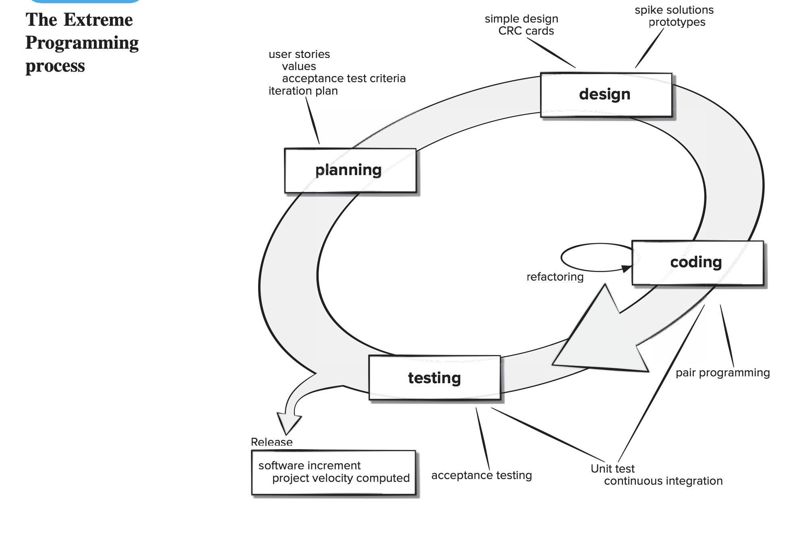

### 2.3.5 Lean Software Development

Lean Software Development, articulated by Mary and Tom Poppendieck, adapts principles from lean manufacturing (Toyota Production System) to software engineering. It focuses on delivering maximum value with minimum waste.

**The Seven Principles of Lean Software Development:**

1. **Eliminate Waste:** Remove anything that does not add value to the customer. In software, waste includes partially done work, unnecessary features, task switching, waiting, handoffs, unnecessary meetings, and defects.
2. **Amplify Learning:** Software development is a discovery process. Use short iterations, frequent feedback loops, and experiments to continuously build knowledge rather than relying on rigid upfront plans.
3. **Decide as Late as Possible:** Delay irreversible decisions until you have the maximum information available. This keeps options open and avoids costly changes based on incomplete knowledge.
4. **Deliver as Fast as Possible:** Reduce the time between identifying a customer need and delivering working software. Rapid delivery provides faster feedback, quicker market response, and lower risk.
5. **Empower the Team:** Trust the people closest to the work to make decisions. Provide them with the tools, authority, and environment to solve problems effectively. Avoid micro-management.
6. **Build Integrity In:** Ensure both conceptual integrity (components work as a cohesive whole) and perceived integrity (the product meets customer expectations). Achieve this through automated testing, continuous integration, and refactoring.
7. **Optimize the Whole:** Focus on improving the entire value stream (the complete sequence of activities required to design, produce, and deliver a product) from concept to delivery, not just individual parts. Avoid sub-optimization where improving one part degrades the overall system.

Lean principles complement other agile methods. Kanban, a lean-originated method, visualizes workflow on a board, limits work in progress (WIP), manages flow, makes process policies explicit, creates feedback loops, and encourages collaborative process evolution.

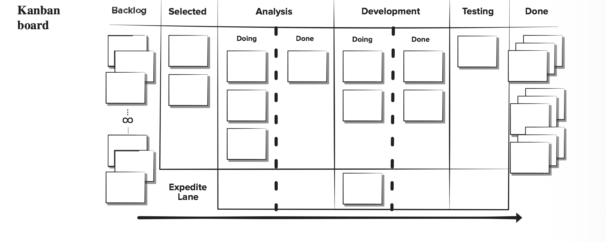

---

## 2.4 Model Selection Considerations

> **Why are different process models used in software development? [2 marks] (2080 Bhadra - IOE - Old Syllabus Relevant)**
>
> **Define software process model. Differentiate the spiral model and incremental model highlighting their advantages and disadvantages. [2+6 marks] (2080 Baishakh - IOE - Old Syllabus Relevant)**
>
> **A client's problem has uncertainties that could lead to loss if not planned. Which model do you suggest? Justify. [5 marks] (2074 Chaitra - IOE - Old Syllabus Relevant)**
>
> **Why do we need to do a feasibility study before accepting any project? [2 marks] (2082 Bhadra - IOE - Old Syllabus Relevant)**

A software process model is a simplified description of a software process, presented from a specific perspective. It defines the sequence of activities, their interdependencies, and how they interact to transform inputs into outputs. Different process models exist because no single model fits every project.

Projects differ in size, complexity, requirements stability, risk level, team size, customer involvement, and time constraints. A small internal tool with clear requirements can use a waterfall approach; a complex product with evolving requirements and high uncertainty needs an evolutionary or agile approach.

**Factors for selecting a process model:**

1. **Requirements clarity and stability:** If requirements are well-defined and unlikely to change, plan-driven models such as waterfall work well. If requirements are volatile or unclear, agile or evolutionary models are better suited.
2. **Project size and complexity:** Large, complex projects with high risk favor the spiral model, while small to medium projects favor agile methods such as Scrum and XP.
3. **Risk level:** High-risk projects benefit from the spiral model's explicit risk analysis, whereas low-risk projects can use simpler models.
4. **Customer involvement:** If the customer is available and willing to participate continuously, agile methods excel. If customer interaction is limited, plan-driven methods with formal documentation may be necessary.
5. **Time-to-market pressure:** If rapid delivery is critical, incremental or agile models are preferred because they deliver working software early.
6. **Team expertise:** Agile and spiral models require experienced, self-organizing teams, while plan-driven models can work with less experienced teams given strong management.
7. **Regulatory and compliance needs:** Safety-critical or regulated domains such as avionics and medical devices may require the documentation rigor of plan-driven models.

**For a project with significant uncertainties and risk of loss:** The **spiral model** is most appropriate. Its risk-driven nature ensures that uncertainties are identified and resolved early through prototyping and risk analysis before committing significant resources. Each iteration includes formal risk assessment, and the project can be terminated at any point if the risk is deemed too high, thus limiting potential losses.

**Feasibility study:**

Before accepting any project, a feasibility study assesses whether the project is technically viable, economically justified, and operationally practical. It examines resource availability, cost-benefit analysis, timeline constraints, and potential risks. This prevents the organization from committing to projects that are unlikely to succeed, thereby avoiding wasted resources and financial losses.

| Spiral Model                                                                        | Incremental Model                                                            |
| ----------------------------------------------------------------------------------- | ---------------------------------------------------------------------------- |
| Performs formal risk analysis at every iteration                                    | Manages risk informally by prioritizing increments                           |
| Customer is involved continuously, especially in planning and risk assessment       | Customer provides periodic feedback after each increment                     |
| Best suited for large, complex, high-risk projects                                  | Best suited for medium projects with generally known requirements            |
| Follows an evolutionary flow where each loop revisits all phases with risk analysis | Follows an iterative flow where each increment goes through a mini-lifecycle |
| Changes are incorporated after risk assessment in each loop                         | Changes are easier to accommodate between increments                         |
| Requires moderate documentation including risk reports                              | Documentation varies and can be lightweight                                  |
| Requires risk assessment expertise and is expensive for small projects              | Requires complete system understanding for proper partitioning               |

---

---

---

## 3. Software Requirements Engineering

## 3.1 Requirement Engineering Process

> **What is requirement engineering? Explain its steps. [4 marks] (2074 Chaitra - IOE - Old Syllabus Relevant)**
>
> **What do you mean by a software requirements document? [2 marks] (2078 Bhadra - IOE - Old Syllabus Relevant)**
>
> **Explain the requirement engineering process in detail. [6 marks] (2078 Bhadra - IOE - Old Syllabus Relevant)**
>
> **Why is it so difficult to gain a clear understanding of what the customer wants? [3 marks] (2081 Bhadra - IOE - Old Syllabus Relevant)**
>
> **What are the different techniques used for requirements gathering and analysis? Explain any three methods in detail. [7 marks] (2070 Ashad - IOE - Old Syllabus Relevant)**

**Requirements engineering (RE)** is the broad spectrum of tasks and techniques that lead to an understanding of requirements. It begins during the communication activity and continues into modeling. RE establishes the solid base for design and construction. Without it, the resulting software has a high probability of not meeting customer needs.

### Seven Tasks of Requirements Engineering

**1. Inception:** Establish a basic understanding of the problem, the people who want a solution, and the nature of the desired solution. At inception, stakeholders are identified, project scope is outlined, and initial communication is established.

**2. Elicitation:** Actively gather requirements from stakeholders. Ask what the system must accomplish, how it fits into business needs, and how it will be used daily. Elicitation also involves understanding business goals (functional and non-functional) and prioritizing them.

**3. Elaboration:** Develop a refined requirements model that identifies various aspects of software function, behavior, and information. User scenarios from elicitation are parsed to extract analysis classes, attributes, and services. The key is to describe the problem sufficiently for design and then move on without obsessing over unnecessary detail.

**4. Negotiation:** Reconcile conflicting requirements among stakeholders. Customers and users rank requirements and discuss priority conflicts. The goal is a "win-win" result where both sides achieve some measure of satisfaction. Requirements are eliminated, combined, or modified based on cost, risk, and priority assessment.

**5. Specification:** Document the agreed-upon requirements. A specification can be a written document, graphical models, a formal mathematical model, a collection of usage scenarios, a prototype, or any combination. For large systems, a formal SRS document is used; for smaller products, user stories or use cases may suffice.

**6. Validation:** Assess the quality of requirements work products. Ensure requirements are stated unambiguously, are consistent, and that omissions and errors are corrected. The primary mechanism is a technical review involving software engineers, customers, users, and other stakeholders.

**7. Management:** Identify, control, and track requirements and changes to requirements throughout the project lifecycle. Requirements change constantly, and management activities ensure that changes are handled systematically (closely related to software configuration management).

### Why It Is Difficult to Understand Customer Requirements

- Customers may have only a vague idea of what is required.
- Different stakeholders have conflicting opinions and priorities.
- Stakeholders may have unspoken assumptions and interpret meanings differently.
- Requirements are often stated in ambiguous or untestable terms (e.g., "the system should be user-friendly").
- Customers may not know exactly what they want until they see working software.
- Project goals may be unclear, and technical knowledge of customers may be limited.
- Requirements continue to change throughout the project.

### Requirements Gathering Techniques

**Interviews:** They are one-on-one or group sessions where the requirements engineer asks structured or unstructured questions to stakeholders. They are effective for understanding individual perspectives, uncovering implicit needs, and clarifying details. Best combined with other methods.

**Facilitated Meetings (Workshops / JAD Sessions):** They are structured meetings attended by both software engineers and stakeholders. A facilitator controls the meeting. Participants develop lists of objects, services, constraints, and performance criteria. Combined lists are refined through discussion to reach consensus. Rules for preparation and participation are established beforehand.

**Prototyping:** It involves building a preliminary version of the system (or part of it) to help stakeholders visualize and refine requirements. It is particularly useful when requirements are fuzzy or when the UI is a major concern.

**Observation (Ethnography):** It involves observing end users performing their actual work to understand how the existing system is used and identify implicit requirements that users may not articulate. It is useful for understanding workflows and business processes.

**Questionnaires/Surveys:** They are used to collect requirements from a large number of stakeholders simultaneously. They are useful for gathering quantitative data on preferences and priorities.

**Document Analysis:** It involves studying existing documentation (manuals, forms, reports, regulations, legacy system specifications) to understand the problem domain and extract requirements.

### A Software Requirements Document

A software requirements document (SRD), commonly called the Software Requirements Specification (SRS), is a formal, written understanding of the problem that all parties agree upon. It describes the required informational, functional, and behavioral domains for the system, serves as a contractual basis between customer and developer, and provides the foundation for design, testing, and maintenance.

---

## 3.2 SRS (Structure, Characteristics, Users)

> **What is the importance of the SRS document in software development? [3 marks] (2082 Baishakh - IOE - Old Syllabus Relevant)**
>
> **Identify and document functional as well as non-functional requirements for "issuing a book from a library." [5 marks] (2079 Bhadra - IOE - Old Syllabus Relevant)**

### Importance of the SRS

- Provides a clear, shared understanding of what the software must do, eliminating ambiguity between customers, developers, and testers.
- Serves as a contractual agreement between the customer and the development team.
- Acts as the basis for project planning, cost estimation, and scheduling.
- Provides the foundation for system design, implementation, and testing (traceability).
- Serves as a reference for maintenance and future enhancements.
- Reduces the risk of building the wrong product.

### SRS Structure (Based on IEEE 830 / ISO/IEC/IEEE 29148)

**Section 1: Introduction.** It covers the purpose of the SRS, scope of the software, definitions/acronyms, references, and document overview.

**Section 2: Overall Description.** It covers product perspective (context within a larger system), product functions (high-level summary), user characteristics (profiles of target users, their expertise), constraints (hardware, software, regulatory), and assumptions/dependencies.

**Section 3: Specific Requirements.** It covers functional requirements (detailed descriptions of each function), external interface requirements (user, hardware, software, communication interfaces), performance requirements (response time, throughput), design constraints, and non-functional attributes (reliability, security, maintainability, portability).

### Characteristics of a Good SRS

- **Correct:** It accurately represents stakeholder needs.
- **Unambiguous:** Each requirement has only one interpretation.
- **Complete:** It contains all significant requirements with no TBD placeholders.
- **Consistent:** No requirement conflicts with another.
- **Verifiable (Testable):** Every requirement can be tested through an objective process.
- **Modifiable:** The structure allows easy changes while maintaining consistency.
- **Traceable:** Each requirement can be traced to its source and to corresponding design/test elements.
- **Feasible:** It is achievable within budget, schedule, and technology constraints.

### Users of the SRS

- **Customers/Clients:** They verify that the document captures their needs.
- **Project Managers:** They use it for planning, estimation, and tracking.
- **Developers/Designers:** They use it as the basis for design and implementation.
- **Testers/QA:** They derive test cases from requirements to validate the system.
- **Maintenance Engineers:** They reference it for understanding the system during future modifications.

### Example: Requirements for "Issuing a Book from a Library"

**Functional Requirements:**

- **FR-01: Search Book [Priority: Essential]** The system shall allow the librarian to search for a book by title, author, or ISBN.
- **FR-02: Verify Membership [Priority: Essential]** The system shall verify the borrower's library membership status before issuing.
- **FR-03: Check Availability [Priority: Essential]** The system shall check if the book is available (not already issued or reserved).
- **FR-04: Record Issue Date [Priority: Essential]** The system shall record the issue date and calculate the due date (e.g., 14 days from issue).
- **FR-05: Update Book Status [Priority: Essential]** The system shall update the book's status to "issued" and associate it with the borrower's account.
- **FR-06: Generate Receipt [Priority: Conditional]** The system shall generate an issue receipt for the borrower.

**Non-Functional Requirements:**

- **Performance:** The system shall process a book issue transaction within 3 seconds.
- **Usability:** The interface shall be simple enough for a librarian with minimal computer training.
- **Security:** Only authorized librarians shall be able to issue books.
- **Reliability:** The system shall be available during all library operating hours with 99.5% uptime.
- **Maintainability:** The system shall be designed to allow easy addition of new book categories.

---

## 3.3 Functional and Non-Functional Requirements

> **Explain functional and non-functional requirements with examples. [6 marks] (2069 Ashad - IOE - Old Syllabus Relevant)**
>
> **Differentiate functional and non-functional requirements. [7 marks] (2069 Chaitra - IOE - Old Syllabus Relevant)**
>
> **Distinguish between user and system requirements. [2 marks] (2079 Bhadra - IOE - Old Syllabus Relevant)**
>
> **Why should an engineer ensure that functional and non-functional needs are in a requirements specification document? [4 marks] (2079 Bhadra - IOE - Old Syllabus Relevant)**
>
> **List and explain functional (any two) and non-functional requirements of an airlines reservation system. [6 marks] (2082 Baishakh - IOE - Old Syllabus Relevant)**
>
> **Explain functional (Order Food, Make Payment) and non-functional (all) requirements of an online food ordering system. [6 marks] (2081 Bhadra - IOE - Old Syllabus Relevant)**
>
> **Prepare functional requirements for an online ticket booking system for a movie theatre. [4 marks] (2082 Bhadra - IOE - Old Syllabus Relevant)**
>
> **List functional and non-functional requirements for a Restaurant Information System. [5 marks] (2068 Chaitra - IOE - Old Syllabus Relevant)**

### Functional Requirements

Functional requirements describe what the system must do, including the specific functions, features, services, and behaviors the software must provide. They define the system's response to specific inputs under specific conditions.

**Example:** "The system shall allow users to search flights by origin, destination, and date."

### Non-Functional Requirements (NFRs)

Non-functional requirements describe how well the system must perform, including quality attributes, performance characteristics, security constraints, and general system constraints. They constrain the overall functioning of the system rather than defining specific features.

**Categories of NFRs:**

- **Performance:** It covers response time, throughput, and capacity (e.g., "The page shall load within 2 seconds under 1000 concurrent users").
- **Reliability:** It covers mean time between failures and availability (e.g., "99.9% uptime").
- **Usability:** It covers ease of use and learnability (e.g., "A new user shall be able to complete registration within 3 minutes without help").
- **Security:** It covers authentication, authorization, and data encryption (e.g., "All passwords shall be stored using bcrypt hashing").
- **Maintainability:** It covers ease of modification and modular design.
- **Portability:** It covers the ability to operate across different platforms.
- **Scalability:** It covers the ability to handle growth in users, data, or transactions.

| Functional Requirements                                                   | Non-Functional Requirements                                 |
| ------------------------------------------------------------------------- | ----------------------------------------------------------- |
| Describe what the system does                                             | Describe how well the system performs                       |
| Specify specific features and behaviors                                   | Specify quality attributes and constraints                  |
| Example: "User can place an order"                                        | Example: "Order confirmation within 2 seconds"              |
| Tested by executing the function directly                                 | Tested by measuring performance, stress, security, etc.     |
| If absent, the system is incomplete because required features are missing | If absent, the system becomes unreliable, slow, or insecure |
| Documented as use cases, user stories, or feature lists                   | Documented as quality metrics, constraints, or SLA targets  |

### Why Both Must Be in the SRS

Functional requirements alone do not guarantee a usable system. A system may perform all required functions but fail if it is too slow, insecure, or difficult to use. Conversely, meeting NFRs without delivering required features is meaningless. Both types are essential for:

- Complete system specification ensures that developers know what to build and to what standard.
- Testing requires both functional test cases and performance/security benchmarks.
- Contract enforcement requires stakeholders to have measurable criteria for acceptance.
- Risk reduction is important because missing NFRs often lead to costly rework or system rejection.

### User Requirements vs. System Requirements

- **User requirements:** They are high-level statements written in natural language (possibly with diagrams) describing what the system should provide to users and the constraints under which it operates. They are written for customers and managers. Example: "The system should allow customers to book flights."
- **System requirements:** They are detailed, precise descriptions of system functions, services, and constraints. They are written for developers and testers. Example: "The system shall accept origin (IATA code), destination (IATA code), departure date (YYYY-MM-DD), and number of passengers (1–9) as search parameters and return matching flights sorted by price within 3 seconds."

### Example: Airlines Reservation System

**Functional Requirements:**

- The system shall allow passengers to search for flights by origin, destination, date, and class.
- The system shall display flight number, departure/arrival times, duration, and price in the search results.
- The system shall allow passengers to select a flight, enter passenger details, and choose a seat.
- The system shall generate a booking confirmation with a PNR number upon confirming the booking.

**Non-Functional Requirements:**

- The system shall return search results within 3 seconds.
- The system shall be available 24/7 with 99.9% uptime.
- The system shall encrypt payment information using TLS 1.2 or higher.
- The system shall comply with PCI-DSS standards for payment processing.
- The system shall support at least 10,000 concurrent users.
- The booking process shall be completable within 5 steps.

### Example: Online Food Ordering System

**Functional Requirements:**

- The system shall allow the customer to browse the menu and select food items.
- The system shall allow the customer to specify quantity and add customizations (e.g., extra cheese, no onions) for each item.
- The system shall allow the customer to add items to the cart.
- The cart shall display a summary with item-wise and total prices.
- The system shall support multiple payment methods (credit/debit card, digital wallet, cash on delivery).
- The system shall display an order confirmation with an estimated delivery time upon successful payment.

**Non-Functional Requirements:**

- The payment transaction shall complete within 5 seconds.
- The system shall transmit all payment data over encrypted connections.
- The system shall store user passwords in hashed format.
- The system shall support a mobile-responsive design.
- The system shall handle order processing without data loss during peak hours.
- The system shall maintain 99.5% uptime during restaurant operating hours.

### Example: Online Ticket Booking System for a Movie Theatre

**Functional Requirements:**

- The system shall display currently running movies with showtimes, language, and format (2D/3D).
- The system shall allow users to select a movie, showtime, and preferred seats from a seat map.
- The system shall hold selected seats for a limited time (e.g., 10 minutes) during payment processing.
- The system shall process online payment and generate an e-ticket with a unique booking ID and QR code.
- The system shall allow users to cancel a booking up to 2 hours before showtime and process a refund.
- The system shall send booking confirmation and e-ticket via email and SMS.

### Example: Restaurant Information System

**Functional Requirements:**

- The system shall allow customers to view the restaurant menu with prices, descriptions, and images.
- The system shall allow customers to place dine-in or takeaway orders.
- The system shall allow waitstaff to update order status (received, preparing, served).
- The system shall generate a bill with itemized charges and applicable taxes.
- The system shall support table reservation with date, time, and party size.

**Non-Functional Requirements:**

- The system shall process order placement within 2 seconds.
- The interface shall be operable on tablets used by waitstaff.
- The system shall not lose orders during power failures by using persistent storage.
- The system shall handle customer payment data per PCI-DSS standards.
- The system shall handle peak-hour load without performance degradation.

---

## 3.4 Gathering Requirements Using Use Case Modeling and Scenarios

> **Prepare a use case diagram for an event management system. [4 marks] (2082 Bhadra - IOE - Old Syllabus Relevant)**
>
> **Draw a use case diagram for an online food ordering system. [5 marks] (2082 Baishakh - IOE - Old Syllabus Relevant)**
>
> **Draw a use case diagram for an online appointment booking app. [5 marks] (2081 Bhadra - IOE - Old Syllabus Relevant)**
>
> **Prepare use case diagrams for an automated ticket issuing system. [5 marks] (2081 Baishakh - IOE - Old Syllabus Relevant)**
>
> **Draw a use case diagram illustrating interactions between a doctor, patients, and prescriptions. [5 marks] (2078 Bhadra - IOE - Old Syllabus Relevant)**

**Scenario:** A specific narrative describing a single path of interaction between an actor and the system. It tells a concrete story of how the system is used.

**Use Case:** A structured, generalized description of how an actor interacts with the system to achieve a specific goal. It includes the main success scenario plus alternate/exception flows. Use cases can be expressed as narrative text (user stories), outlines, template-based descriptions, or UML diagrams.

**Example Scenario: Customer Purchasing a Book:**

1. Customer logs into the bookstore website.
2. Customer searches for "Software Engineering" in the search bar.
3. System displays a list of matching books with titles, authors, prices, and ratings.
4. Customer selects a book and views its details page.
5. Customer clicks "Add to Cart."
6. Customer proceeds to checkout.
7. Customer enters shipping address and selects payment method.
8. System processes the payment through the payment gateway.
9. System confirms the order and sends a confirmation email.
10. Customer receives the book within the estimated delivery time.

### Writing a Use Case (Template-Based Description)

A formal use case includes: use case name, primary actor, secondary actor, preconditions, trigger, main scenario (numbered steps), exceptions/alternate flows, post conditions and priority (essential, conditional, optional).

**Use Case: Purchase a Book:**

| Element           | Details                                                                                                                                                                                                                                                                                                                                    |
| ----------------- | ------------------------------------------------------------------------------------------------------------------------------------------------------------------------------------------------------------------------------------------------------------------------------------------------------------------------------------------ |
| **Use Case Name** | Purchase a Book                                                                                                                                                                                                                                                                                                                            |
| **Actor**         | Customer                                                                                                                                                                                                                                                                                                                                   |
| **Precondition**  | Customer has a registered account and is logged in.                                                                                                                                                                                                                                                                                        |
| **Trigger**       | The customer decides to search for and purchase a book.                                                                                                                                                                                                                                                                                    |
| **Main Flow**     | 1. Customer searches for a book. <br>2. System displays matching results. <br>3. Customer selects a book. <br>4. Customer adds book to cart. <br>5. Customer proceeds to checkout. <br>6. Customer enters shipping and payment details. <br>7. System validates payment via payment gateway. <br>8. System confirms order and sends email. |
| **Exceptions**    | 1. Out of Stock: System displays an "Out of Stock" message and suggests similar books. <br>2. Payment Failure: System notifies the customer and asks them to retry or use a different payment method.                                                                                                                                      |
| **Postcondition** | Order is placed, payment is processed, and confirmation email is sent.                                                                                                                                                                                                                                                                     |
| **Priority**      | Essential                                                                                                                                                                                                                                                                                                                                  |

**Use Case: Add New Book to Catalog:**

| Element           | Details                                                                                                                                                                                                                                                                                                                     |
| ----------------- | --------------------------------------------------------------------------------------------------------------------------------------------------------------------------------------------------------------------------------------------------------------------------------------------------------------------------- |
| **Use Case Name** | Add New Book to Catalog                                                                                                                                                                                                                                                                                                     |
| **Actor**         | Bookstore Owner                                                                                                                                                                                                                                                                                                             |
| **Precondition**  | Bookstore Owner is logged in with admin privileges.                                                                                                                                                                                                                                                                         |
| **Trigger**       | The bookstore owner decides to add a new book to the catalog.                                                                                                                                                                                                                                                               |
| **Main Flow**     | 1. Owner selects "Add New Book" from the dashboard. <br>2. Owner enters book details (title, author, ISBN, price, description, cover image, stock quantity). <br>3. System validates the input fields. <br>4. System adds the book to the catalog database. <br>5. System displays confirmation: "Book added successfully." |
| **Exceptions**    | 1. Duplicate ISBN: System notifies the owner that a book with this ISBN already exists and offers to update the existing entry. <br>2. Missing Required Fields: System highlights the missing fields for the owner.                                                                                                         |
| **Postcondition** | New book is visible in the catalog and available for purchase.                                                                                                                                                                                                                                                              |
| **Priority**      | Essential                                                                                                                                                                                                                                                                                                                   |

### Elements of a Use Case (Diagram-Based Description)

- **Actor:** It is any external entity (person, device, or external system) that communicates with the system. Actors represent roles, not specific individuals. A single user may play multiple roles (and thus be multiple actors).
- **Primary actor:** It directly interacts with and derives benefit from the system.
- **Secondary actor:** It supports the system so primary actors can do their work.
- **Use case:** It is a specific function or service provided by the system, described from the actor's perspective.
- **System boundary:** It is a rectangle that defines the scope of the system. Actors are outside and use cases are inside.

### Relationships in Use Case Diagrams

- **Association:** It is a solid line connecting an actor to a use case, indicating interaction.
- **Include (<<include>>):** It is represented by a dashed arrow from the base use case to the included use case. The included use case is always executed as part of the base use case. It is used for common, reusable functionality. Example: "Place Order" includes "Verify Login."
- **Extend (<<extend>>):** It is represented by a dashed arrow from the extending use case to the base use case. The extending use case is executed only under certain conditions. The base use case is complete on its own. Example: "Checkout" may be extended by "Apply Coupon."
- **Generalization:** It is a solid line with a hollow triangle arrowhead, representing inheritance between actors or between use cases.

Use case diagram is drawn with symbols: a rectangle for the system boundary (labeled with the system name), stick figures for actors (outside the boundary), ovals for use cases (inside the boundary), solid lines for associations, and dashed arrows with stereotypes for <<include>> and <<extend>> relationships.

| 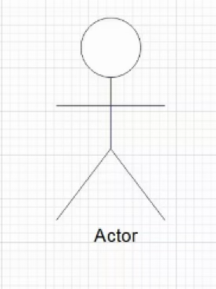 | 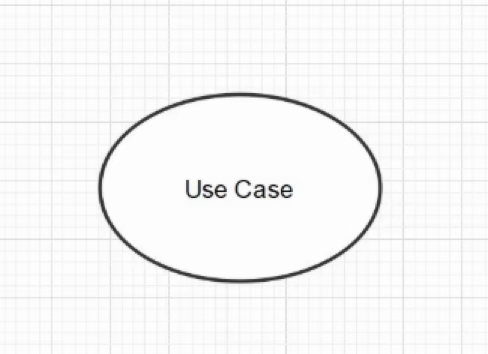 |
| ------------------------------- | ------------------------------------- |

|  | 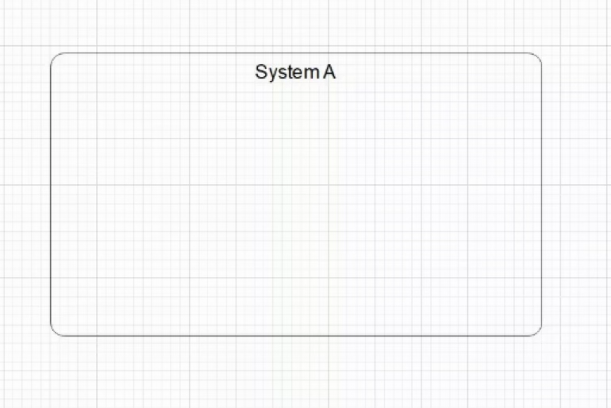 |
| ------------------------------------ | ------------------------------------- |

### Use Case Diagram Examples

**Railway Reservation System:**

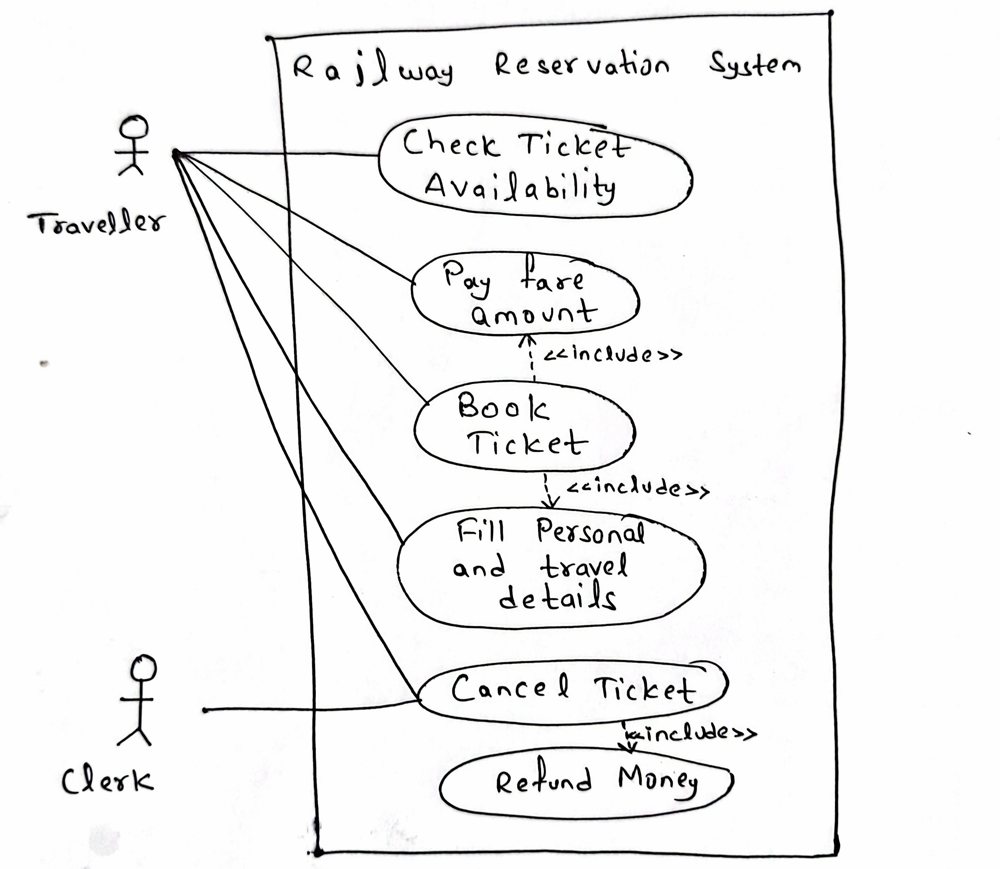

**Parking Management System:**

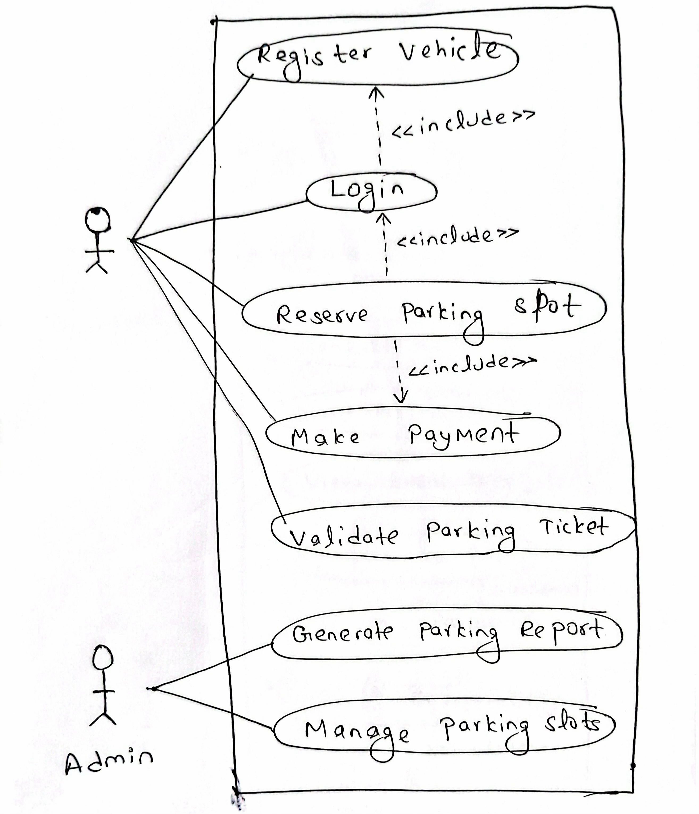

**Library Management System:**

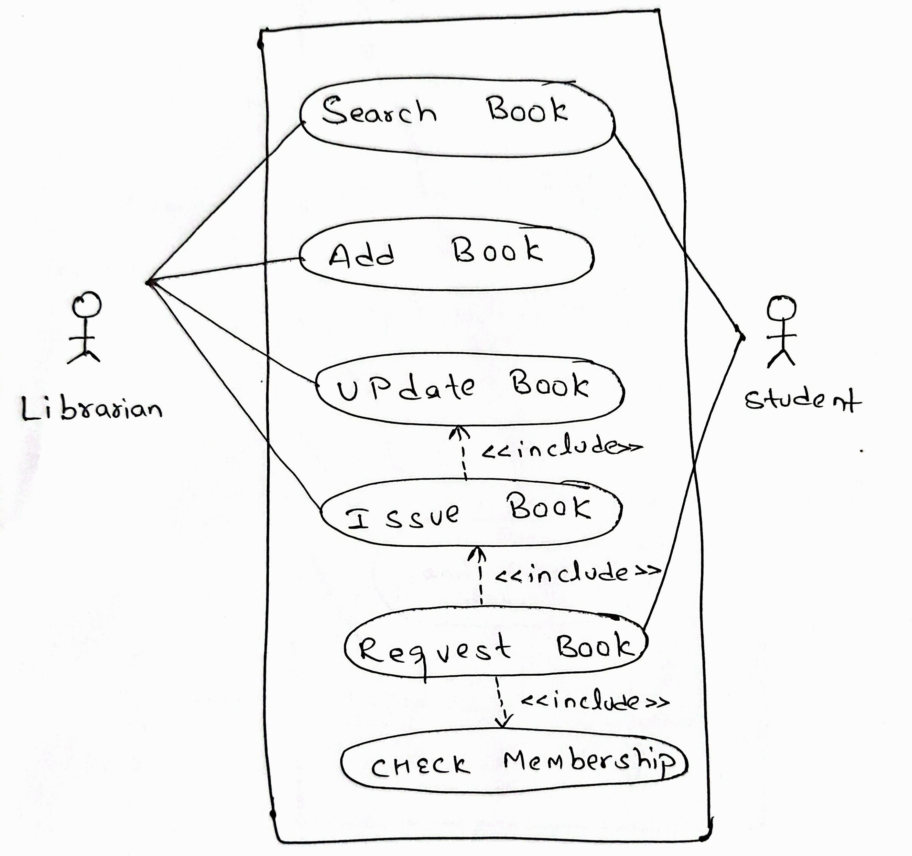

**Event Management System:**

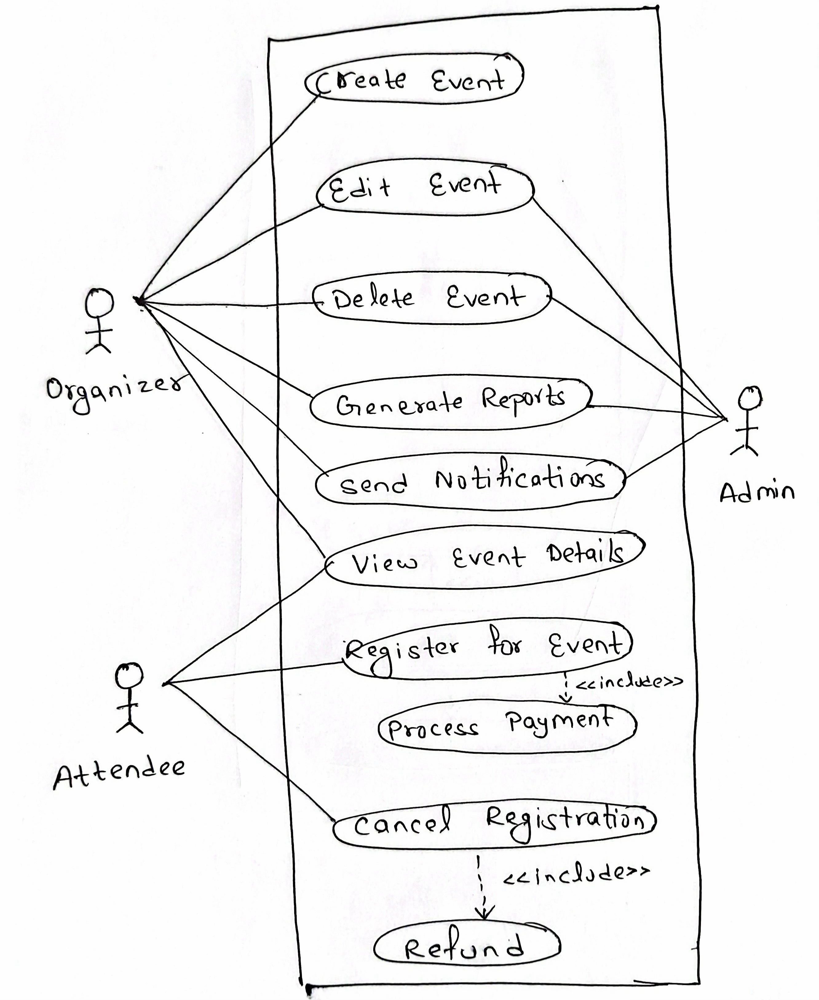

**Online Food Ordering System:**

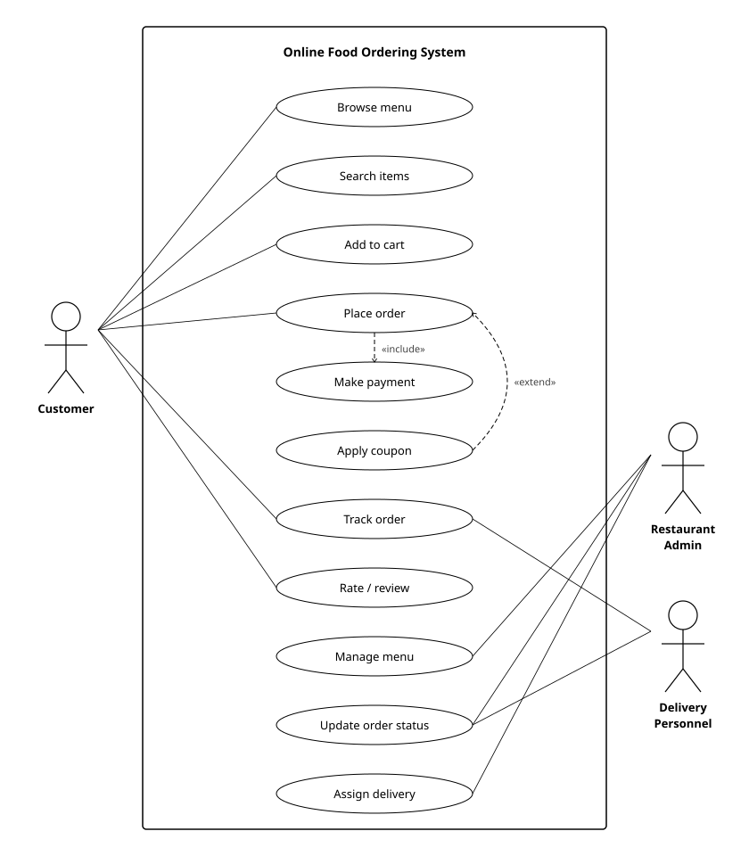

**Online Appointment Booking System:**


---

## 3.5 Agile Requirements Engineering

### 3.5.1 User Stories and Acceptance Criteria

A user story is a short, informal description of a feature told from the perspective of the user who wants the capability. It serves as a placeholder for conversation rather than a rigid specification.

**Standard Format:**

> As a [type of user], I want [some goal] so that [some reason/benefit].

**Example:** "As a customer, I want to filter products by price range so that I can find items within my budget."

**INVEST Criteria for Good User Stories:**

- **I (Independent):** The story is self-contained and not dependent on other stories.
- **N (Negotiable):** Details are open for discussion and the story is not a rigid contract.
- **V (Valuable):** It delivers clear value to the user or business.
- **E (Estimable):** The team can estimate the effort required.
- **S (Small):** It is small enough to be completed within a single sprint.
- **T (Testable):** It has clear criteria that allow verification.

**Acceptance Criteria** define the specific conditions that must be satisfied for a user story to be considered complete. They bridge the gap between the user story and the implementation.

**Given-When-Then Format (BDD Style):**

- **Given** [a precondition/context],
- **When** [an action is performed],
- **Then** [an expected result occurs].

```text
BDD (Behavior-Driven Development) is a software development approach that focuses on describing how a system should
behave from the user's or business's perspective, instead of starting with technical implementation details.
```

**Example:**

**Story:** "As a customer, I want to reset my password so that I can regain access if I forget it."

**Acceptance criteria:**

1. Given the user is on the login page, when they click "Forgot Password" and enter a registered email, then a password reset link shall be sent to that email within 1 minute.
2. Given the user clicks the reset link, when they enter a new password meeting complexity rules, then the password shall be updated and a confirmation displayed.
3. Given the user enters an unregistered email, when they submit the form, then an error message "Email not found" shall be displayed.

### 3.5.2 Product Backlog Creation and Prioritization

The product backlog is an ordered, evolving list of everything needed in the product, including features, enhancements and bug fixes. It is the single source of requirements for the development team. The Product Owner is responsible for maintaining and prioritizing the backlog.

**Creating the Product Backlog:**

- Gather initial user stories from stakeholders through interviews, workshops, and brainstorming.
- Write each requirement as a user story with acceptance criteria.

- Estimate effort for each story (using story points or ideal days).
- Order the backlog by priority. Highest-priority items at the top are refined in detail, while lower items remain coarser.

**Prioritization Techniques:**

- **MoSCoW Method:** It categorizes items as Must Have (essential, non-negotiable), Should Have (important but not critical for current release), Could Have (desirable if time permits), and Won't Have (explicitly out of scope for now).
- **Business Value vs. Effort:** It prioritizes items that deliver the highest business value relative to their development effort.
- **Risk-Based:** This prioritization addresses high-risk items early to reduce uncertainty.
- **Kano Model:** It classifies features as Basic (expected), Performance (more is better), or Delighters (unexpected positive features).

### 3.5.3 Story Mapping Basics

User story mapping, popularized by Jeff Patton, is a visual technique for organizing user stories to provide the "big picture" of the product while maintaining the detail of individual stories. It addresses the limitation of flat backlogs, which often lose context of the overall user experience.

**Structure of a Story Map:**

- **Backbone (horizontal axis):** It contains the high-level user activities arranged left-to-right following the narrative flow of the user journey (the sequence of steps a user takes to achieve a goal).
- **Ribs (vertical axis):** They are placed beneath each backbone activity. Specific user tasks and stories are stacked vertically in order of priority (most important at top).
- **Release slices (horizontal lines):** They are drawn across the map to group stories into releases. The topmost slice forms the Minimum Viable Product (MVP) or "walking skeleton."

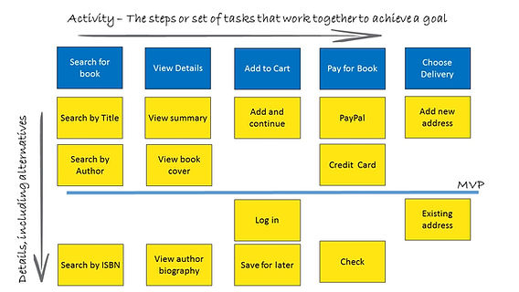

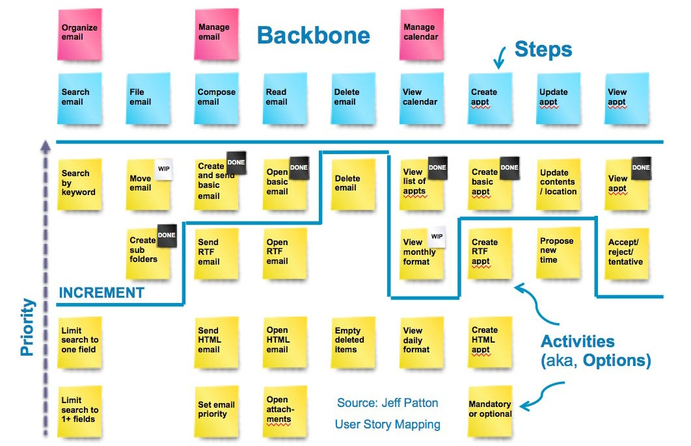

**Steps to Create a Story Map:**

- Frame the problem by identifying users and their goals.
- Map the user journey by outlining the main activities (backbone).
- Break down activities into user tasks and specific stories (ribs).
- Prioritize stories vertically under each activity.
- Slice horizontally for release planning.

**Benefits:**

- Visualizes the entire product scope and prevents losing sight of the big picture.
- Identifies gaps, dependencies, and missing functionality.
- Facilitates release planning by enabling teams to slice out cohesive, valuable releases.
- Improves communication and shared understanding among team members and stakeholders.

### 3.5.4 Continuous Requirements Refinement (Backlog Grooming)

Backlog refinement (also called backlog grooming) is the ongoing process of reviewing, updating, and elaborating product backlog items to ensure they are ready for upcoming sprints. It is not a one-time event but a continuous activity throughout the project.  
Typically, teams dedicate about 10% of sprint capacity to backlog refinement.  
It can occur during a dedicated refinement meeting (mid-sprint) or informally throughout the sprint.  
The Product Owner, development team, and Scrum Master participate.

Ensure that items at the top of the backlog are "ready," meaning they are small enough, well-understood, estimated, and have clear acceptance criteria, so that sprint planning is efficient and the team can begin work immediately.

**Activities during backlog refinement:**

- **Adding detail:** It involves breaking down large stories (epics) into smaller, implementable user stories.
- **Re-estimating:** It involves updating effort estimates as the team gains more understanding.
- **Re-prioritizing:** It involves adjusting the order of backlog items based on changing business needs, customer feedback, or new information learned from recent sprints.
- **Removing obsolete items:** It involves deleting stories that are no longer relevant.
- **Adding acceptance criteria:** It involves ensuring each story near the top of the backlog has clear, testable acceptance criteria.
- **Identifying dependencies:** It involves flagging stories that depend on others so the team can plan accordingly.

**Refinement vs. Sprint Planning:** Refinement prepares items for future sprints; sprint planning selects and commits to items for the upcoming sprint. Without effective refinement, sprint planning becomes chaotic and time-consuming.

---

---

---

## 4. Architectural Design

## 4.1 Introduction and Importance

> **What is architectural design? [2 marks] (2082 Baishakh - IOE - Old Syllabus Relevant)**
>
> **Why is architectural design important in software engineering? [2 marks] (2076 Ashwin - IOE - Old Syllabus Relevant)**
>
> **Explain why it may be necessary to design the system architecture before specifications are written. [3 marks] (2075 Ashwin - IOE - Old Syllabus Relevant)**

### What Is Architectural Design?

Architectural design is the process of defining the overall structure of a software system, including its major components, the relationships and interactions among those components, and the properties that govern their composition. It represents the "big picture" of the software before detailed component-level design begins. The output is an architectural model that depicts the system's structural elements (modules, objects, subsystems), their interfaces, the connectors that enable communication and coordination among them, and the constraints that define how they can be integrated.

Software architecture is analogous to a building's floor plan. It shows the layout of rooms (components), how they connect (interfaces and connectors), and the overall structural form, without specifying plumbing or wiring details (component internals).

### Why Is Architecture Important?

- **Facilitates communication among stakeholders.** The architecture serves as a common vocabulary for developers, managers, customers, and testers to discuss and reason about the system at a high level.
- **Highlights early design decisions.** Architectural choices (e.g., selecting a layered vs. client-server style) have a profound impact on all subsequent development, including data structures, interfaces, control flow, testing strategy, and maintainability. Correcting architectural mistakes late in the project is extremely expensive.
- **Provides a transferable model.** Architectural styles and patterns are reusable across projects. Once an architecture is proven for one system, it can serve as a template for similar systems.
- **Enables quality assessment before implementation.** The architecture can be analyzed for performance, reliability, security, and modifiability before any code is written.
- **Reduces risk.** By evaluating architectural alternatives early, the team can identify and mitigate structural risks before they propagate into the codebase.

### Why Design Architecture Before Detailed Specifications?

- The architecture defines the structural "skeleton" on which all detailed specifications and components will be built. Without it, specifications may describe features that are structurally incompatible or impossible to integrate.
- Early architectural design enables the team to identify subsystems and allocate work to parallel development teams.
- It allows assessment of non-functional requirements (performance, scalability, security) at a stage when changes are still inexpensive.
- In iterative/agile projects, a preliminary architecture (a "walking skeleton") guides sprint planning even as detailed requirements continue to evolve.

---

## 4.2 Architectural Design Principles

Architectural design is guided by a set of fundamental principles that apply regardless of the specific method, style, or programming language used:

**Principle 1: Design should be traceable to the requirements model.** Every element in the architectural design, such as subsystems, components, and interfaces, should map back to one or more requirements. If a component cannot be traced to a requirement, it may be unnecessary; if a requirement has no corresponding component, the design is incomplete.

**Principle 2: Always consider the architecture first.** Architecture affects interfaces, data structures, control flow, testability, and maintainability. Component-level details should only be addressed after the architecture is established.

**Principle 3: Data design is as important as processing design.** The way data objects are structured and stored fundamentally shapes the program's architecture and flow. A well-designed data architecture simplifies component implementation and improves processing efficiency.

**Principle 4: Interfaces must be designed with care.** Both internal interfaces (between components) and external interfaces (to users, devices, other systems) critically affect integration ease, error propagation, and design simplicity. A well-designed interface makes integration easier and helps testers validate component functions.

**Principle 5: User interface design should prioritize ease of use.** No matter how sophisticated the internal architecture, a poorly designed UI leads to the perception that the software is "bad."

**Principle 6: Components should be functionally independent.** Each component should be cohesive, meaning it is focused on a single, well-defined function. This simplifies development, testing, and maintenance.

**Principle 7: Components should be loosely coupled.** Minimize dependencies between components. High coupling increases error propagation and reduces maintainability.

**Principle 8: Design representations should be easily understandable.** The architectural model must serve as an effective communication medium for coders, testers, and maintainers.

**Principle 9: Design should be developed iteratively.** Each iteration refines the architecture, corrects errors, and strives for greater simplicity.

**Principle 10: Agile projects still need architectural design.** Even in agile development, a design model (kept lean and in sync with code) provides essential context that source code alone cannot convey, especially regarding high-level purpose and inter-module interactions.

---

## 4.3 Taxonomy of Architectural Styles

> **Explain client-server architecture with a suitable example. [5 marks] (2082 Baishakh - IOE - Old Syllabus Relevant)**
>
> **Describe layered architecture for software with an example. [4 marks] (2082 Bhadra - IOE - Old Syllabus Relevant)**
>
> **Differentiate repository model and layered model with their advantages and disadvantages. [3+3 marks] (2080 Bhadra - IOE - Old Syllabus Relevant)**
>
> **Explain multi-tier (2-tier and 3-tier) architecture with examples. [4 marks] (2078 Bhadra - IOE - Old Syllabus Relevant)**

An architectural style defines a family of systems in terms of a pattern of structural organization. Each style describes:  
(1) a set of components that perform system functions,  
(2) a set of connectors that enable communication, coordination, and cooperation among components,  
(3) constraints that define how components can be integrated, and  
(4) semantic models that help understand the overall system properties.

### Data-Centered (Repository) Architecture

A central data store (database, file, or shared repository) resides at the center of the architecture. All other components access, add, update, or delete data from this store. Components operate independently and do not communicate directly with each other. Instead, they interact only through the shared data store.

- In a passive repository, client components access data independently of other clients. The repository simply stores and retrieves data on request.
- In a blackboard variant, the repository is active. It sends notifications to client components when data of interest changes, triggering further processing. This is useful for problems with no deterministic solution path (e.g., speech recognition, AI systems).

**Advantages:**

Components can be changed or added independently without affecting other components (high integrability).

Centralized data management simplifies backup, security, and consistency.

Efficient for systems where many components share large volumes of data.

**Disadvantages:**

The repository is a single point of failure.

Components become tightly coupled to the data model, and changes to the data schema may require updates across many components.

It can also be difficult to distribute across multiple machines.

**Example:** A CASE (Computer-Aided Software Engineering) tool suite where all tools (editor, compiler, debugger, version control) access a shared project repository.

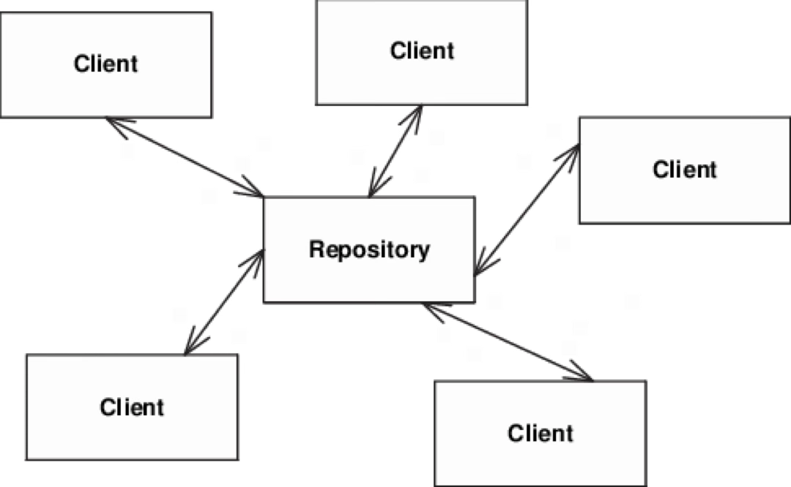

### Data-Flow (Pipe-and-Filter) Architecture

Input data is transformed through a series of processing components (called filters) connected by pipes that transmit data from one filter to the next. Each filter works independently. It receives input in a defined format, processes it, and produces output in a defined format. Filters do not need to know the internal workings of neighboring filters.

**Advantages:**

Supports reuse (filters can be recombined).

Easy to understand, add new filters, or replace existing ones.

Naturally supports concurrent processing.

**Disadvantages:**

Not suitable for interactive applications.

Can have performance overhead due to data transformation between filters.

Not well-suited for complex, branching control flows.

**Example:** A Unix command pipeline: `cat file.txt | grep "error" | sort | uniq -c`. In this pipeline, each command is a filter connected by pipes.

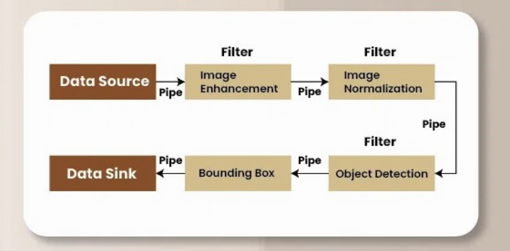

### Call-and-Return Architecture

A program structure where a "main" program invokes subprograms, which may in turn invoke further subprograms, forming a control hierarchy. Two common substyles:

- **Main program/subprogram:** Classic hierarchical decomposition where the main program delegates tasks to subprograms.
- **Remote procedure call (RPC):** The same hierarchy, but components are distributed across multiple computers on a network.

**Advantages:**

Relatively easy to modify and scale.

Well-understood, traditional approach.

Clear control flow.

**Disadvantages:**

Can be rigid.

Changes to the hierarchy may require restructuring.

Tightly coupled control flow can reduce flexibility.

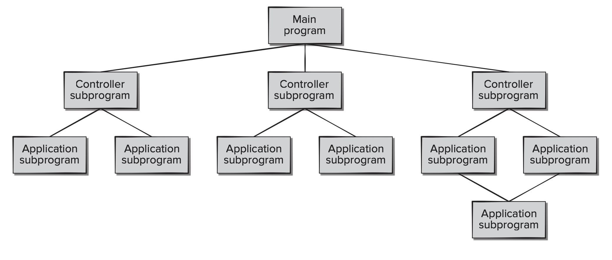

### Object-Oriented Architecture

Components encapsulate both data and the operations that manipulate it. Communication between components is achieved through message passing. Each object manages its own state and exposes behavior through well-defined interfaces.

**Advantages:**

Promotes reuse, modularity, and information hiding.

Changes to one object's internal representation do not affect others.

Natural mapping to real-world problem domains.

**Disadvantages:**

Can be harder to visualize the overall system structure.

Performance overhead from message passing.

Potential for complex interdependencies if not designed carefully.

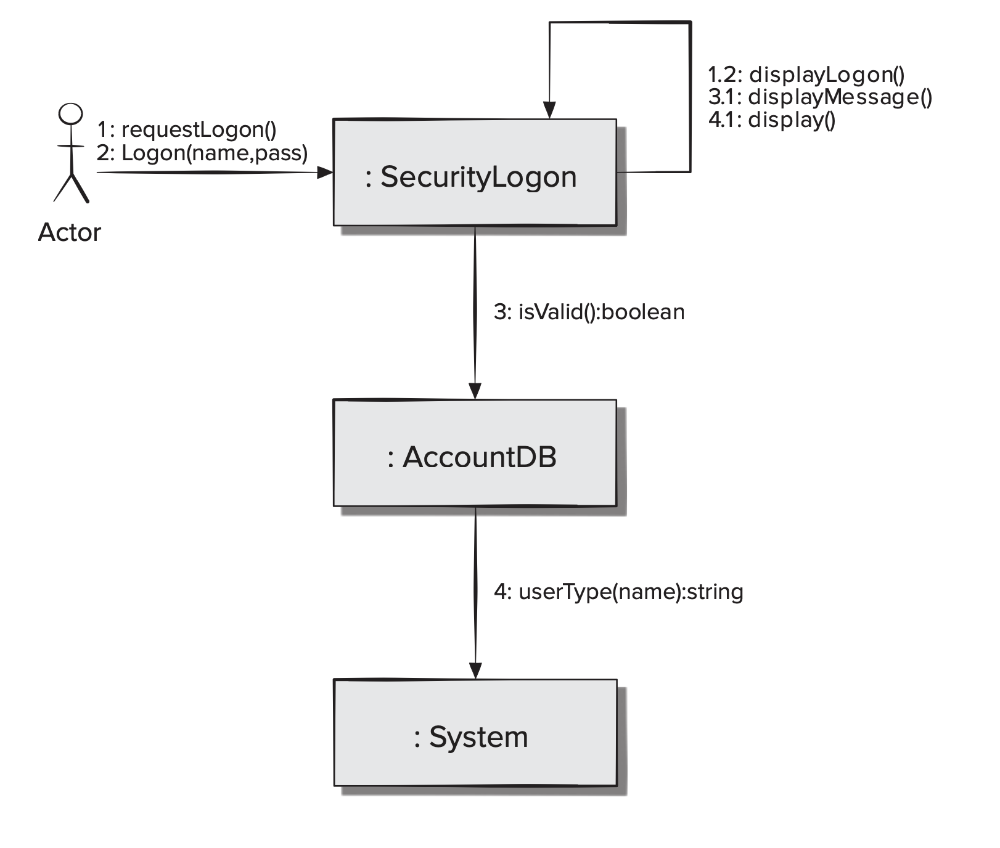

### Layered Architecture

The system is organized into horizontal layers, each providing a set of services to the layer above it and using services from the layer below. Each layer accomplishes operations that progressively become closer to the hardware level.

- The outermost layer handles user interface operations.
- The intermediate layers handle application logic and utility services.
- The innermost layer handles operating system interfacing and low-level services.

**Advantages:**

Separation of concerns ensures that each layer has a clearly defined responsibility.

Layers can be developed, tested, and modified independently.

Changes in one layer generally do not affect others (as long as the interface is preserved).

Supports reuse of layers across applications.

**Disadvantages:**

Performance overhead is a concern because requests may have to traverse multiple layers.

Not all systems decompose cleanly into layers. Excessive layering can introduce complexity and rigidity.

**Example:** An Operating System architecture:  
(1) User Interface layer (Shell or GUI),
(2) System Utilities layer (File management and process tracking),
(3) Kernel layer (Core memory management and CPU scheduling), and
(4) Hardware Abstraction layer (Device drivers communicating with physical hardware).

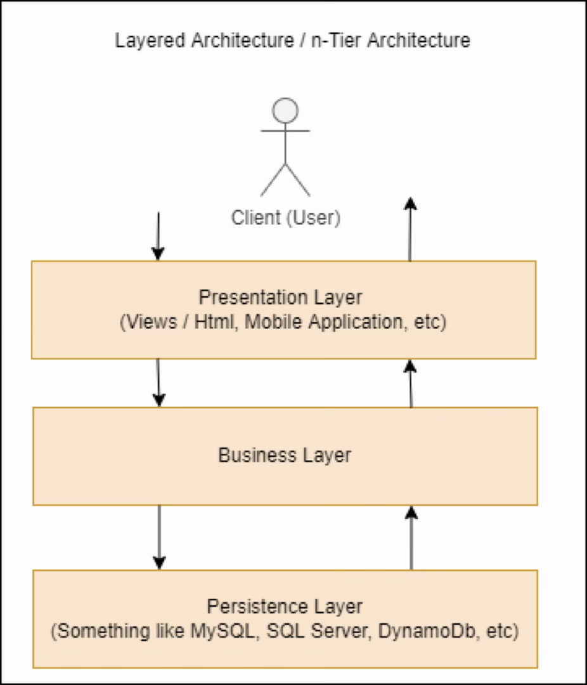

### Client-Server Architecture

A distributed architecture that partitions work between servers (providers of resources/services) and clients (requesters of services). The server hosts shared resources (data, processing logic, files) and listens for client requests. Clients present the user interface and send requests to the server over a network.

**Advantages:**

Centralized management of data and security.

The architecture is scalable because servers can be upgraded or additional servers can be added.

**Advantages:**

It is resource-efficient since thin clients can access powerful server-side processing.

Data integrity is maintained at the server.

**Disadvantages:**

Server is a single point of failure.

Entirely dependent on network connectivity.

Server can become a bottleneck under heavy load.

Higher infrastructure cost.

**Example:** In an online banking system, the mobile app (client) sends transaction requests to the bank's application server, which processes business logic and communicates with the database server to fetch or update account information. The server returns results to the client for display.

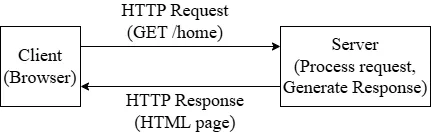

### Multi-Tier Architecture

An extension of client-server that separates functionality into distinct tiers, each running on separate infrastructure:

**2-Tier Architecture:** The client communicates directly with the server. The client handles the UI and some application logic; the server handles data storage and remaining logic. Example: A desktop database application where the client application connects directly to a database server.

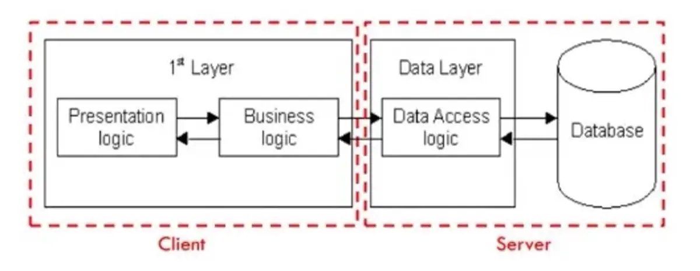

**3-Tier Architecture:** This style adds a middle tier between client and server. The three tiers are:  
(1) the Presentation tier, which is the client UI,  
(2) the Application/Logic tier, which handles business rules and processing, and  
(3) the Data tier, which is the server database.

Each tier can be developed, deployed, and scaled independently.

**Example:** In an e-commerce website, the browser (presentation tier) sends requests to a web/application server (logic tier) that processes orders, applies business rules, and queries the database server (data tier).

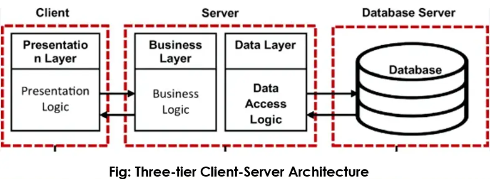

**Advantages of 3-tier over 2-tier:**

Better separation of concerns.

The middle tier can be scaled independently.

Security is improved because the database is not directly exposed to clients.

Maintenance is easier because business logic changes do not affect the client or database.

### Model-View-Controller (MVC) Architecture

A widely used architectural pattern, particularly in web and mobile applications, that separates an application into three interconnected components:

- The Model encapsulates application data, business logic, and rules. It manages data access and state.
- The View presents data from the model to the user. It handles all UI rendering and display logic.
- The Controller receives user input, interprets it, and invokes appropriate model operations. It selects the view to display the response.

The user interacts with the View. The Controller receives the request and invokes the Model. The Model processes the data and returns the results to the Controller. The Controller then selects the appropriate View, and the View renders the response to the user.

**Advantages:**

- Clear separation of concerns allows designers to work on the UI (View) independently of developers working on business logic (Model).
- Supports multiple views for the same data.
- Facilitates testing (Model can be tested independently).

**Disadvantages:**

Can increase complexity for simple applications.

Tight coupling between Controller and Model can emerge if not designed carefully.

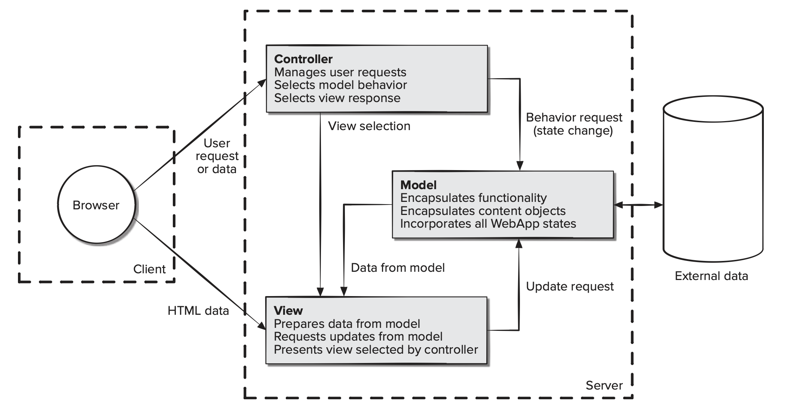

| Repository Model                                                                                       | Layered Model                                                                                                       |
| ------------------------------------------------------------------------------------------------------ | ------------------------------------------------------------------------------------------------------------------- |
| A central data store is accessed by independent components.                                            | The system is organized into horizontal layers, each serving the layer above it.                                    |
| All components interact through the shared data store.                                                 | Each layer communicates only with adjacent layers.                                                                  |
| It is efficient for systems with large shared data sets.                                               | Data passes through multiple layers, which may introduce overhead.                                                  |
| Components are coupled to the data model, not to each other.                                           | Layers are coupled only through well-defined interfaces.                                                            |
| Adding or removing components is easy, but changing the data schema is hard.                           | Changing a layer is easy as long as the interface is preserved.                                                     |
| The data store is a single point of failure.                                                           | There is no single point of failure unless a critical layer fails.                                                  |
| It is best suited for systems with shared, complex data such as CASE tools, IDEs, and data warehouses. | It is best suited for systems with clear functional separation such as web applications, OS, and network protocols. |

---

## 4.4 Modular Design, Cohesion, and Coupling

> **What are the different modular decomposition styles used during system design? Explain with examples. [5 marks] (2075 Chaitra - IOE - Old Syllabus Relevant)**
>
> **How is the modular decomposition concept practiced in the system design process? [4 marks] (2071 Shrawan - IOE - Old Syllabus Relevant)**

### Modular Design

Modularity is the most common manifestation of the "separation of concerns" principle. The software is divided into separately named and addressable components called modules, each of which is integrated to satisfy overall system requirements. A monolithic program (one large module) is nearly impossible to understand, test, or maintain. Modularization makes software intellectually manageable.

**Why modularize?** Development can be more easily planned. Software increments can be defined and delivered. Changes can be more easily accommodated. Testing, debugging, and long-term maintenance can be conducted more efficiently and without serious side effects.

**The modularization trade-off:** As the number of modules increases, the cost per individual module decreases (smaller, simpler modules). However, the cost of integrating modules increases (more interfaces, more communication). There is an optimal number of modules (M) that minimizes total development cost. Too few modules means each is too complex; too many modules means excessive integration overhead.

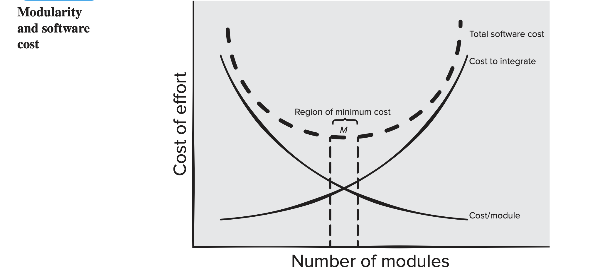

### Modular Decomposition Styles

**Functional decomposition (top-down):** The system is decomposed by function. A high-level function is broken into sub-functions, which are further broken into smaller sub-functions until each module performs a single, well-defined task. Example: An order processing system decomposed into modules for "Validate Order," "Calculate Total," "Process Payment," and "Generate Invoice."

**Object-oriented decomposition:** The system is decomposed into objects (classes) that encapsulate data and the operations on that data. Modules correspond to real-world entities. Example: An e-commerce system decomposed into objects like `Customer`, `Product`, `ShoppingCart`, `Order`, and `Payment`.

### Information Hiding

The principle of information hiding (proposed by David Parnas) states that modules should be designed so that internal details (algorithms, data structures, design decisions) are hidden from other modules. Only the module's interface (what it does, not how it does it) is visible to the outside.

- Effective modularity is achieved by defining independent modules that communicate only information necessary to achieve software function.
- Information hiding reduces error propagation. Inadvertent errors introduced during modification are less likely to spread to other parts of the software.
- It provides the greatest benefits during testing and maintenance, when modifications are frequent.

### Functional Independence

A module is functionally independent if it performs a single, well-defined function and interacts with other modules only through simple, well-defined interfaces. Functional independence is a direct outgrowth of separation of concerns, modularity, abstraction, and information hiding.

**Importance:**

- Independent modules are easier to develop (function is compartmentalized, interfaces are simplified).
- Independent modules are easier to test and maintain (secondary effects of modifications are limited, error propagation is reduced).
- Independent modules are more reusable.

Functional independence is assessed using two qualitative criteria: cohesion and coupling. The goal is high cohesion and low coupling.

### Cohesion

Cohesion measures how closely related and focused the responsibilities within a single module are. A cohesive module performs a single task, requiring little interaction with other modules. Types of cohesion (from worst to best):

**Coincidental cohesion** means that module parts are completely unrelated and grouped arbitrarily. This is the weakest form. Example: A "utility" module containing unrelated functions like `printReport()`, `calculateTax()`, and `validateEmail()` simply because they were written by the same developer.

**Logical cohesion** means that module parts perform logically similar functions but are otherwise unrelated. Example: A module that handles all input operations (keyboard, file, network) through a single function with a control flag.

**Temporal cohesion** means that module parts are grouped because they are executed at the same time (e.g., initialization, cleanup). Example: A `startup()` function that initializes the database connection, loads configuration, and sets the system clock.

**Procedural cohesion** means that module parts are grouped because they always execute in a specific sequence. Example: A module that reads a record, validates it, and writes it to a file. The steps are related only by sequence, not by function.

**Communicational cohesion** means that module parts operate on the same data or contribute to the same output. Example: A module that generates a report by reading customer data, calculating totals, and formatting the output. All operations share the same data.

**Sequential cohesion** means that the output of one part serves as the input for the next part. Example: A module where `parseInput()` produces data consumed by `validateData()`, whose output is consumed by `transformData()`.

**Functional cohesion** means that every element of the module is essential for the execution of a single, well-defined function. This is the strongest and most desirable form. Example: A `computeSquareRoot()` module that performs only the square root computation and returns the result.

Always strive for functional cohesion. Communicational and sequential cohesion are also acceptable. Avoid coincidental, logical, and temporal cohesion.

### Coupling

Coupling measures the degree of interdependence between modules. Low coupling means modules are relatively independent; high coupling means modules are heavily dependent on each other. Types of coupling (from worst to best):

**Content coupling** occurs when one module directly accesses or modifies the internal data or code of another module. This violates information hiding and is the most harmful form. Example: Module A directly modifies a local variable inside Module B.

**Common coupling** occurs when multiple modules share the same global data. A change to the global data structure can affect all modules that use it. Example: Several modules read and write a global configuration array.

**Control coupling** occurs when one module passes a control flag to another module that directs its internal logic. Example: Module A calls `processRecord(flag)` where the flag tells Module B whether to insert, update, or delete. Changes to Module B's logic may require changes to the flag's meaning in Module A.

**Stamp coupling** occurs when modules share a composite data structure (e.g., a struct or object) but each uses only part of it. The modules become dependent on the structure's format. Example: Passing an entire `Customer` object to a module that only needs the customer's email address.

**Data coupling** occurs when modules communicate only through simple parameters (primitive data types). Each parameter is an independent data item needed by the module. This is the most desirable form. Example: `calculateArea(length, width)` where only the required primitive values are passed.

Always strive for data coupling. Avoid content coupling and common coupling. Minimize control coupling by redesigning interfaces.

### Relationship Between Cohesion and Coupling

Cohesion and coupling are inversely related. Increasing cohesion within modules tends to decrease coupling between modules. A system with high cohesion and low coupling is easier to understand, test, maintain, and reuse. This is the hallmark of a well-designed modular system.

---

---

---

## 5. System Modeling

## 5.1 System Modeling

> **Why is system modeling important? [2 marks] (2068 Chaitra - IOE - Old Syllabus Relevant)**

### What Is System Modeling?

System modeling is the process of developing abstract representations (models) of a system. Each model presents a different view or perspective of that system, including its data, its functions, its behavior, or its structure. Models are typically expressed using a standardized graphical notation, most commonly the Unified Modeling Language (UML).

System models are used during requirements analysis to help understand the existing system and the requirements for the new system. They are also used during design to describe the system to engineers implementing it. Because models are abstractions, they deliberately omit detail. They are simpler than the reality they represent, allowing stakeholders to focus on specific aspects of the system without being overwhelmed by complexity.

### 5.1.1 Need for System Modeling

1. **Clarifies understanding.** Models force stakeholders and developers to think carefully about system requirements, exposing ambiguities, inconsistencies, and gaps that text descriptions alone may hide.
2. **Facilitates communication.** Graphical models serve as a common language between developers, customers, managers, and testers. A well-drawn diagram often conveys structure and flow more effectively than pages of text.
3. **Bridges requirements to design.** The requirements model establishes a foundation upon which architectural, interface, and component-level designs are built. It provides traceability from customer needs through design to implementation.
4. **Supports analysis and validation.** Models can be reviewed, checked against requirements, and validated before any code is written, catching errors when they are least expensive to fix.
5. **Documents the system.** Models serve as long-term documentation that supports maintenance and evolution of the software.

The requirements model must achieve three primary objectives:
(1) describe what the customer requires,
(2) establish a basis for creating the software design, and
(3) define a set of requirements that can be validated once the software is built.

### 5.1.2 Role of Abstractions in Managing Complexity

**Abstraction** is the fundamental mechanism used to manage complexity in system modeling. Complex real-world systems involve thousands of interacting elements such as users, devices, data, rules, and functions. Attempting to model everything simultaneously is impossible. Abstraction works by:

1. **Hiding unnecessary detail.** At each level of modeling, only the information relevant to that level's purpose is shown. For example, a context diagram hides internal processes; a class diagram hides algorithmic detail.
2. **Separating concerns.** Different models address different concerns: use cases capture functional interactions, class diagrams capture data structures, activity diagrams capture flow of control, and state diagrams capture behavior. No single model attempts to capture everything.
3. **Enabling hierarchical decomposition.** Complex systems are modeled top-down. A single high-level abstraction (e.g., "the entire system" in a context diagram) is progressively decomposed into finer-grained components. This allows engineers to manage each piece independently.
4. **Supporting multiple viewpoints.** Different stakeholders need different views of the same system. A customer needs a use-case view; an architect needs a structural view; a tester needs a behavioral view. Abstraction enables the creation of multiple complementary models, each targeted at a specific audience.

The five key principles of requirements modeling:

**Principle 1:** The information domain (data flowing in, out, and stored within the system) must be represented and understood.

**Principle 2:** The functions the software performs must be defined, including both user-visible functions and internal processing.

**Principle 3:** The software's behavior (as a consequence of external events) must be represented.

**Principle 4:** Models of information, function, and behavior must be partitioned hierarchically to uncover detail in a layered fashion.

**Principle 5:** The analysis should move from essential (problem-domain) information toward implementation detail.

---

## 5.2 Process Modeling Using DFD

> **Design Level-0 and Level-1 DFD for an Examination Management System. [5 marks] (2082 Bhadra - IOE - Old Syllabus Relevant)**
>
> **Draw Level-0 and Level-1 DFD of a Student Attendance Management System. [6 marks] (2082 Baishakh - IOE - Old Syllabus Relevant)**
>
> **Design Level-0 and Level-1 DFD for an Airline Ticketing System. [7 marks] (2081 Bhadra - IOE - Old Syllabus Relevant)**
>
> **Develop a Context diagram and Level-1 DFD for an online food ordering system. [3+5 marks] (2081 Baishakh - IOE - Old Syllabus Relevant)**
>
> **Draw Level-0 and Level-1 DFD for an online shopping system. [3+5 marks] (2079 Bhadra - IOE - Old Syllabus Relevant)**

### What Is a Data Flow Diagram (DFD)?

A Data Flow Diagram (DFD) is a graphical representation that models how data moves through a system. It shows the inputs, outputs, processes (transformations), and data stores involved in a system without prescribing implementation details. DFDs are a core technique of structured analysis and focus on what the system does with data, not how it does it.

### DFD Notation (Symbols)

There are two common notations. The Yourdon-DeMarco notation is most commonly used in academic settings:

A **Process** is represented as a circle (Yourdon-DeMarco) or a rounded rectangle (Gane-Sarson). A process transforms incoming data flows into outgoing data flows. Processes are named with verbs (e.g., "Validate Order," "Calculate Total").

A **Data Flow** is represented as a named arrow. It shows the direction and path of data movement between processes, data stores, and external entities. Data flows are named with nouns (e.g., "order details," "payment confirmation").

A **Data Store** is represented as two parallel horizontal lines (Yourdon-DeMarco) or an open-ended rectangle (Gane-Sarson). It represents data at rest, such as a file, a database table, or any repository where data is stored for later use. Data stores are named with nouns (e.g., "Customer Database," "Order File").

An **External Entity** is represented as a rectangle. It represents a source or destination of data that is outside the system boundary. External entities are people, organizations, devices, or other systems that interact with the system. They are named with nouns (e.g., "Customer," "Bank," "Sensor").

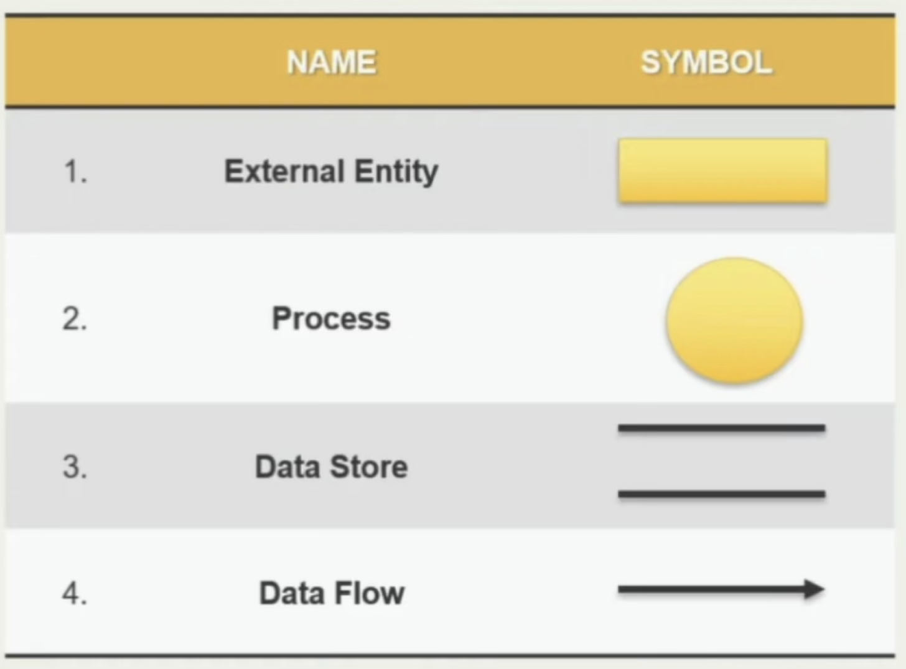

### Levels of DFD

DFDs are organized hierarchically into levels, each providing progressively more detail:

**Context Diagram (Level-0 DFD):** The highest-level view of the system. The entire system is represented as a single process (a single circle or rounded rectangle). External entities are shown around it, and data flows between the system and external entities are drawn as labeled arrows. No internal processes or data stores are shown. The context diagram establishes the system boundary, defining what is inside the system and what is outside.

**Level-1 DFD:** Decomposes the single process from the context diagram into its major sub-processes. Shows the main functional areas of the system, the data flows between them, the data stores used to hold information, and the interactions with external entities. Each sub-process in a Level-1 DFD can be further decomposed into a Level-2 DFD, and so on, until each process represents a single, simple, atomic function.

**Level-2+ DFDs:** Further decompose individual processes from Level-1 into more granular detail. They are not always necessary. Decomposition stops when each process is simple enough to be described in a short process specification (minispec).

### Rules for Drawing DFDs

- Every process must have at least one input data flow and at least one output data flow (no "black holes" or "miracles").
- Data cannot flow directly between two external entities. It must pass through at least one process.
- Data cannot flow directly between two data stores. It must pass through at least one process.
- Data cannot flow directly from an external entity to a data store (or vice versa). It must pass through a process.
- Each process, data flow, data store, and external entity must be named.
- All data flows entering/leaving a parent process must also appear in its child (decomposed) diagram. The parent and child diagrams must be consistent.

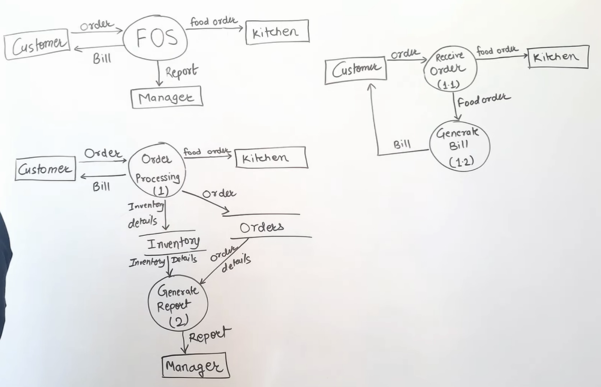


---

## 5.3 Scenario-Based Analysis

> **Prepare a use case diagram for an event management system. [4 marks] (2082 Bhadra - IOE - Old Syllabus Relevant)**
>
> **Draw a use case diagram for an online food ordering system. [5 marks] (2082 Baishakh - IOE - Old Syllabus Relevant)**
>
> **Draw a use case diagram for an online appointment booking app. [5 marks] (2081 Bhadra - IOE - Old Syllabus Relevant)**
>
> **Prepare use case diagrams for an automated ticket issuing system. [5 marks] (2081 Baishakh - IOE - Old Syllabus Relevant)**
>
> **Draw a use case diagram illustrating interactions between a doctor, patients, and prescriptions. [5 marks] (2078 Bhadra - IOE - Old Syllabus Relevant)**

### 5.3.1 Concept of Scenarios

A scenario is a specific sequence of actions and interactions between an actor and a system that accomplishes a particular goal. Scenarios describe the system from the user's point of view and answer the question: "How will the system be used?"

Scenarios are the foundation of scenario-based modeling. The primary tool for capturing scenarios is the use case. A use case describes a specific usage scenario, serving as a "contract for behavior," in straightforward language from the perspective of a defined actor. Use cases are often the first part of the requirements model to be developed because they directly capture user expectations.

Scenarios serve multiple purposes: they help stakeholders validate that the system will meet their needs, they provide developers with clear functional expectations, they drive the identification of classes and objects, and they form the basis for test case development.

### 5.3.2 Use-Case Descriptions and Diagrams

Covered in 3.4

---

## 5.4 Behavioral and Structural Modeling

### 5.4.1 Activity Diagrams

A UML activity diagram models the flow of control or data from one activity to another within a system or a specific use case. It is similar to a flowchart but with support for parallel (concurrent) behavior. Activity diagrams are particularly useful for modeling complex processing logic, workflows, and business processes.

| 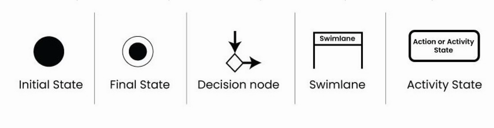 |
| ---------------------------------------------------------------------------------- |
| 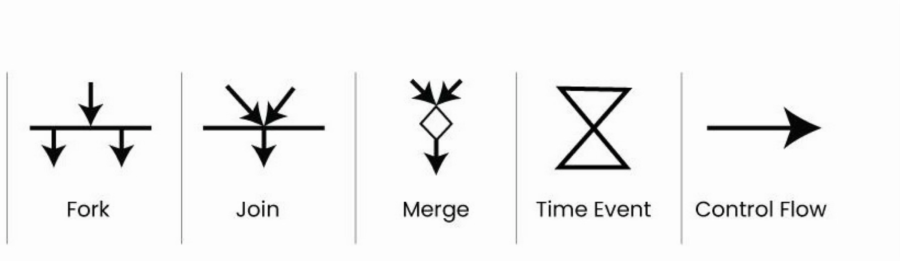 |

#### Elements of an Activity Diagram

The **initial node** is a filled black circle. It represents the starting point of the activity flow. Every activity diagram has exactly one initial node.

An **activity (action) node** is a rounded rectangle containing the name of the activity or action. It represents a single step in the process and is named with a verb phrase (e.g., "Validate Password," "Send Notification").

A **flow (edge)** is an arrow connecting activity nodes. It shows the sequence in which activities are performed. Control flows from one activity to the next along the arrow.

A **decision node** is a diamond with one incoming flow and two or more outgoing flows. Each outgoing flow has a guard condition (written in square brackets, e.g., [password valid], [password invalid]) that determines which path the control follows. Exactly one guard condition must be true at any decision point.

A **merge node** is a diamond with two or more incoming flows and one outgoing flow. It brings together alternative paths that were separated by a previous decision node. It does not synchronize and simply passes through whatever flow arrives.

A **fork node** is a thick horizontal (or vertical) bar with one incoming flow and multiple outgoing flows. It splits the control flow into two or more concurrent (parallel) activities that execute simultaneously.

A **join node** is a thick horizontal (or vertical) bar with multiple incoming flows and one outgoing flow. It synchronizes concurrent activities. The outgoing flow is not triggered until all incoming parallel flows have completed.

The **final node** is a filled black circle inside a hollow circle (bullseye). It represents the end of the activity flow.

**Process Order - Acitvity Diagram**

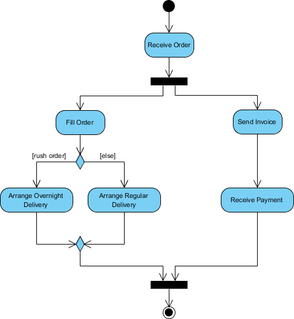

**Activity Diagram for Emotion based music player**

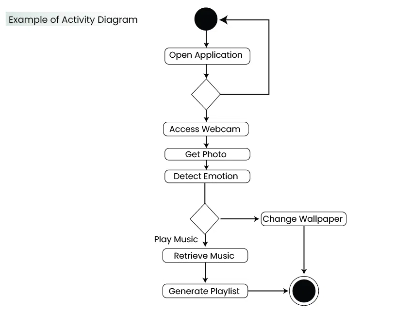

### Swimlane Diagrams (Activity Partitions)

A **swimlane diagram** is a variation of the activity diagram that partitions activities by the entity (actor, department, class, or system component) responsible for performing them. The diagram is divided into vertical (or horizontal) bands called swimlanes, each labeled with the responsible entity. Activities are placed in the swimlane of the entity that performs them. Arrows crossing swimlane boundaries indicate handoffs between entities.

Swimlane diagrams answer the question "who does what?" and are especially useful for modeling business processes involving multiple actors or departments.

**Purchasing an Product from Ecommerce**

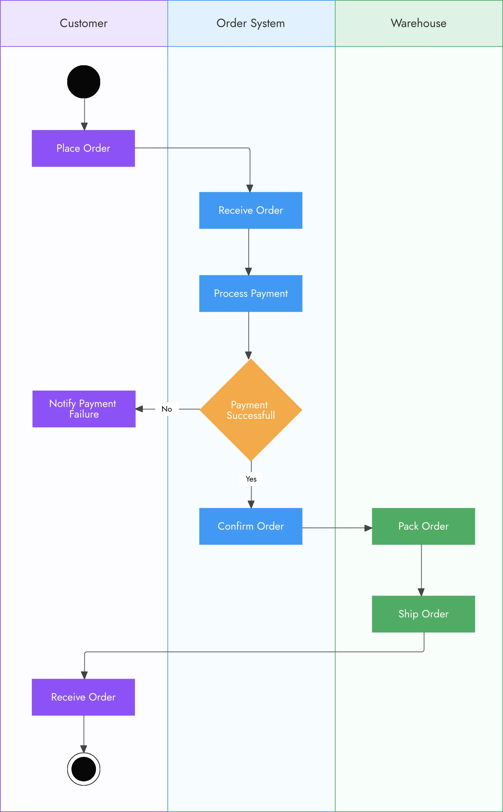

### 5.4.2 Class-Based Modeling

Class-based modeling represents the objects (things) that the system will manipulate, the attributes (data) that describe those objects, the operations (behaviors) that can be applied to those objects, and the relationships between objects.

#### Identifying Analysis Classes

The primary technique for identifying classes is the grammatical parse, which involves examining use cases or processing narratives and extracting nouns and noun phrases as candidate classes. The process:

1. Underline every noun and noun phrase in the use case or processing narrative.
2. List all nouns as potential classes.
3. Eliminate duplicates, synonyms, and nouns that are clearly attributes rather than classes.
4. Apply selection criteria to determine which potential classes should be included in the model.

**Selection criteria for classes** (Coad and Yourdon):

- **Retained information:** The system must remember information about the class for it to function.
- **Needed services:** The class must have identifiable operations that change the values of its attributes.
- **Multiple attributes:** A class with only a single attribute is probably better represented as an attribute of another class.
- **Common attributes:** A set of attributes can be defined that apply to all instances of the class.
- **Common operations:** A set of operations can be defined that apply to all instances of the class.
- **Essential requirements:** External entities that produce or consume information essential to the system should almost always be defined as classes.

**Categories of analysis classes:** External entities (other systems, devices, people), Things (reports, displays, signals), Occurrences/events (OrderPlaced or BookIssued), Roles (Student or Librarian), Organizational units (departments, teams, branches), Places (warehouses or classrooms), Structures (sensors, vehicles, buildings).

#### Attributes and Operations

**Attributes** describe the properties of a class. They are the data items that define the class in the context of the problem. Attributes are identified by asking: "What data items fully define this class?" For example, a `Sensor` class might have attributes: `sensorID`, `sensorType`, `location`, `status`.

**Operations** define the behavior of a class. They are the actions that can be performed on or by instances of the class. Operations are identified by extracting verbs from use cases and processing narratives. Operations generally fall into four categories: (1) data manipulation (add, delete, format, select), (2) computation, (3) state inquiry, and (4) event monitoring.

| MyClass                                                          |
| ---------------------------------------------------------------- |
| -attribute1: int<br>-attribute2: float<br>#attribute3: Circle    |
| +operation1(a : bool, b: int): String<br>+operation2(): Circle\* |

#### UML Class Diagrams

A UML class diagram shows classes, their attributes and operations, and the relationships between classes. Each class is represented as a rectangle divided into three compartments:

- The **top compartment** contains the class name (capitalized, e.g., `Customer`).
- The **middle compartment** contains the attributes (e.g., `-customerID: int`, `+name: String`, `-email: String`).
- The **bottom compartment** contains the operations (e.g., `+placeOrder()`, `+getProfile()`, `+updateAddress()`).

#### Relationships Between Classes

**Association** is the most general relationship. It is a structural connection between two classes indicating they collaborate or hold references to each other. It is drawn as a solid line between classes and can be labeled with a role name and multiplicity (e.g., `1`, `0..1`, `1..*`, `0..*`).

```java
class Student {
    void enrollIn(Course course) { } // Student uses Course
}
```

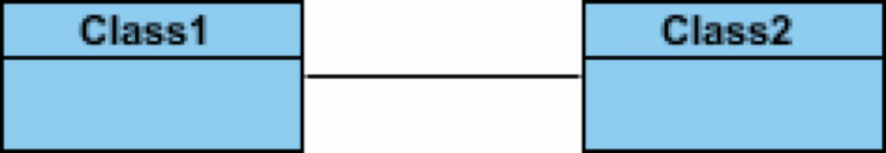

**Aggregation** is a "whole-part" relationship where the part can exist independently of the whole. It is drawn as a solid line with a hollow diamond at the "whole" end. Example: A `Department` has `Employees`, but employees can exist without the department.

```java
class Department {
    List<Employee> employees; // Department has employees
}
```

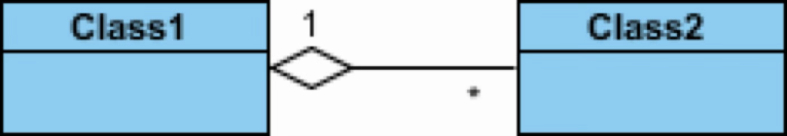

**Composition** is a stronger form of aggregation where the part cannot exist without the whole. If the whole is destroyed, its parts are also destroyed. It is drawn as a solid line with a filled (solid) diamond at the "whole" end. Example: A `House` is composed of `Rooms`. If the house is demolished, the rooms cease to exist.

```java
class House {
    private Room room = new Room(); // Room cannot exist without House
}
```

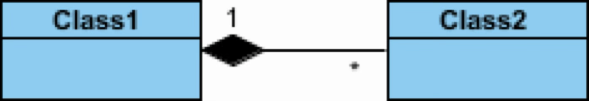

**Generalization (Inheritance)** is an "is-a" relationship where a subclass inherits attributes and operations from a superclass. The subclass is a specialized version of the superclass. It is drawn as a solid line with an unfilled (hollow) triangular arrowhead pointing from subclass to superclass. Example: `SavingsAccount` and `CheckingAccount` are subclasses of `BankAccount`.

```java
class Animal { }
class Dog extends Animal { } // Dog is an Animal
```

**Generalization (Inheritance)**

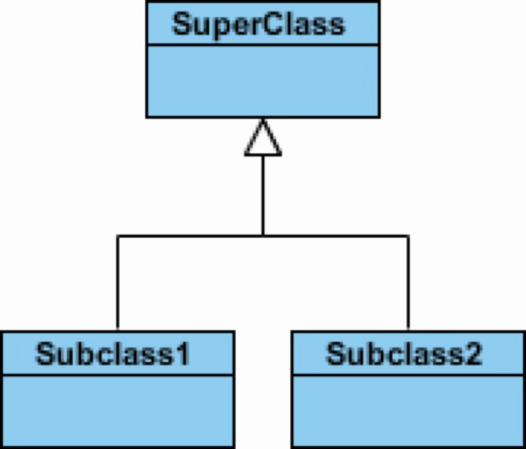

**Dependency** is a weaker relationship where one class depends on another (e.g., uses it as a parameter in an operation). It is drawn as a dashed arrow from the dependent class to the class it depends on.

```java
class OrderProcessor {
    void process(Order order) {
        PaymentGateway gateway = new PaymentGateway(); // Temporary dependency
        gateway.charge(order.getAmount());
    }
}
```

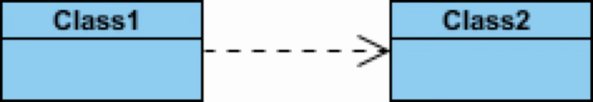

#### Multiplicity

Multiplicity specifies how many instances of one class can be associated with a single instance of another class:

- `1` means exactly one.
- `0..1` means zero or one (optional).
- `1..*` means one or more (at least one).
- `0..*` or `*` means zero or more (any number).

Example: A `Customer` places `0..*` Orders (a customer may have no orders or many orders). Each `Order` belongs to exactly `1` Customer.

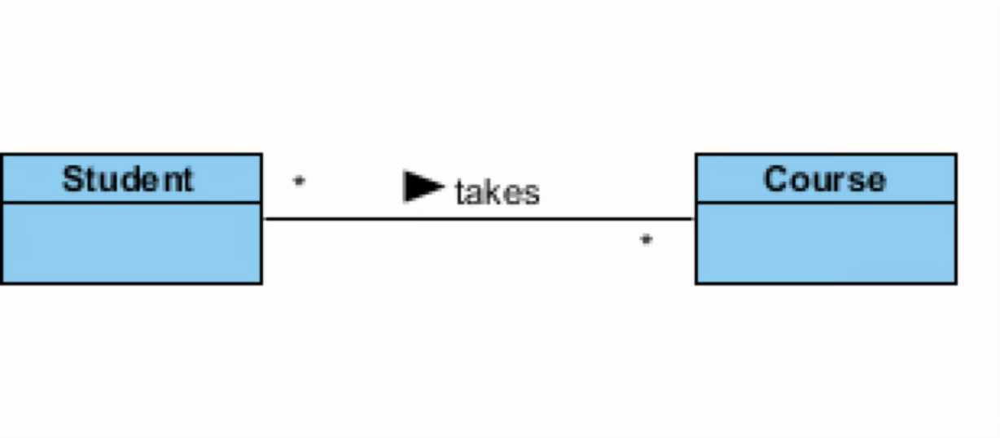

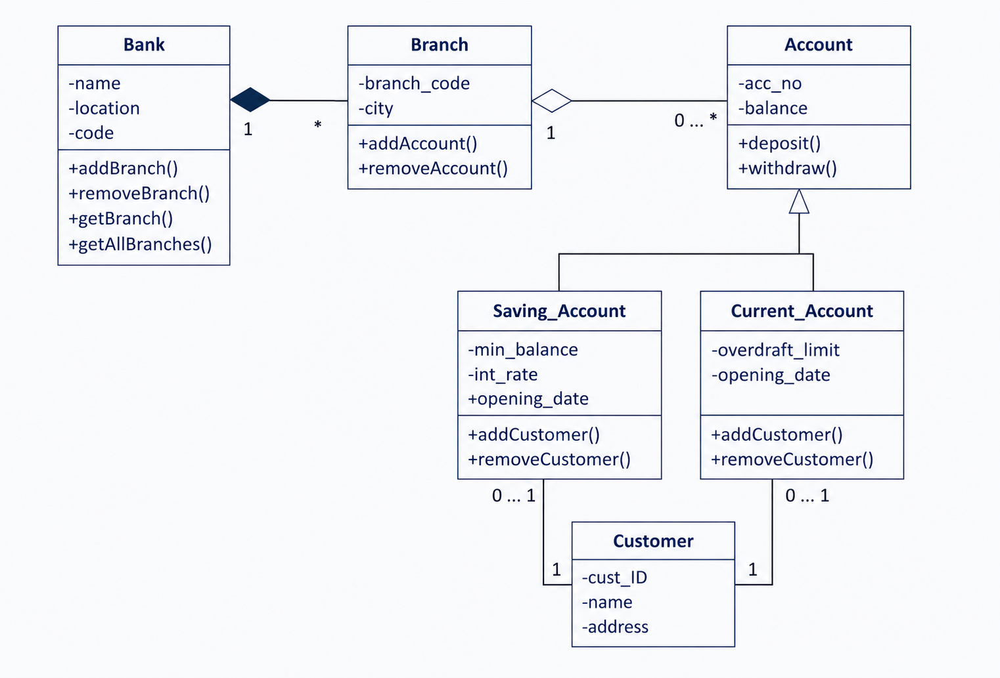

#### Class-Responsibility-Collaborator (CRC) Modeling

CRC modeling is a simple technique for identifying and organizing classes. Each class is represented on an index card with three sections:

- **Class name** (top)
- **Responsibilities** (left side) list the attributes the class maintains and the operations it performs.
- **Collaborators** (right side) list other classes that provide information or actions needed to fulfill a responsibility.

CRC cards are useful for brainstorming classes and for role-playing reviews. In a role-playing review, a group of reviewers each holds cards for different classes and walks through use cases to verify that all responsibilities are assigned and all collaborations work correctly.

**Example: CRC (Class-Responsibility-Collaborator) design for Online E-Commerce Shopping System**

<table>
  <tr>
    <th colspan="2">Class: Customer</th>
  </tr>
  <tr>
    <td colspan="2">
      Represents a registered user who navigates the store, alters profiles, and purchases goods.
    </td>
  </tr>
  <tr>
    <th>Responsibility</th>
    <th>Collaborator</th>
  </tr>
  <tr>
    <td>Maintains contact info, shipping, and billing addresses</td>
    <td></td>
  </tr>
  <tr>
    <td>Reviews previous transaction logs and receipts</td>
    <td>Order</td>
  </tr>
    <tr>
    <td>Initiates the checkout sequence</td>
    <td>ShoppingCart, Order</td>
  </tr>
</table>

<table>
  <tr>
    <th colspan="2">Class: ShoppingCart</th>
  </tr>
  <tr>
    <td colspan="2">
      Manages the temporary list of items selected by a customer for potential purchase.
    </td>
  </tr>
  <tr>
    <th>Responsibility</th>
    <th>Collaborator</th>
  </tr>
  <tr>
    <td>Adds a product and tracking its quantity</td>
    <td>Product</td>
  </tr>
  <tr>
    <td>Removes a product from the current selection</td>
    <td>Product</td>
  </tr>
  <tr>
    <td>Calculates the subtotal cost of all items inside</td>
    <td>Product</td>
  </tr>
  <tr>
    <td>Empties all contents after a successful checkout</td>
    <td>Order</td>
  </tr>
</table>

<table>
  <tr>
    <th colspan="2">Class: Order</th>
  </tr>
  <tr>
    <td colspan="2">
      Represents a finalized purchase transaction and tracks its fulfillment status.
    </td>
  </tr>
  <tr>
    <th>Responsibility</th>
    <th>Collaborator</th>
  </tr>
  <tr>
    <td>Compiles final purchase items from the cart</td>
    <td>ShoppingCart</td>
  </tr>
  <tr>
    <td>Authorizes and completes financial transaction</td>
    <td>PaymentGateway</td>
  </tr>
  <tr>
    <td>Requests reduction of available warehouse stock</td>
    <td>Product</td>
  </tr>
  <tr>
    <td>Records the delivery location and buyer profile</td>
    <td>Customer</td>
  </tr>
</table>

<table>
  <tr>
    <th colspan="2">Class: Product</th>
  </tr>
  <tr>
    <td colspan="2">
      Defines a specific item available for sale, including its core details and pricing.
    </td>
  </tr>
  <tr>
    <th>Responsibility</th>
    <th>Collaborator</th>
  </tr>
  <tr>
    <td>Supplies retail price, name, and description</td>
    <td></td>
  </tr>
  <tr>
    <td>Verifies if requested quantities are in stock</td>
    <td></td>
  </tr>
  <tr>
    <td>Updates internal inventory counts after order changes</td>
    <td></td>
  </tr>
</table>

### Class collaboration diagram

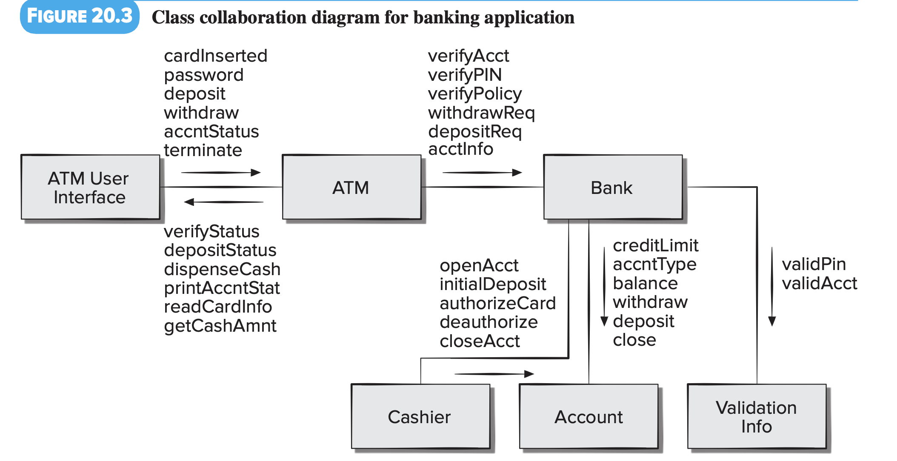

---

---

---

## 6. Coding and Testing

## 6.1 Coding Standards and Guidelines

**Coding standards** are a set of rules and conventions that a development team agrees to follow when writing source code. They govern how code is structured, named, formatted, and documented. The purpose is to produce code that is consistent, readable, maintainable, and less error-prone across the entire team.

### Importance of coding standards:

- **Readability:** Consistent code is easier for any team member to read and understand, not just the original author.
- **Maintainability:** Since 60–80% of total software effort is spent on maintenance, code that follows uniform conventions is significantly cheaper to modify and extend.
- **Reduced errors:** Standards enforce practices (e.g., proper initialization, boundary checking) that prevent common coding mistakes.
- **Easier code reviews:** Reviewers can focus on logic and correctness rather than style inconsistencies.
- **Onboarding:** New team members can understand the codebase faster when it follows predictable conventions.

### Areas of coding standards:

**Naming conventions:** Variable, function, class, and constant names should be meaningful and follow a consistent scheme. Common conventions include: `camelCase` for variables and functions (e.g., `totalPrice`, `calculateTax()`), `PascalCase` for classes (e.g., `OrderManager`, `CustomerAccount`), and `UPPER_SNAKE_CASE` for constants (e.g., `MAX_RETRIES`, `DEFAULT_TIMEOUT`). Names should be descriptive enough to convey purpose without requiring additional comments.

**Indentation and formatting:** A consistent number of spaces (typically 2 or 4) or tabs should be used for indentation. Line length should be limited (commonly 80–120 characters). Braces, parentheses, and whitespace around operators should follow a single, agreed-upon style. Consistent formatting makes the control structure of code visually apparent.

**Commenting and documentation:** Comments should explain why something is done, not what is done (the code itself should be clear enough for the "what"). Every module or file should have a header comment describing its purpose, author, and date. Complex algorithms should be annotated. Over-commenting (restating obvious code) should be avoided as it clutters the codebase.

**Code organization:** Related functions should be grouped logically. Files and directories should follow a consistent project structure. Dead code (unused functions, commented-out blocks) should be removed.

**Error handling:** All functions should handle error conditions explicitly. Return values should be checked. Exception handling should follow a defined pattern across the project.

**Coding guidelines vs. coding standards:** Standards are strict rules that must be followed (e.g., "all class names must use PascalCase"). Guidelines are recommended best practices that allow some flexibility (e.g., "prefer composition over inheritance where possible"). Both contribute to code quality, but standards are mandatory and enforceable, while guidelines are advisory.

---

## 6.2 Code Review

> **What is a software inspection process? [4 marks] (2082 Bhadra - IOE - Old Syllabus Relevant)**
>
> **What are the faults that can be uncovered by software inspection? [2 marks] (2082 Baishakh - IOE - Old Syllabus Relevant)**
>
> **Why are program inspections an effective technique for discovering errors? [5 marks] (2068 Chaitra - IOE - Old Syllabus Relevant)**
>
> **What types of errors are unlikely to be discovered through inspections? [5 marks] (2068 Chaitra - IOE - Old Syllabus Relevant)**

**Code review** is the systematic examination of source code by peers to find errors, improve quality, and share knowledge. It is a form of static testing because code is analyzed without being executed. Reviews are one of the most effective techniques for early defect detection. Industry studies show that review techniques can be up to 75% effective in uncovering design flaws.

**Importantance of Code review:**

- An error found during review costs far less to fix than one found during testing or after deployment. A requirements error found during review may cost about 6 person-hours to fix, while the same error found during testing costs an average of 45 person-hours.
- Reviews catch defects that testing often misses, such as logic errors, poor algorithmic efficiency, security vulnerabilities, and violations of standards.
- Reviews don't just find bugs; they also improve team knowledge, enforce coding standards, and promote consistency across the codebase.

**Defect amplification:** An error introduced early in the software process (e.g., during requirements) and left undetected can amplify into multiple errors during design, and those can further amplify during coding. A single uncorrected requirements error can cascade into dozens of coding errors. Reviews at each stage break this amplification chain.

### 6.2.1 Code Walkthrough

**Code walkthrough** is an informal, author-led peer review in which the developer guides a small group of colleagues through the code, explaining the logic and design decisions.

**Process:**

- The author organizes the session and presents the code.
- Participants (typically 2–5 peers) listen, ask questions, and offer suggestions.
- The author "walks" the reviewers through the code line-by-line or function-by-function.
- Discussion is relatively free-form and collaborative.
- Notes may be taken informally, but there is no formal follow-up process.

**Characteristics:**

- Low formality: minimal advance preparation is required from reviewers.
- Author-driven: the author controls the pace and focus of the session.
- Best used for knowledge sharing, brainstorming, and getting quick feedback.
- Effective at catching high-level design problems and sharing context among team members.
- Less effective at finding subtle defects compared to formal inspections, because reviewers have not studied the code in advance.

### 6.2.2 Code Inspection

**Code inspection** (also called a Fagan inspection, after Michael Fagan who formalized the process at IBM in 1976) is a highly formal, structured peer review process specifically designed for systematic defect detection.

**Process (distinct phases):**

1. **Planning:** The inspection leader selects the review team (typically 3–5 people), distributes materials, and sets the schedule.
2. **Overview (optional):** The author provides background on the work product for the reviewers.
3. **Preparation:** Each reviewer independently examines the code using predefined checklists, noting potential defects. This typically requires 1–2 hours per reviewer.
4. **Inspection meeting:** A trained moderator (not the author) leads the meeting. A designated reader (not the author) walks through the code. A recorder logs every defect found. The author answers questions but does not lead. The meeting is time-limited (typically under 2 hours).
5. **Rework:** The author corrects all identified defects.
6. **Follow-up:** The moderator verifies that all defects have been properly corrected.

**Characteristics:**

- High formality: defined roles (moderator, reader, recorder, author), checklists, metrics.
- Not author-driven: the moderator controls the process, and a reader (not the author) presents the code.
- Focused on defect detection, not problem solving. Solutions are not discussed during the inspection meeting.
- Produces formal records: an issues list and a summary report.
- The review team decides whether to:
  (1) accept the work product without modification,
  (2) accept provisionally with minor corrections (no re-inspection needed), or
  (3) reject due to severe errors (re-inspection required after corrections).

**Faults uncovered by inspection:** Logic errors, incorrect or missing functionality, violations of coding standards, data type mismatches, incorrect variable initialization, boundary condition errors, unreachable code, incorrect interface usage, and security vulnerabilities.

**Errors unlikely to be discovered through inspection:** Performance bottlenecks under real load, timing and concurrency issues, hardware-dependent failures, usability problems, and errors that only manifest through complex multi-module interactions during execution.

**Formal Technical Reviews (FTR) guidelines:**

- Review the product, not the producer. The tone should be constructive, not adversarial.
- Set an agenda and maintain it. Avoid drift.
- Limit debate and rebuttal. Record issues for offline discussion.
- Enunciate problem areas, but don't attempt to solve problems during the meeting.
- Limit the number of participants and insist on advance preparation.
- Develop checklists for each type of work product.
- Allocate dedicated resources and schedule time for reviews.

### 6.2.3 Cleanroom Technique

**Cleanroom software engineering** technique is a rigorous development methodology that emphasizes defect prevention rather than defect removal. It was developed by Harlan Mills at IBM and draws its name from hardware cleanroom manufacturing, where contamination is prevented rather than cleaned up afterward.

### Principles:

- **No unit testing by developers.** Developers never compile or execute their own code for debugging purposes. The rationale is that reliance on testing encourages sloppy coding; removing the "safety net" of debugging forces developers to think more carefully.
- **Formal verification.** Instead of testing, developers use mathematical correctness verification (also called functional verification) to demonstrate that the code is consistent with its specification. Each code segment is verified by the developer through logical reasoning.
- **Incremental development.** Software is developed in small increments. Each increment is formally specified, designed, verified, and then passed directly to an independent testing team.
- **Statistical usage testing.** An independent testing team (separate from developers) tests each increment using statistical usage testing, where test cases are generated based on the expected usage profile of the software. This tests the software the way real users would use it, giving a statistically valid measure of reliability.
- **Statistical quality certification.** The results of usage testing are fed into reliability models to compute a mean time to failure (MTTF) for the software. If the computed reliability meets the specified target, the increment is certified. If not, it is returned to the developers for correction.

| Traditional Approach                                                                | Cleanroom Approach                                                                            |
| ----------------------------------------------------------------------------------- | --------------------------------------------------------------------------------------------- |
| Development begins with coding, followed by testing, debugging, and fixing defects. | Development begins with formal specification, verification, and certification before release. |
| Testing is primarily used to find and remove defects.                               | Verification is used to prevent defects from being introduced.                                |
| Developers are responsible for testing their own code.                              | An independent certification team performs testing and evaluation.                            |
| Reliability is often unknown until the later stages of development.                 | Reliability is measured and certified for each software increment.                            |

---

## 6.3 Software Testing Fundamentals

**Software testing** is the process of executing a program with the intent of finding errors. A good test is one that has a high probability of discovering an as-yet-undiscovered error. Testing cannot prove the absence of defects; it can only demonstrate their presence. Exhaustive testing (testing every possible input and path) is practically impossible for any non-trivial program.

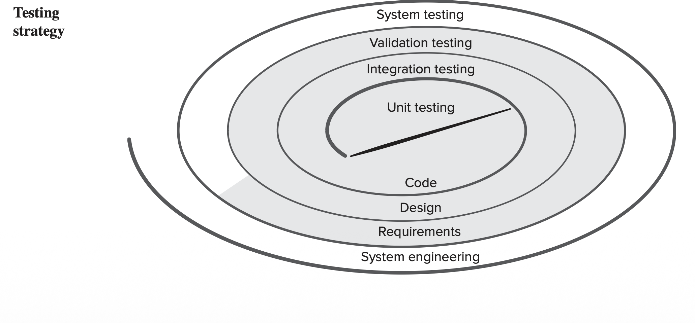

### 6.3.1 Verification and Validation

> **Differentiate between verification and validation. [3 marks] (2082 Baishakh - IOE - Old Syllabus Relevant)**
>
> **Why is verification and validation planning necessary? [2 marks] (2075 Chaitra - IOE - Old Syllabus Relevant)**

<br>

**Verification** and **validation** (V&V) are two complementary activities that ensure software quality.

**Verification:** "Are we building the product right?" Verification checks that the software correctly implements a specific function or specification. It ensures that the output of each development phase conforms to the input specification for that phase. Verification activities include technical reviews, inspections, walkthroughs, and analysis of design models.

**Validation:** "Are we building the right product?" Validation checks that the software meets the customer's actual needs and requirements. It ensures the final product is traceable to customer expectations. Validation activities include acceptance testing, usability testing, and customer demonstrations.

**Importance of V&V planning:**

- It defines what will be tested, when, and by whom, preventing ad hoc and incomplete testing.
- It ensures that testing resources are allocated proportionally to risk.
- It establishes success criteria and exit criteria for each testing phase.
- It provides traceability from requirements through test cases, ensuring no requirement goes untested.

### 6.3.2 Unit Testing

> **Explain unit testing. [2 marks] (2078 Kartik - IOE - Old Syllabus Relevant)**
>
> **Why is unit testing alone not enough for verifying a complex system? [4 marks] (2070 Ashad - IOE - Old Syllabus Relevant)**

**Unit testing** focuses on the smallest testable unit of software, typically an individual function, method, or component. The goal is to verify that each unit performs its intended function correctly in isolation.

### What is tested during unit testing:

- **Interface:** Data flows correctly into and out of the unit (correct parameter types, order, and count).
- **Local data structures:** Variables maintain integrity throughout all steps of the algorithm.
- **Independent paths:** All execution paths through the control structure are exercised at least once.
- **Boundary conditions:** The unit operates correctly at the limits of input/output values (minimum, maximum, edge cases).
- **Error-handling paths:** Error conditions are handled properly and produce appropriate error messages.

### 6.3.2 Unit Testing

**Scaffolding:** Because a unit is not a standalone program, testing it requires supporting code:

- A **driver** is a "main program" that calls the unit under test, passes it test data, and collects results. It simulates the part of the system that invokes the unit.
- A **stub** (or "dummy subprogram") replaces a module that the unit under test calls. It uses the correct interface, performs minimal processing, and returns control to the unit being tested.

**Why unit testing alone is not sufficient:** Unit testing verifies individual components in isolation but cannot detect interface errors between components, integration problems, system-level performance issues, or defects that arise from the interaction of multiple units working together.

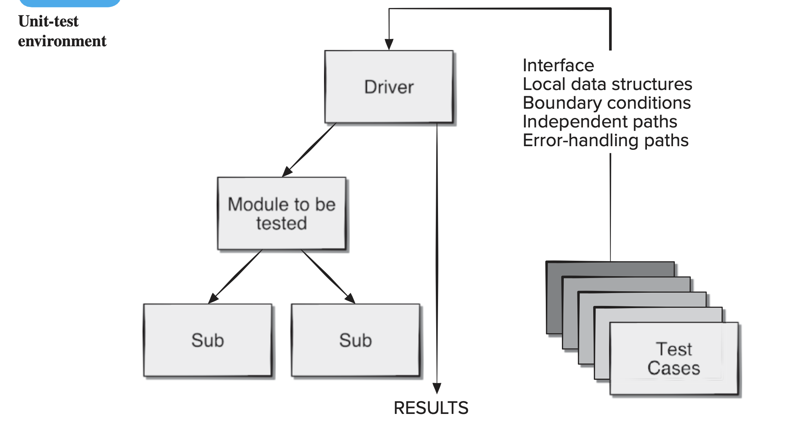

### 6.3.3 Integration Testing

> **Explain integration testing. [2 marks] (2078 Kartik - IOE - Old Syllabus Relevant)**
>
> **Write about stub and driver testing. [3 marks] (2075 Chaitra - IOE - Old Syllabus Relevant)**

**Integration testing** is the systematic process of combining unit-tested components and testing them as a group. The focus is on detecting errors in the interfaces and interactions between components.

### Importance:

Even if every individual unit works correctly in isolation, combining them can produce errors. Data may be lost across interfaces, one component may have unintended side effects on another, combined sub-functions may not produce the desired major function, and individually acceptable imprecisions may accumulate to unacceptable levels.

**Approaches to integration:**

**Big bang integration:** All components are combined at once and the system is tested as a whole. This approach is discouraged because when errors are found, it is very difficult to isolate their cause within the vast expanse of the entire program.

**Top-down integration:** Integration starts with the main control module. Subordinate modules are added one at a time (either depth-first or breadth-first). Stubs are used to replace modules that have not yet been integrated.
Advantage: major control and decision points are tested early.
Disadvantage: stubs may need to be complex.

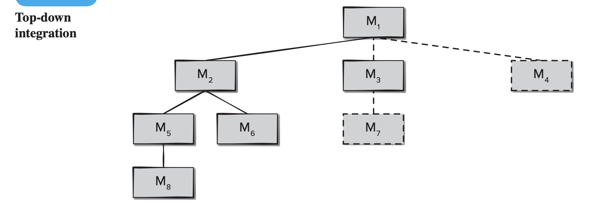

**Bottom-up integration:** Integration begins with the lowest-level (atomic) modules, which are combined into clusters. Drivers are used to coordinate testing of each cluster. As integration progresses upward, drivers are removed and clusters are combined. Advantage: eliminates the need for complex stubs. Disadvantage: the complete system is not visible until the last module is added.

**Continuous integration:** Components are merged into the evolving software build one or more times per day. Each integration triggers automated tests. This is the standard practice in agile and DevOps environments. A variant called smoke testing involves rebuilding and testing the software daily to ensure the build is stable enough for further testing.

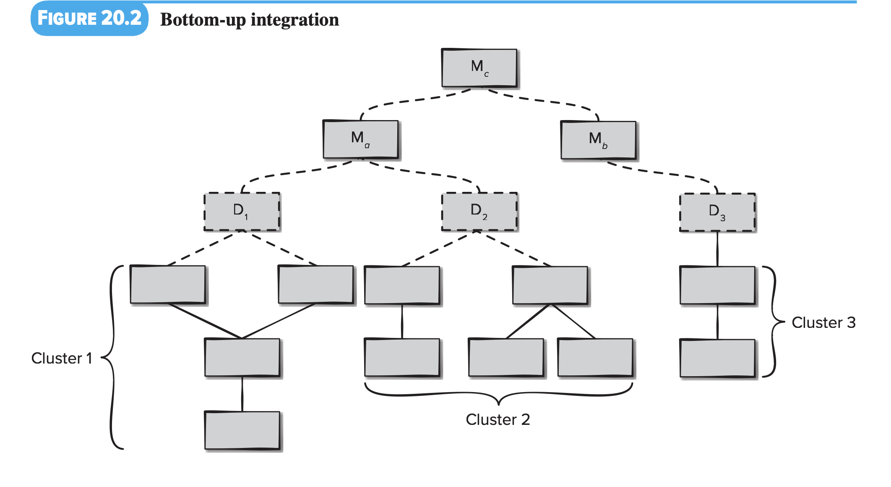

**Regression testing:** After each integration of a new component, a subset of previously passed tests is re-executed to ensure the new addition has not broken existing functionality. The regression test suite contains: (1) tests that exercise all software functions, (2) tests focusing on functions likely affected by the change, and (3) tests targeting the changed components.

**Stubs and drivers in integration testing:**

Stubs are used in top-down integration to simulate lower-level modules not yet integrated. Drivers are used in bottom-up integration to simulate higher-level modules. Both represent testing overhead as they must be written but are not delivered with the final product.

### 6.3.4 System Testing

> **Explain system testing. [2 marks] (2078 Kartik - IOE - Old Syllabus Relevant)**
>
> **Differentiate between system testing and integration testing. [2 marks] (2081 Baishakh - IOE - Old Syllabus Relevant)**

**System testing** tests the fully integrated software system as a whole within the context of the broader computer-based system. It verifies that the software meets all functional, behavioral, and performance requirements when combined with other system elements such as hardware, databases, networks, and people.

### Types of system testing:

- **Recovery testing:** Forces the system to fail and verifies that recovery is properly performed (e.g., automatic restart, data integrity after crash).
- **Security testing:** Attempts to breach the system's protection mechanisms to verify that the system is resistant to unauthorized access.
- **Stress testing:** Pushes the system beyond its normal operating limits to determine how it degrades and at what point it fails.
- **Performance testing:** Tests run-time performance (response time, throughput, resource utilization) under expected and peak conditions.

**Difference between system testing and integration testing:**

Integration testing focuses on verifying the interfaces and interactions between combined software components. System testing focuses on validating the entire system (software + hardware + environment) against the original system requirements and specifications.

### 6.3.5 Acceptance Testing

> **Differentiate between alpha testing and beta testing. [2 marks] (2081 Bhadra - IOE - Old Syllabus Relevant)**

**Acceptance testing** is conducted by the end users (or customer) to determine whether the software meets their business requirements and is ready for deployment. It is the final testing phase before the software is released.

### Types of acceptance testing:

**Alpha testing:** Conducted at the developer's site by end users. The developer observes and records errors and usage problems. The environment is controlled by the developer.

**Beta testing:** Conducted at the end user's site in a real-world environment. The developer is generally not present. Users record problems and report them to the developer. Beta testing is a "live" test of the software by real users in their actual working conditions.

| Alpha Testing                                                                | Beta Testing                                                                       |
| ---------------------------------------------------------------------------- | ---------------------------------------------------------------------------------- |
| Alpha testing is conducted at the developer's site.                          | Beta testing is conducted at the user's site.                                      |
| Alpha testing is performed by end users under the observation of developers. | Beta testing is performed by end users without direct observation from developers. |
| Alpha testing takes place in a controlled environment.                       | Beta testing takes place in a real world, uncontrolled environment.                |
| Alpha testing aims to identify and fix errors before beta testing begins.    | Beta testing aims to identify remaining issues before the final software release.  |

---

## 6.4 Black-Box and White-Box Testing Approach

> **Differentiate between black-box testing and white-box testing. [5 marks] (2076 Chaitra - IOE - Old Syllabus Relevant)**
>
> **Are both black-box and white-box testing necessary, or is just one sufficient? Justify. [3 marks] (2079 Bhadra - IOE - Old Syllabus Relevant)**
>
> **What is equivalence partitioning? Explain with an example. [5 marks] (2070 Ashad - IOE - Old Syllabus Relevant)**

These are two fundamental and complementary philosophies for designing test cases. Both are necessary; neither alone is sufficient.

**White-box testing** (also called glass-box testing or structural testing) designs test cases based on knowledge of the internal structure, logic, and code of the software. The tester examines the source code and designs tests to exercise specific paths, conditions, and loops.

Ensure that all internal operations are performed according to specifications and that all internal code paths have been exercised.

**What white-box testing guarantees:**

- All independent paths within a module are exercised at least once.
- All logical decisions are exercised on their true and false sides.
- All loops are executed at their boundaries and within their operational bounds.
- Internal data structures are exercised to ensure their validity.

**A. Basis path testing:** A technique proposed by Tom McCabe that uses cyclomatic complexity to determine the number of independent paths through a program. This defines the minimum number of test cases needed to ensure every statement is executed at least once.

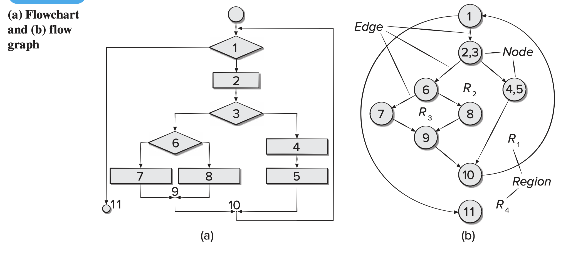

**Cyclomatic complexity V(G)** is computed in three ways:

1. V(G) = Number of regions in the flow graph.
2. V(G) = E − N + 2, where E = number of edges and N = number of nodes.
3. V(G) = P + 1, where P = number of predicate (decision) nodes.

The value of V(G) gives an upper bound on the number of independent paths and, therefore, the minimum number of test cases needed for full statement coverage.

**B. Control structure testing:**

- **Condition testing:** Exercises all logical conditions in the program.
- **Data flow testing:** Selects test paths based on the locations of variable definitions and uses.
- **Loop testing:** Tests loop constructs specifically. For simple loops (with max n iterations): skip the loop entirely; 1 pass; 2 passes; m passes (m < n); and n−1, n, n+1 passes. For nested loops: start at the innermost loop, test it while holding outer loops at minimum values, then work outward.

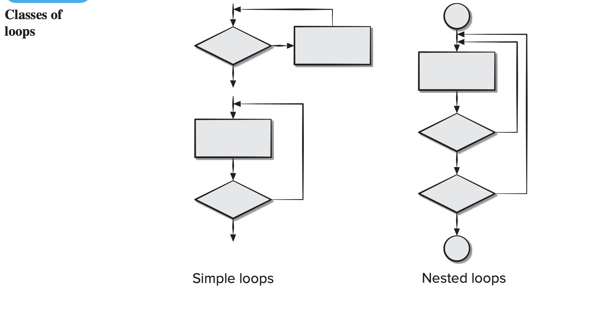

### Black-Box Testing

**Black-box testing** (also called behavioral testing or functional testing) designs test cases based on the functional requirements and specifications of the software without knowledge of or regard for the internal code structure. The tester treats the software as a "black box" and focuses on inputs and expected outputs.

Black-Box Testing find errors in the following categories: (1) incorrect or missing functions, (2) interface errors, (3) errors in data structures or external database access, (4) behavior or performance errors, and (5) initialization and termination errors.

**A. Equivalence partitioning:** Divides the input domain into classes (partitions) of data that are expected to be treated the same way by the software. One representative test case is selected from each class, reducing the number of test cases while maintaining coverage.

Rules for defining equivalence classes:

- If input specifies a range (e.g., 1–100): one valid class (values within range) and two invalid classes (below and above the range).
- If input specifies a specific value: one valid class and two invalid classes.

Rules for defining equivalence classes:

- If input specifies a member of a set: one valid class (member of set) and one invalid class (not a member).
- If input is Boolean: one valid class (true) and one invalid class (false).

**Example:** An input field accepts ages 18–60. Equivalence classes: valid = {18–60}, invalid₁ = {< 18}, invalid₂ = {> 60}. Test cases: one from each class (e.g., 30, 10, 75).

**B. Boundary value analysis (BVA):** A technique that focuses on testing at the edges of equivalence classes, because errors tend to occur at boundaries. For a range bounded by values a and b, test cases should include: a, b, a−1, a+1, b−1, b+1.

**Example:** For the age range 18–60, BVA test values would be: 17, 18, 19, 59, 60, 61.

| White-Box Testing                                                                          | Black-Box Testing                                                                    |
| ------------------------------------------------------------------------------------------ | ------------------------------------------------------------------------------------ |
| It is based on the internal structure and implementation of the code.                      | It is based on functional requirements and specifications.                           |
| It requires access to the source code.                                                     | It requires only the software specifications and expected behavior.                  |
| It focuses on logic paths, conditions, loops, and code coverage.                           | It focuses on input and output behavior without considering internal implementation. |
| It is typically performed during the early stages of development, especially unit testing. | It is commonly performed during integration, system, and acceptance testing.         |
| It helps identify logic errors, path errors, and data flow issues.                         | It helps identify missing functionality, interface defects, and behavioral errors.   |
| It is also known as structural testing or glass-box testing.                               | It is also known as behavioral testing or functional testing.                        |

**Are both White-Box Testing and Black-Box Testing necessary?**

Yes. White-box testing ensures internal correctness and coverage of all code paths. Black-box testing ensures the software meets functional requirements from the user's perspective. Each uncovers different classes of errors that the other is likely to miss. Using only one approach leaves significant categories of defects untested.

---

## 6.5 Agile Testing Practices

Agile methodologies integrate testing throughout the development lifecycle rather than treating it as a separate phase at the end. Testing is continuous, collaborative, and closely tied to user stories and acceptance criteria.

### 6.5.1 Test-Driven Development (TDD)

**Test-Driven Development (TDD)** is a software development practice in which automated unit tests are written before the production code. It follows a short, iterative cycle called Red-Green-Refactor:

**1. Red - Write a failing test:** Before writing any production code, the developer writes a small, focused test case for the next piece of desired functionality. Running this test should fail (shown as "red" in testing tools) because the code being tested does not exist yet. This step confirms the test is valid and that the requirement is truly missing.

**2. Green - Write the minimum code to pass:** The developer writes the simplest possible code that makes the failing test pass. The goal is correctness, not elegance. No optimization, no design patterns, just enough code to turn the test result from red to green.

**3. Refactor - Improve the code:** With the test passing as a safety net, the developer cleans up the implementation: removes duplication, improves names, simplifies logic, and improves structure. After refactoring, the test must still pass. The cycle then repeats for the next piece of functionality.

**Benefits of TDD:**

- Forces the developer to think about requirements and interface design before implementation.
- Produces a comprehensive suite of automated regression tests as a byproduct.
- Encourages small, modular, loosely coupled code.
- Provides immediate feedback on whether new code breaks existing functionality.
- Reduces debugging time because defects are caught at the moment the test fails.
- The test suite serves as living documentation of expected system behavior.

### 6.5.2 Continuous Testing

**Continuous testing** is the practice of executing automated tests as part of the software delivery pipeline, providing rapid feedback on code quality at every stage. It is a core component of CI/CD (Continuous Integration / Continuous Delivery) workflows.

**How continuous testing works in a CI/CD pipeline:**

1. A developer commits code to the shared repository.
2. The CI server (e.g., Jenkins, GitHub Actions, GitLab CI) automatically detects the change, builds the project, and runs the automated test suite.
3. If any test fails, the pipeline halts and the developer is notified immediately.
4. Only code that passes all tests is promoted to the next stage (integration testing, staging, deployment).

**Characteristics:**

- Tests run automatically on every code commit, not just at the end of a sprint or release cycle.
- Provides rapid feedback: developers learn about failures within minutes while the context is still fresh.
- Covers multiple levels: unit tests, integration tests, and sometimes acceptance tests are all automated.
- Enables the "shift left" approach, moving testing earlier in the development process to reduce the cost of defect correction.

### 6.5.3 Automated Unit Testing Basics

**Automated unit testing** uses testing frameworks to write, execute, and report on tests without manual intervention. Tests are written as code, stored alongside the production code, and executed automatically.

**Common testing frameworks:**

JUnit (Java), pytest (Python), NUnit (.NET), Jest (JavaScript) are widely used unit testing frameworks.

**Structure of an automated unit test (Arrange-Act-Assert):**

- **Arrange:** Set up the test data, objects, and preconditions.
- **Act:** Execute the unit under test with the prepared inputs.
- **Assert:** Verify that the actual output matches the expected output.

- Each test should be independent: it should not depend on the order of execution or the state left by other tests.
- Tests should be fast: a slow test suite discourages frequent execution.
- Tests should be deterministic: the same test should always produce the same result.
- Test names should clearly describe what is being tested and what the expected behavior is.
- Tests should cover both normal cases and edge/error cases.

### 6.5.4 Refactoring for Code Quality

**Refactoring** is the disciplined technique of restructuring existing code by altering its internal structure without changing its external behavior.

**Purpose of refactoring:**

- Improve code readability and understandability.
- Reduce complexity and eliminate duplication.
- Make the code easier to extend and maintain.
- Pay down technical debt (the accumulated cost of shortcuts and poor design decisions).

**Code smells** (indicators that refactoring is needed):

- **Long method:** A function that does too much and should be broken into smaller, focused methods.
- **Duplicate code:** The same or very similar code appears in multiple places.
- **Large class:** A class that has too many responsibilities and should be split.
- **Dead code:** Unused variables, functions, or code blocks that should be removed.
- **Feature envy:** A method that uses data from another class more than its own.
- **Magic numbers:** Hard-coded numeric values that should be replaced with named constants.

**Common refactoring techniques:**

- **Extract method:** Move a code fragment into a new method with a descriptive name.
- **Rename variable/method:** Replace unclear names with meaningful ones.
- **Replace magic number with named constant:** Replace `if (age > 18)` with `if (age > MIN_VOTING_AGE)`.
- **Inline method:** Replace a method call with the method's body if the method is trivially simple.
- **Move method:** Relocate a method to the class where it logically belongs.
- **Decompose conditional:** Break a complex conditional expression into separate, well-named methods.

**Refactoring and testing:**

Refactoring must always be supported by a comprehensive suite of automated tests. Before refactoring, run all tests to confirm they pass. After each small refactoring step, re-run the tests to verify that behavior is preserved. This is why TDD and refactoring are closely linked: TDD produces the test suite that makes refactoring safe.

---

---

---

## 7. Software Quality, Assurance, Maintenance

## 7.1 Quality Concepts

> **Define software quality and briefly describe the rationale for your definition. [2+3 marks] (2073 Shrawan - IOE - Old Syllabus Relevant)**
>
> **What are software quality measures? [2 marks] (2074 Chaitra - IOE - Old Syllabus Relevant)**

Quality is a complex and multifaceted concept. David Garvin describes it from five different points of view:

1. **Transcendental view:** Quality is something you immediately recognize but cannot explicitly define.
2. **User view:** Quality is seen in terms of an end user's specific goals. If a product meets those goals, it exhibits quality.
3. **Manufacturer's view:** Quality is defined in terms of the original specification. If the product conforms to the spec, it exhibits quality.
4. **Product view:** Quality can be tied to inherent characteristics (e.g., functions and features) of a product.
5. **Value-based view:** Quality is measured based on how much a customer is willing to pay for a product.

**Software Quality (Definition):** An effective software process applied in a manner that creates a useful product that provides measurable value for those who produce it and those who use it. This definition emphasizes three important points:

1. **An effective software process** establishes the infrastructure that supports building a high-quality product. Management aspects create checks and balances to avoid project chaos. Umbrella activities such as change management and technical reviews have as much to do with quality as any other part of practice.
2. **A useful product** delivers the content, functions, and features that end users desire in a reliable, error-free way. It satisfies both explicitly stated requirements and implicit requirements (e.g., ease of use).
3. **Adding value** for both producer and user. The software organization gains added value because high-quality software requires less maintenance effort, fewer bug fixes, and reduced customer support. The user community gains added value because the application provides a useful capability that expedites some business process.

**Quality of Design vs. Quality of Conformance:**

- **Quality of design** encompasses the degree to which the design meets the functions and features specified in the requirements model.
- **Quality of conformance** focuses on the degree to which the implementation follows the design and the resulting system meets its requirements and performance goals.

Robert Glass proposes: user satisfaction = compliant product + good quality + delivery within budget and schedule.

**The Cost of Quality:**

The cost of quality includes all costs incurred in the pursuit of quality or in performing quality-related activities and the downstream costs of lack of quality. It can be divided into:

1. **Prevention costs:** Cost of management activities for planning and coordinating quality control/assurance, added technical activities for complete requirements and design models, test planning costs, and training costs.
2. **Appraisal costs:** Cost of conducting technical reviews, data collection and metrics evaluation, and testing and debugging.
3. **Failure costs:**
   - **Internal failure costs:** These are incurred when an error is detected before shipment. They include rework or repair costs, side-effect costs from rework, and costs of collecting quality metrics for failure mode analysis.
   - **External failure costs:** These are associated with defects found after shipment. They include complaint resolution, product return or replacement, help line support, warranty work, and loss of reputation or business.

The cost to find and repair an error increases dramatically as development progresses. According to Boehm and Basili, a defect costing ~$977 to fix during coding costs ~$7,136 during system testing and ~$14,102 during maintenance.

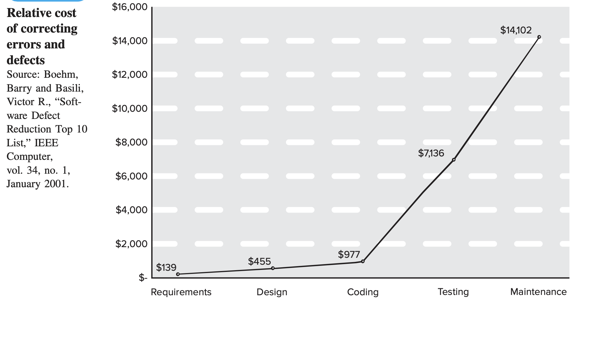

---

## 7.2 Quality Attributes

> **Explain quality attributes of software. [3 marks] (2073 Shrawan - IOE - Old Syllabus Relevant)**

**McCall's Software Quality Factors (1977):**

McCall and Walters proposed a model that organizes 11 quality factors into three perspectives of a software product:

**1. Product Operation** (how well it runs day-to-day):

- **Correctness:** The extent to which a program satisfies its specification and fulfills the user's mission objectives.
- **Reliability:** The extent to which a program can be expected to perform its intended function without failure.

**McCall's Software Quality Factors (1977):**

1. **Product Operation** (how well it runs day-to-day):

- **Efficiency:** The amount of computing resources and code required by a program to perform its function.
- **Integrity:** The extent to which access to software or data by unauthorized persons can be controlled.
- **Usability:** The effort required to learn, operate, prepare input, and interpret output of a program.

**2. Product Revision** (how easy it is to change):

- **Maintainability:** The effort required to locate and fix an error in a program.
- **Flexibility:** The effort required to modify an operational program.
- **Testability:** The effort required to test a program to ensure it performs its intended function.

**3. Product Transition** (how well it adapts to new environments):

- **Portability:** The effort required to transfer a program from one hardware/software environment to another.
- **Reusability:** The extent to which a program (or parts of it) can be reused in other applications.
- **Interoperability:** The effort required to couple one system to another.

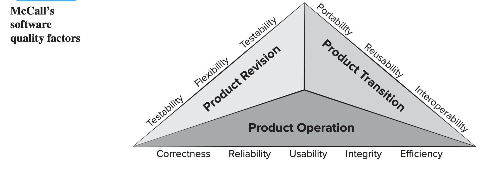

**ISO 25010 Quality Model:**

The ISO 25010 standard defines two quality models:

**A. Quality in Use Model** (five characteristics when considering using the product in a particular context):

- **Effectiveness:** Accuracy and completeness with which users achieve goals.
- **Efficiency:** Resources expended to achieve user goals.
- **Satisfaction:** Usefulness, trust, pleasure, comfort.
- **Freedom from risk:** Mitigation of economic, health, safety, and environmental risks.
- **Context coverage:** Completeness, flexibility.

**B. Product Quality Model** (eight characteristics focusing on static and dynamic nature):

- **Functional suitability:** Complete, correct, appropriate.
- **Performance efficiency:** Timing, resource utilization, capacity.
- **Compatibility:** Coexistence, interoperability.
- **Usability:** Appropriateness, learnability, operability, error protection, aesthetics, accessibility.
- **Reliability:** Maturity, availability, fault tolerance, recoverability.
- **Security:** Confidentiality, integrity, accountability, authenticity.
- **Maintainability:** Modularity, reusability, modifiability, testability.
- **Portability:** Adaptability, installability, replaceability.

---

## 7.3 Reviews, Inspections, and QA Concepts

> **Define SQA. [2 marks] (2080 Bhadra - IOE - Old Syllabus Relevant)**
>
> **What is FTR? [2 marks] (2076 Chaitra - IOE - Old Syllabus Relevant)**
>
> **How is a Formal Technical Review (FTR) conducted? [5 marks] (2078 Bhadra - IOE - Old Syllabus Relevant)**
>
> **What is the significance of "the vital few" in statistical SQA? [2 marks] (2082 Bhadra - IOE - Old Syllabus Relevant)**

### Software Quality Assurance (SQA)

Software Quality Assurance is a planned and systematic pattern of actions required to ensure high quality in software. It is an umbrella activity applied throughout the software process. SQA encompasses:

1. An SQA process.
2. Specific quality assurance and quality control tasks (including technical reviews and a multitiered testing strategy).
3. Effective software engineering practice (methods and tools).
4. Control of all software work products and the changes made to them.
5. A procedure to ensure compliance with software development standards.
6. Measurement and reporting mechanisms.

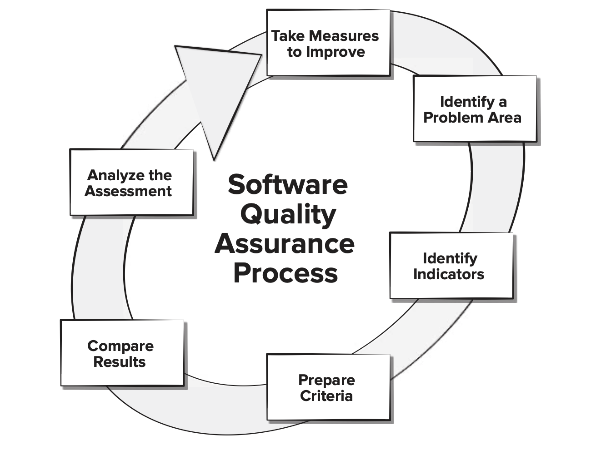

## SQA Process

**1. Identify a Problem Area**

The cycle begins by recognizing a specific aspect of the software, development process, or system performance that needs attention or exhibits defects (e.g., high crash rates, slow API response times, or frequent regression bugs).

**2. Identify Indicators**

Once the problem area is defined, the team determines _what_ to measure to track this problem. These indicators (or metrics) could include things like test coverage percentages, defect density, server response latency, or user-reported bugs per release.

**3. Prepare Criteria**

In this step, benchmarks, standards, or acceptance thresholds are established based on the indicators. For example, if the indicator is "response latency," the criteria might be set as: _"95% of API requests must resolve in less than 200ms."_

**4. Compare Results**

Actual data gathered from testing, production logs, or user feedback is compared against the pre-established criteria. This acts as a gap analysis to see where the software or process is falling short.

**5. Analyze the Assessment**

The team dives deep into the discrepancies found during the comparison stage. This involves root-cause analysis to understand _why_ the criteria weren't met (e.g., identifying a memory leak, a bottleneck in the CI/CD pipeline, or poorly written test cases).

**6. Take Measures to Improve**

Based on the analysis, concrete actions are implemented to resolve the underlying issues. This could involve refactoring code, updating hardware, adjusting development workflows, or writing more robust automated tests.

Once improvements are made, the process loops back. The team continues to monitor the indicators and look for new or recurring problem areas, ensuring that software quality steadily increases over time.

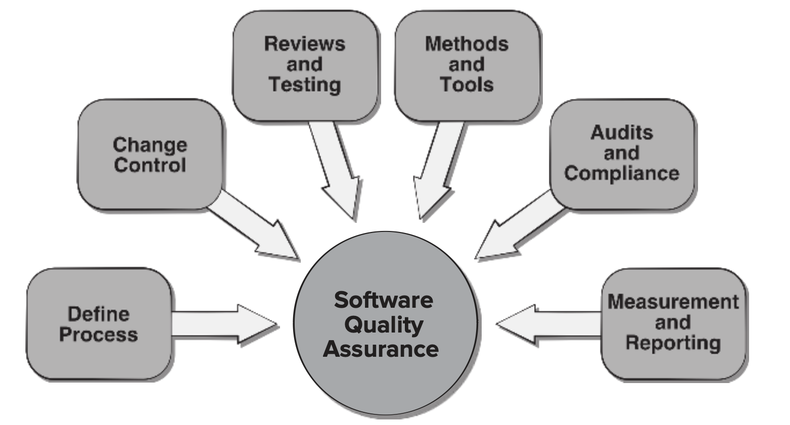

### Elements of SQA:

- **Standards:** Ensure adopted standards (IEEE, ISO, etc.) are followed and all work products conform to them.
- **Reviews and audits:** Technical reviews are quality control performed by software engineers to uncover errors. Audits are performed by SQA personnel to ensure quality guidelines are being followed.
- **Testing:** Ensure testing is properly planned and efficiently conducted to find errors.
- **Error/defect collection and analysis:** Collect and analyze error data to understand how errors are introduced and what activities best eliminate them.
- **Change management:** Ensure adequate change management practices are instituted.
- **Education:** Lead in software process improvement and sponsor educational programs.
- **Vendor management:** Ensure high-quality software results from external vendors.
- **Security management:** Ensure appropriate process and technology are used for software security.
- **Safety:** Assess the impact of software failure and initiate steps to reduce risk.
- **Risk management:** Ensure risk management activities are properly conducted and contingency plans are established.

### SQA Tasks (by the SQA Group):

1. Prepares an SQA plan for a project (identifies evaluations, audits, reviews, standards, procedures for error reporting/tracking, and feedback for the software team).
2. Participates in developing the project's software process description and reviews it for compliance.
3. Reviews software engineering activities to verify compliance with the defined software process.
4. Audits designated software work products to verify compliance.
5. Ensures deviations in software work and work products are documented and handled according to procedure.
6. Records any noncompliance and reports to senior management.

### Formal Technical Review (FTR)

A Formal Technical Review (FTR) is a structured software quality assurance activity conducted by a small group of peers. Its primary objectives are:

- Uncover errors in function, logic, or implementation.
- Verify that the software meets its requirements.
- Ensure software is represented according to predefined standards.
- Achieve software that is developed in a uniform manner.
- Make projects more manageable.

**How an FTR is conducted:**

1. **Planning:** A review team of 3–5 people is assembled, including a moderator (review leader), the producer (author of the work product), and reviewers. Materials are distributed in advance.
2. **Preparation:** Each reviewer independently examines the work product, noting errors, questions, and issues. Advance preparation should take no more than 2 hours.
3. **Review meeting:** The moderator leads the meeting following a strict agenda. The producer may walk through the work product briefly. Reviewers raise issues identified during preparation. A recorder logs all defects and issues. The meeting focuses strictly on identifying problems, not solving them. Duration is limited to less than 2 hours.
4. **Decision:** At the end, the team makes one of three decisions:
   - **Accept** the product as is (with no or minor modifications).
   - **Rework:** The producer must correct errors and the moderator verifies corrections (no re-review needed).
   - **Reject:** Serious errors are found. The product must be reworked and re-reviewed.
5. **Follow-up:** The producer addresses all identified defects. The moderator verifies that corrections are complete. A review summary report is produced.

**Review guidelines:**

- Review the product, not the producer (critique the work, not the person).
- Set and maintain an agenda.
- Limit debate and rebuttal.
- Identify problem areas but don't attempt to solve every problem noted.
- Take written notes.
- Limit participants and insist upon advance preparation.
- Develop a checklist for each type of review.

### Statistical Software Quality Assurance

Statistical SQA reflects a growing trend to become more quantitative about quality. It implies these steps:

1. Information about software errors and defects is collected and categorized.
2. An attempt is made to trace each error and defect to its underlying cause (e.g., nonconformance to specifications, design error, violation of standards, poor communication with the customer).
3. Using the Pareto principle (80% of the defects can be traced to 20% of all possible causes), isolate the 20% which are called "the vital few."
4. Once the vital few causes have been identified, move to correct the problems that have caused the errors and defects.

**Significance of "the vital few":** The vital few represent the small percentage of defect causes (typically 20%) that are responsible for the majority of defects (typically 80%). By focusing corrective action on these vital few causes first, organizations achieve the greatest quality improvement with the most efficient use of resources. As the vital few causes are corrected, new candidates emerge at the top, enabling continuous improvement.

### Six Sigma

Six Sigma is the most widely used strategy for statistical quality assurance. The term is derived from six standard deviations, which means 3.4 defects per million occurrences. This implies an extremely high-quality standard. It defines the DMAIC method:

- **Define** customer requirements and project goals.
- **Measure** the existing process and its output (collect defect metrics).
- **Analyze** defect metrics and determine the vital few causes.
- **Improve** the process by eliminating the root causes of defects.
- **Control** the process to ensure future work does not reintroduce defect causes.

For developing a new process (rather than improving an existing one), Six Sigma uses the DMADV method (Define, Measure, Analyze, Design, Verify).

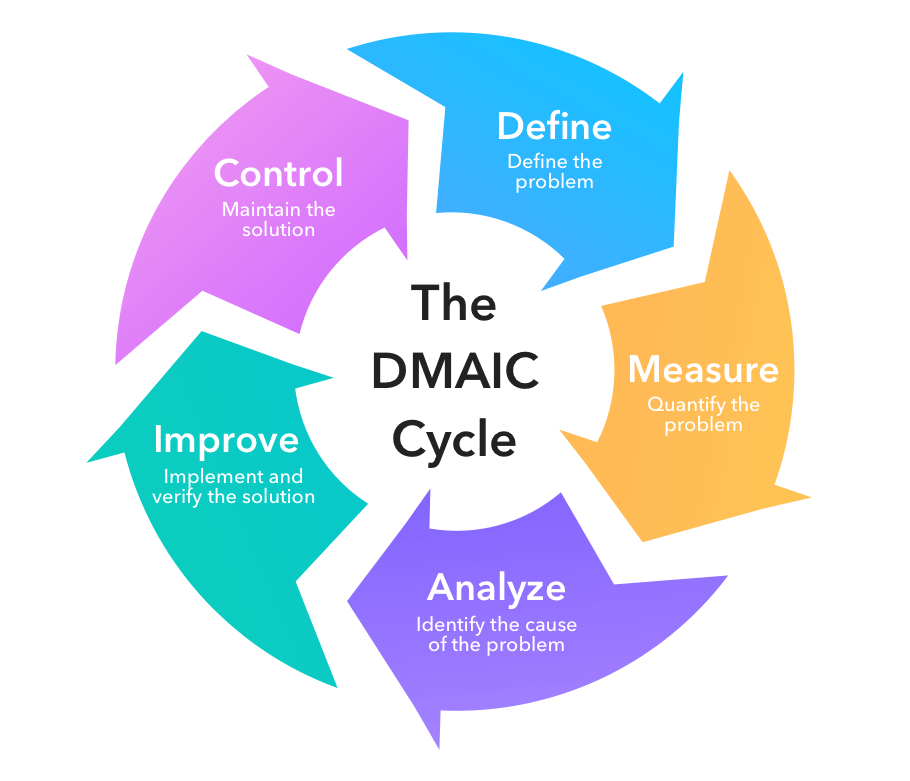

---

## 7.4 ISO Standards, CMMI Levels

> **Describe the staged CMMI model with levels and key process areas. [5 marks] (2082 Bhadra - IOE - Old Syllabus Relevant)**
>
> **Explain different levels of CMMI. [5 marks] (2082 Baishakh - IOE - Old Syllabus Relevant)**
>
> **How are CMM standards different from ISO standards for software quality? [4 marks] (2073 Chaitra - IOE - Old Syllabus Relevant)**

### ISO 9001:2015 Quality Standard

ISO 9000 describes quality assurance elements in generic terms that can be applied to any business regardless of the products or services offered. A quality assurance system may be defined as the organizational structure, responsibilities, procedures, processes, and resources for implementing quality management.

**Key elements of ISO 9001:2015:**

1. Establish the elements of a quality management system. This involves developing, implementing, and improving the system. It also requires defining a policy that emphasizes the importance of the system and documenting the quality system.
2. Support quality control and assurance. This is done by promoting the importance of quality among all stakeholders and focusing on customer satisfaction. You should also define a quality plan that addresses objectives, responsibilities, and authority.
3. Establish review mechanisms for the quality management system. This involves identifying review methods and feedback mechanisms, and defining follow-up procedures.
4. Identify quality resources including personnel, training, and infrastructure elements.
5. Establish control mechanisms. These are needed for planning, customer requirements, technical activities (analysis, design, testing), and project monitoring or management.
6. Define methods for remediation. This includes assessing quality data and metrics, and defining an approach for continuous process and quality improvement.

ISO 9001:2015 has adopted a "plan-do-check-act" cycle applied to quality management elements:

- **Plan:** Establish the process objectives, activities, and tasks necessary to achieve high-quality software.
- **Do:** Implement the software process.
- **Check:** Monitor and measure processes against policies, objectives, and requirements.
- **Act:** Initiate software process improvement activities.

To become ISO certified, a company's quality system and operations are scrutinized by third-party auditors for compliance. Upon successful registration, a certificate is issued. Semiannual surveillance audits ensure continued compliance.

### CMMI (Capability Maturity Model Integration)

CMMI is a process improvement framework developed by the Software Engineering Institute (SEI). The staged CMMI model defines five maturity levels, each providing a layer of foundation for continuous process improvement:

**Level 1: Initial**

- Processes are ad hoc, chaotic, and reactive.
- Success depends on individual effort and heroics, not on established processes.
- The organization typically does not provide a stable environment for processes.
- No key process areas.

**Level 2: Managed**

- Basic project management processes are established to track cost, schedule, and functionality.
- The discipline exists to repeat earlier successes on projects with similar applications.
- Key Process Areas: Requirements Management, Project Planning, Project Monitoring and Control, Supplier Agreement Management, Measurement and Analysis, Process and Product Quality Assurance, Configuration Management.

**Level 3: Defined**

- Processes for both management and engineering activities are documented, standardized, and integrated into a standard software process for the organization.
- All projects use an approved, tailored version of the organization's standard process.
- Key Process Areas: Requirements Development, Technical Solution, Product Integration, Verification, Validation, Organizational Process Focus, Organizational Process Definition, Organizational Training, Integrated Project Management, Risk Management, Decision Analysis and Resolution.

**Level 4: Quantitatively Managed**

- The organization and projects establish quantitative objectives for quality and process performance and use them as criteria in managing processes.
- Detailed measures of the software process and product quality are collected and statistically analyzed.
- Key Process Areas: Organizational Process Performance, Quantitative Project Management.

**Level 5: Optimizing**

- Continuous process improvement is enabled by quantitative feedback from the process and from piloting innovative ideas and technologies.
- The organization identifies weaknesses and strengthens the process proactively, preventing defects.
- Key Process Areas: Causal Analysis and Resolution, Organizational Performance Management.

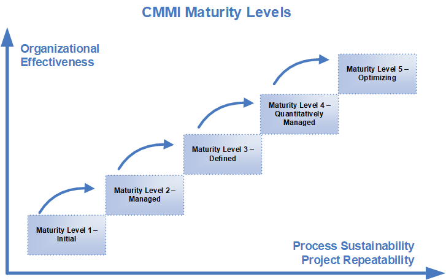

| ISO 9001:2015                                                                    | CMMI                                                                        |
| -------------------------------------------------------------------------------- | --------------------------------------------------------------------------- |
| It is a Quality Management System standard.                                      | It is a process improvement framework.                                      |
| Its primary goal is quality management and customer satisfaction.                | Its primary goal is process capability and maturity improvement.            |
| It is applicable to any industry of any size.                                    | It is primarily applicable to IT, software, engineering, and defense.       |
| Assessment is done through a third-party audit for certification (pass or fail). | Assessment is done through an appraisal for maturity level rating (1 to 5). |
| It focuses on consistent quality and continual improvement.                      | It focuses on process sophistication and performance maturity.              |
| Its scope defines what must be done in terms of requirements.                    | Its scope defines how to do things using best practices and guidelines.     |

Both frameworks can work together. ISO 9001 serves as an overarching quality framework, while CMMI provides specific, granular best practices to mature software development processes. They are complementary rather than competing.

---

## 7.5 Software Maintenance and Its Types

> **Describe different types of software maintenance. [10 marks] (2070 Chaitra - IOE - Old Syllabus Relevant)**

Software maintenance is defined as the modification of a software product after delivery to correct faults, improve performance or other attributes, or adapt the product to a modified environment. It is a critical, continuous phase in the SDLC that begins after the software is delivered and continues throughout its operational lifetime.

Maintenance typically accounts for 60 - 80% of the total software lifecycle costs, making it the most expensive phase of the software lifecycle.

**Types of Software Maintenance:**

**1. Corrective Maintenance:**

Corrective maintenance involves diagnosing and fixing errors (bugs) discovered in the software after delivery. These may be errors in design, logic, or code that cause incorrect results or system failures. Corrective maintenance is reactive. It occurs in response to problem reports from users or from monitoring systems.

Example: Fixing a calculation error in a payroll system that causes incorrect tax deductions.

**2. Adaptive Maintenance:**

Adaptive maintenance involves modifying the software to keep it usable in a changed or changing environment. Changes in the environment may include new operating systems, new hardware, changes in government regulations, new database management systems, or migration to cloud infrastructure.

Example: Modifying a desktop application to work with a new version of the operating system, or updating a system to comply with new data privacy regulations.

**3. Perfective Maintenance:**

Perfective maintenance involves changes made to the software to improve performance, maintainability, or other attributes, or to add new features or capabilities based on user requests. This type of maintenance is driven by evolving user needs and changing business requirements.

Example: Adding a new reporting module to an existing ERP system, or optimizing a search algorithm for faster response times.

**4. Preventive Maintenance:**

Preventive maintenance involves making changes to the software to prevent future problems. It is proactive. Changes are made to improve the software's future maintainability and reliability before problems actually occur. This includes restructuring code, optimizing, and updating documentation to reduce technical debt.

Example: Refactoring legacy code to improve its structure, updating libraries before they become unsupported, or adding error-handling routines to modules that currently lack them.

**Distribution of maintenance effort (approximate):**

- Perfective maintenance: ~50% (enhancements and new features)
- Corrective maintenance: ~21% (bug fixes)
- Adaptive maintenance: ~25% (environment changes)
- Preventive maintenance: ~4% (future-proofing)

---

## 7.6 Maintenance Effort and Lifecycle Considerations

Maintenance effort is influenced by several factors and understanding these factors helps organizations plan and budget effectively for the long-term lifecycle of software.

**Factors affecting maintenance effort:**

1. **Application domain:** Complex business domains require more effort to understand and modify.
2. **Staff stability:** Frequent turnover means new maintainers must spend significant time understanding the existing codebase. Understanding existing code can consume up to 50% of total maintenance effort.
3. **Software age and structure:** Older, poorly structured programs are harder and more costly to maintain. Lehman's Law of Increasing Complexity states that as a system evolves, its structure degrades and complexity increases unless active effort is invested to maintain or reduce it.
4. **Documentation quality:** Poor or absent documentation makes it extremely difficult to understand and modify the software safely.
5. **Programming language and development tools:** Obsolete languages and tools can make maintenance harder, as fewer skilled practitioners are available.
6. **Reliability of the original software:** Software with high initial defect density will require more corrective maintenance.
7. **Hardware and software environment changes:** Rapid changes in platforms and technologies increase the adaptive maintenance burden.

### Lifecycle considerations:

1. **Maintenance begins at delivery:** Maintenance is not an afterthought; it should be planned from the start of the project. Requirements, design, and coding decisions all affect future maintainability.
2. **Lehman's Laws of Software Evolution:**
   - **Law of Continuing Change:** A system must be continually adapted, or it becomes progressively less useful in its environment.
   - **Law of Increasing Complexity:** As a system evolves, its complexity increases unless work is done to maintain or reduce it.
3. **Configuration management:** Effective version control, change management, and release planning are essential to manage the maintenance phase systematically.
4. **Re-engineering and retirement:** When the cost of maintaining a legacy system exceeds the cost of replacement, the organization should consider re-engineering or retiring the system. Re-engineering involves restructuring or rewriting existing software without changing its functionality, making it easier to maintain going forward.
5. **Impact analysis:** Before any maintenance change is implemented, an impact analysis should be performed to understand the ripple effects of the change across the system.
6. **Regression testing:** After any maintenance modification, regression testing must be performed to ensure that the changes have not introduced new errors into existing functionality.

### Software Reliability:

Software reliability is defined as the probability of failure-free operation of a computer program in a specified environment for a specified time. Key measures:

- **MTBF (Mean Time Between Failure):** MTBF = MTTF + MTTR, where MTTF is mean time to failure and MTTR is mean time to repair.
- **Availability:** Availability = (MTTF / (MTTF + MTTR)) × 100%. Availability is more sensitive to MTTR, making it an indirect measure of maintainability.
- **FIT (Failures in Time):** A statistical measure of how many failures a component will have over 1 billion hours of operation.

Software reliability, unlike hardware reliability, is a function of design defects rather than physical wear. All software failures can be traced to design or implementation problems.

---

---

---

## 8. Software Configuration Management

## 8.1 Software Configuration Management

> **Define configuration management and explain SCM activities. [4 marks] (2080 Bhadra - IOE - Old Syllabus Relevant)**
>
> **Explain why we need Software Configuration Management (SCM). [4 marks] (2073 Shrawan - IOE - Old Syllabus Relevant)**

Software configuration management (SCM) is a set of activities designed to manage change throughout the life cycle of computer software. The output of the software process, which includes programs, documents, and data, collectively forms the software configuration. Because change can occur at any time during development and maintenance, SCM is an umbrella activity applied from the moment a project begins until the software is taken out of operation.

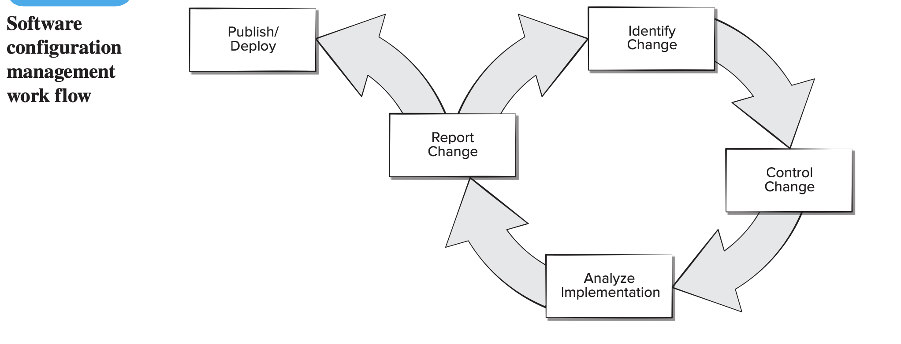

Software configuration management (SCM) is an umbrella activity that is applied throughout the software process. Typical SCM work flow is shown in Figure. Because change can occur at any time, SCM activities are developed to (1) identify change, (2) control change, (3) ensure that change is being properly implemented, and (4) report changes to others who may have an interest.

**Importance of SCM:**

Software projects produce a large number of work products (requirements documents, design models, source code, test plans, user manuals, etc.). These work products are interdependent because a change to one can affect many others. Without SCM, uncontrolled changes lead to confusion, quality degradation, and delayed delivery. SCM provides the discipline and tools to identify, control, track, and report changes so that the software team can accommodate change without introducing chaos.

**Four fundamental sources of change:**

1. New business or market conditions dictate changes in product requirements or business rules.
2. New stakeholder needs demand modification of data, functionality, or services.
3. Reorganization or business growth/downsizing causes changes in project priorities or team structure.
4. Budgetary or scheduling constraints cause a redefinition of the system or product.

**Software Configuration Items (SCIs):**

A software configuration item is a named element of information created as part of the software engineering process. An SCI can be as small as a single UML diagram or as large as the complete design document. Examples include specifications, design models, source code files, test plans, test cases, and user documentation. SCIs are organized into configuration objects that are cataloged in the project database with a single name, attributes, and relationships to other objects.

**Baselines:**

A baseline is a specification or product that has been formally reviewed and agreed upon, that thereafter serves as the basis for further development, and that can be changed only through formal change control procedures (IEEE definition).

Before an SCI becomes a baseline, changes can be made quickly and informally. Once a baseline is established, a specific, formal procedure must be applied to evaluate and verify each change. Common software baselines include:

1. **System Specification:** This is established after system requirements are reviewed and approved.
2. **Software Requirements Specification:** This is established after requirements are reviewed and approved.
3. **Design Specification:** This is established after the design model is reviewed and approved.
4. **Source Code:** This is established after code is reviewed, compiled, and tested.
5. **Test Plans/Procedures/Data:** These are established after test documentation is reviewed.
6. **Operational System:** This is established after the system is delivered and accepted.

When a member of the team wants to modify a baselined SCI, it is copied from the project database into the engineer's private workspace. The modification can proceed only if SCM controls are followed. After modification, the SCI is checked back in through the controlled process.

**Elements of a Configuration Management System:**

1. **Component elements:** A set of tools coupled within a file management system (e.g., a database/repository) that enables access to and management of each SCI.
2. **Process elements:** A collection of procedures and tasks that define an effective approach to change management for all constituencies.
3. **Construction elements:** A set of tools that automate the construction of software by ensuring that the proper set of validated components (correct version) have been assembled.
4. **Human elements:** A set of tools and process features used by the software team to implement effective SCM.

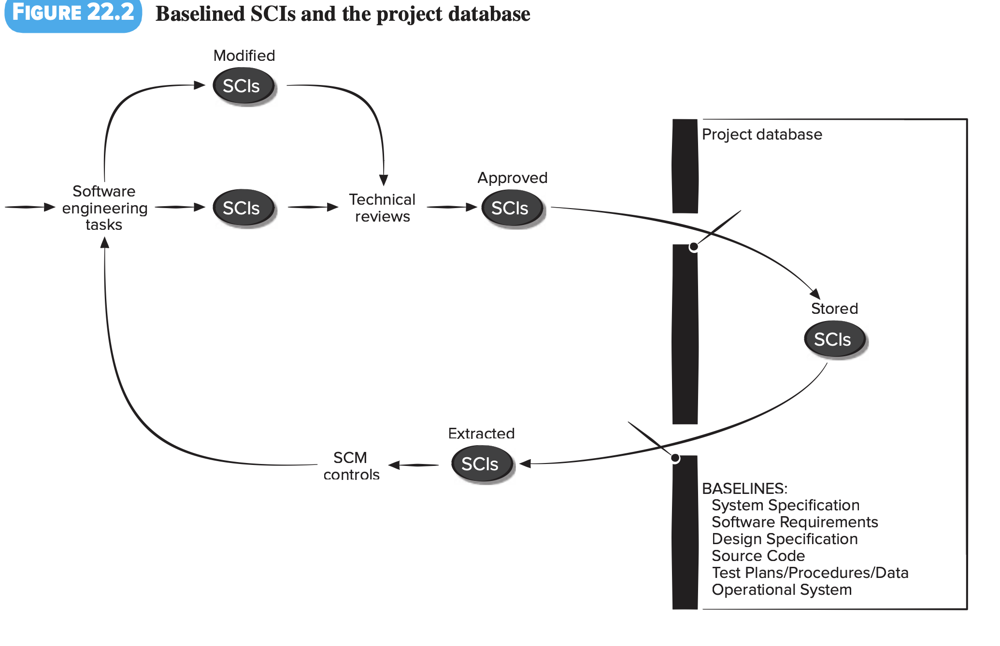

**SCM Activities (Core Tasks):**

SCM tasks can be viewed as concentric layers through which SCIs flow throughout their useful life:

1. **Identification:** Uniquely naming and describing every SCI so it can be tracked and managed.
2. **Change control:** Combining human procedures and automated tools to provide a mechanism for controlling change requests, evaluating them, and implementing approved changes.
3. **Version control:** Managing different versions and variants of configuration objects created during the software process.
4. **Configuration auditing:** Ensuring that changes have been properly implemented and that quality is maintained.
5. **Status reporting (status accounting):** Recording and reporting information about each change, including what happened, who did it, when it happened, and what else will be affected.

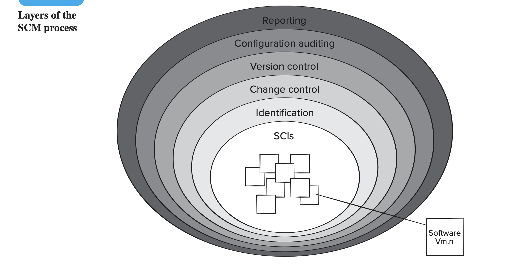

---

## 8.2 Version Control and Continuous Integration

> **Define version, variants, and release with respect to configuration management. [4 marks] (2079 Bhadra - IOE - Old Syllabus Relevant)**
>
> **Differentiate version and variant in the context of configuration management. [2 marks] (2082 Bhadra - IOE - Old Syllabus Relevant)**

### Version Control

Version control combines procedures and tools to manage different versions of configuration objects created during the software process. A version control system implements four major capabilities:

1. **Project database (repository):** Stores all relevant configuration objects.
2. **Version management capability:** Stores all versions of a configuration object (or enables any version to be constructed using differences from past versions).
3. **Make/build facility:** Collects all relevant configuration objects and constructs a specific version of the software.
4. **Issue tracking (bug tracking):** Records and tracks the status of all outstanding issues associated with each configuration object.

**Version, Variant, and Release:**

**Version:** A version is a specific, identifiable state of a software configuration item at a particular point in time. Versions are sequential and represent the evolution of a product over time (e.g., v1.0, v1.1, v2.0). Each new version typically incorporates bug fixes, enhancements, or new features relative to the previous version. The evolution of a program can be tracked by examining the revision history of all configuration objects.

**Variant:** A variant is a parallel version of a software product designed to serve different needs, markets, or hardware/software configurations. Unlike versions, which are sequential, variants exist in parallel. For example, a software product might have a "Windows" variant and a "Linux" variant, or a "Standard" edition and a "Enterprise" edition, maintained simultaneously.

**Release:** A release is a specific version (or set of versions of components) that has been officially approved, packaged, and distributed to customers or end users. While there are many internal versions during development, only selected, stable versions are formally released. A release is typically tagged with a release number and accompanied by release notes.

**Difference between version and variant:** A version represents sequential evolution of the same product over time, such as progressing from v1.0 to v1.1 and then to v2.0. A variant represents parallel, simultaneous forms of the same product tailored for different environments, platforms, or customer segments. All variants may share the same version number but differ in configuration.

**Change Set:** A change set is a collection of all changes (to some baseline configuration) required to create a specific version of the software. It captures all changes to all files in the configuration along with the reason for changes and details of who made the changes and when. Named change sets can be identified and applied to a baseline configuration to construct any specific version.

**Access control and synchronization control:**

- **Access control** governs which software engineers have the authority to access and modify a particular configuration object.
- **Synchronization control** ensures that parallel changes performed by two different people don't overwrite one another. Modern version control systems handle this through locking, merging, or branching mechanisms.

### Continuous Integration

Continuous Integration (CI) is the practice of merging all developers' working copies to a shared mainline frequently, which is often done multiple times per day. Each integration triggers an automated build and test process to detect errors as quickly as possible.

**How CI works:**

1. A developer commits code changes to the shared repository.
2. The CI server (e.g., Jenkins, GitHub Actions, GitLab CI, Travis CI) automatically detects the change.
3. The server builds the project and runs the automated test suite.
4. If any test fails, the pipeline halts and the developer is notified immediately.
5. Only code that passes all tests is promoted to the next stage.

**Advantages of CI:**

- **Accelerated feedback:** Notifying developers immediately when integration fails allows fixes to be made while the number of performed changes is small.
- **Increased quality:** Building and integrating software whenever necessary provides confidence in the quality of the developed product.
- **Reduced risk:** Integrating components early avoids risking a long, painful integration phase because design failures are discovered and fixed early.
- **Improved reporting:** Providing additional information (e.g., code analysis metrics) allows for more accurate configuration status accounting.
- **Early defect capture:** Always reduces development costs by allowing cheaper fixes earlier in the project timeline.

**Best practices for SCM with CI:**

1. Keep the number of code variants small.
2. Test early and often.
3. Integrate early and often.
4. Use tools to automate testing, building, and code integration.

---

## 8.3 Change Management Process

> **Describe the change management process in software engineering. [4 marks] (2078 Bhadra - IOE - Old Syllabus Relevant)**

The change management process defines a series of tasks with four primary objectives: (1) identify all items that collectively define the software configuration, (2) manage changes to one or more of these items, (3) facilitate the construction of different versions of an application, and (4) ensure that software quality is maintained as the configuration evolves over time.

**The Change Control Process:**

1. **Change request submission:** A user, developer, or stakeholder submits a formal change request describing the desired modification.
2. **Evaluation:** The developer or a designated evaluator assesses the change request for technical merit, potential side effects, overall impact on other configuration objects and system functions, and the projected cost of the change.
3. **Change report:** The results of the evaluation are presented as a change report.
4. **Change Control Authority (CCA) decision:** The change report is reviewed by a Change Control Authority, which is a person or group that makes a final decision on the status and priority of the change. The CCA may be the project manager alone (on small projects) or a committee with representatives from software, hardware, database engineering, support, and marketing. The CCA takes a global view, assessing the impact of the change beyond the immediate SCI.
5. **Engineering Change Order (ECO):** If the change is approved, an ECO is generated describing the change to be made, the constraints that must be respected, and the criteria for review and audit. If the change is rejected, the user is informed with reasons.
6. **Check out:** The affected configuration objects are checked out from the repository into the developer's workspace.
7. **Implementation:** The developer makes the approved change.
8. **Review and audit:** The change is reviewed (technical review) and audited (configuration audit) to verify correctness, completeness, and compliance with standards.
9. **Check in:** The modified objects are checked back into the repository using version control mechanisms, creating a new version.
10. **Baseline and testing:** A new baseline is established for testing. QA and testing activities are performed.
11. **Release:** The changes are promoted and included in the next release. The new software version is rebuilt and distributed.

**Levels of change control:**

- **Before baseline:** Only informal change control is needed. The developer may make changes freely as justified by project and technical requirements.
- **After baseline (project level):** Project-level change control is implemented. The developer must gain approval from the project manager (for local changes) or from the CCA (for changes affecting other SCIs).
- **After release to customers:** Formal change control is instituted with the full process described above.

**Configuration Audit:**

A software configuration audit complements technical reviews by assessing a configuration object for characteristics not typically considered during review. The audit verifies:

1. Has the change specified in the ECO been made? Have any additional unauthorized modifications been incorporated?
2. Has a technical review been conducted to assess technical correctness?
3. Has the software process been followed, and have standards been properly applied?
4. Has the change been highlighted in the SCI? Have the change date and author been specified?
5. Have SCM procedures for noting, recording, and reporting the change been followed?
6. Have all related SCIs been properly updated?

**Configuration Status Reporting (CSR):**

Status reporting answers: (1) What happened? (2) Who did it? (3) When did it happen? (4) What else will be affected? A CSR entry is made each time an SCI is assigned new or updated identification, each time a change is approved by the CCA, and each time a configuration audit is conducted. CSR output may be placed in an online database or website so that developers and support staff can access change information.

**Impact Management:**

Before implementing a change, impact analysis must be performed to understand the web of software work product interdependencies. Impact management involves:

- **Impact network:** Identifies team members and stakeholders who might affect or be affected by changes.
- **Forward impact management:** Assesses the impact of your changes on others and informs affected members.
- **Backward impact management:** Examines changes made by others and their impact on your work, incorporating mechanisms to mitigate the impact.

---

## 8.4 Branching Strategies (Git-flow Basics)

Git-flow is a structured branching model introduced by Vincent Driessen in 2010. It assigns specific roles to different branches and defines how and when they should interact. Git-flow is well suited for projects with scheduled release cycles and teams that need clear separation between development, release preparation, and production hotfixes.

**Core Branches (permanent):**

**1. `main` (or `master`):**

The main branch stores the official production-ready release history. Every commit on main represents a stable, deployable version of the software. Commits on main are typically tagged with a version number (e.g., v1.0.0, v2.1.0). No one develops directly on main.

**2. `develop`:**

The develop branch serves as the integration branch for features. It contains the latest delivered development changes for the next release. All new features are merged into develop. When develop reaches a stable point and is ready for release, it is merged into main through a release branch.

**Supporting Branches (temporary):**

**3. `feature/*` branches:**

- **Purpose:** Used for developing new features or functionality.
- **Branched from:** `develop`.
- **Merged back into:** `develop`.
- **Naming convention:** `feature/login-page`, `feature/payment-gateway`.
- **Workflow:** A developer creates a feature branch from develop, works on the feature in isolation, and once the feature is complete and tested, merges it back into develop via a pull request. The feature branch is then deleted.

**4. `release/*` branches:**

- **Purpose:** Used to prepare for a new production release (final bug fixes, documentation updates, version number bumps).
- **Branched from:** `develop`.
- **Merged back into:** Both `main` and `develop`.
- **Naming convention:** `release/1.2.0`.
- **Workflow:** When develop has acquired enough features for a release, a release branch is created. No new features are added on this branch. It only contains bug fixes, documentation updates, and release-oriented tasks. Once ready, it is merged into main (and tagged with a version number) and also merged back into develop so that any fixes made during release preparation are not lost.

**5. `hotfix/*` branches:**

- **Purpose:** Used for urgent, unplanned fixes that must go directly into production.
- **Branched from:** `main`.
- **Merged back into:** Both `main` and `develop`.
- **Naming convention:** `hotfix/critical-bug-fix`.
- **Workflow:** When a critical bug is discovered in production, a hotfix branch is created directly from main. The fix is implemented and tested. Once complete, the hotfix branch is merged into main (and tagged with an updated version number) and also merged into develop to ensure the fix is included in ongoing development.

**Basic Git Operations in Git-flow:**

- **`git commit`:** Records changes to the local repository with a descriptive message.
- **`git branch <name>`:** Creates a new branch from the current branch.
- **`git checkout <branch>`** (or `git switch <branch>`): Switches to the specified branch.
- **`git merge <branch>`:** Merges the specified branch into the current branch.
- **`git pull`:** Fetches and integrates changes from the remote repository.
- **`git push`:** Uploads local commits to the remote repository.

**Conflict Resolution:**

When two developers modify the same lines in the same file on different branches, a merge conflict occurs during merge. Git marks the conflicting sections in the file. The developer must manually review the conflicting changes, decide which changes to keep (or combine both), edit the file to resolve the conflict, and then commit the resolution.

---

---

---

## 9. Recent Trends

## 9.1 DevOps and Continuous Deployment Pipelines

DevOps is a set of practices, cultural philosophies, and tools that unify software development (Dev) and IT operations (Ops) to shorten the systems development life cycle and deliver high-quality software continuously. The term was coined around 2008 to 2009 by Patrick Debois and Andrew Shafer, and has since become a dominant paradigm in modern software engineering.

Traditionally, development teams and operations teams worked in silos. Developers wrote code and "threw it over the wall" to operations for deployment, leading to blame games, slow releases, and fragile production environments. DevOps breaks down these silos by encouraging shared ownership, collaboration, and automation across the entire software delivery pipeline.

### Principles of DevOps

1. **Culture of collaboration:** Developers and operations staff share responsibility for the entire lifecycle, from development through production. There is no "your problem" when something breaks; the team collectively owns quality and uptime.
2. **Automation:** Manual, error-prone tasks (building, testing, deploying, provisioning infrastructure) are automated to achieve speed, consistency, and repeatability.
3. **Continuous feedback:** Monitoring, logging, and alerting systems provide real-time feedback on application health and performance, allowing teams to detect and resolve issues quickly.
4. **Continuous improvement:** Teams regularly reflect on processes and outcomes, iterating on both the software and the delivery pipeline itself.
5. **Infrastructure as Code (IaC):** Infrastructure is defined and managed through code (configuration files) rather than manual setup, enabling version control, repeatability, and auditability.

### DevOps Lifecycle

The DevOps lifecycle is often depicted as an infinity loop (∞) representing the continuous, iterative nature of the process:

1. **Plan:** Define requirements, user stories, and sprint goals.
2. **Code:** Develop features in short iterations using version control.
3. **Build:** Compile and package the application into deployable artifacts.
4. **Test:** Run automated tests (unit, integration, system) to validate quality.
5. **Release:** Approve and tag a production-ready version.
6. **Deploy:** Push the release to production environments (automatically or with approval).
7. **Operate:** Manage and maintain the live application and its infrastructure.
8. **Monitor:** Collect metrics, logs, and traces to observe application behavior and user experience.

The cycle then feeds back into the Plan phase, creating a continuous loop.

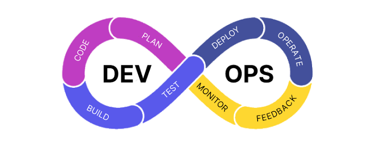

### Continuous Deployment Pipeline

A continuous deployment pipeline automates the journey of code from a developer's commit to production. It extends beyond CI/CD by removing all manual gates. Every change that passes automated validation is automatically deployed to production without human intervention.

**Stages of a deployment pipeline:**

1. **Source stage:** A developer pushes code to the version control repository (e.g., Git). This triggers the pipeline automatically.
2. **Build stage:** The source code is compiled, dependencies are resolved, and a deployable artifact (binary, container image, package) is produced.
3. **Test stage:** The artifact is subjected to automated tests such as unit tests, integration tests, security scans, and performance tests. If any test fails, the pipeline halts and the developer is notified.
4. **Staging/Pre-production stage:** The artifact is deployed to a staging environment that mirrors production. Smoke tests and acceptance tests validate behavior in a production-like setting.
5. **Production deployment:** The artifact is automatically deployed to the live production environment.
6. **Monitoring and feedback:** Post-deployment monitoring detects anomalies. If critical issues arise, automated rollback mechanisms can revert to the previous stable version.

### Benefits of DevOps

1. **Faster time to market:** Automated pipelines reduce lead time from days or weeks to minutes or hours.
2. **Higher quality:** Automated testing at every stage catches defects early, reducing the cost and impact of bugs.
3. **Improved reliability:** Consistent, repeatable deployments eliminate "works on my machine" problems.
4. **Faster recovery:** Monitoring and automated rollback enable rapid detection and resolution of production incidents.
5. **Better team morale:** Shared ownership and reduced manual toil lead to more engaged and productive teams.

## DevOps Tools

- **Version control:** The popular version control tools include Git, GitHub, and GitLab.
- **CI/CD servers:** Common CI/CD servers are Jenkins, GitHub Actions, GitLab CI/CD, and CircleCI.
- **Containerization:** Docker is widely used for containerization.
- **Orchestration:** Kubernetes is the standard tool for orchestration.
- **Configuration management:** Popular configuration management tools are Ansible, Chef, and Puppet.
- **Monitoring:** Teams use tools like Prometheus, Grafana, and Datadog for monitoring.
- **IaC:** Terraform, AWS CloudFormation, and Pulumi are commonly used for Infrastructure as Code.

---

## 9.2 CI/CD in Modern Projects

CI/CD is the backbone of modern DevOps practices. It consists of two related but distinct practices: Continuous Integration (CI) and Continuous Delivery/Deployment (CD).

**Continuous Integration (CI):**

Continuous Integration is the practice of merging all developers' working copies to a shared mainline frequently, ideally multiple times per day. Each integration triggers an automated build and test process to detect errors as quickly as possible. The central idea is that integrating early and often prevents the "integration hell" that occurs when developers work in isolation for long periods and then try to merge large batches of changes.

### Practices of CI

1. Maintain a single source repository (version control) where all code resides.
2. Automate the build so that the entire system can be built with a single command.
3. Make the build self-testing where every build runs a comprehensive suite of automated tests.
4. Every developer commits to the mainline at least once per day.
5. Every commit triggers an automated build and test on the CI server.
6. Fix broken builds immediately. A broken build is the highest-priority issue for the team.
7. Keep the build fast so that developers get feedback within minutes, not hours.

**Continuous Delivery (CD):**

Continuous Delivery extends CI by ensuring that the software is always in a releasable state. After passing through the CI pipeline (build and test), the software is automatically deployed to a staging or pre-production environment. The final deployment to production requires a manual approval step where a human decides when to release.

**Continuous Deployment:**

Continuous Deployment goes one step further than Continuous Delivery. Every change that passes all stages of the automated pipeline is deployed to production automatically, without any manual intervention. There is no human gate between a successful build and production.

**Difference between Continuous Delivery and Continuous Deployment:**

In Continuous Delivery, the code is automatically prepared, built, tested, and staged for release, but a human must manually approve the final push to production. In Continuous Deployment, the entire process from code commit to production deployment is fully automated. No manual approval is required. Continuous Delivery means "can be released at any time"; Continuous Deployment means "is released every time."

### Stages of a CI/CD Pipeline

1. **Source (Trigger):** The pipeline is triggered when a developer commits code to the repository.
2. **Build:** Source code is compiled, dependencies are fetched, and a build artifact is produced.
3. **Test:** Automated tests run to verify the code. Unit tests verify individual components, integration tests verify module interactions, and security or functional tests validate the application.
4. **Package:** The successfully tested artifact is versioned and stored in an artifact repository or container registry.
5. **Deploy to staging:** The artifact is deployed to a staging environment for final validation.
6. **Deploy to production:** The artifact is released to the production environment (manually approved in CD, automatic in continuous deployment).
7. **Monitor:** Post-deployment monitoring provides feedback on application health, performance, and user behavior.

### Benefits of CI/CD in Modern Projects

1. **Accelerated feedback:** Developers receive immediate notification when integration fails, allowing fixes while the scope of change is small.
2. **Increased quality:** Building and testing software on every commit provides continuous confidence in quality.
3. **Reduced risk:** Frequent, small releases are inherently less risky than infrequent, large releases. If something breaks, the change set is small and easy to diagnose.
4. **Faster delivery:** Automation removes manual bottlenecks, enabling teams to release new features, bug fixes, and improvements rapidly.
5. **Improved reporting:** CI/CD tools generate metrics (build times, test coverage, deployment frequency, failure rates) that enable continuous process improvement.

### CI/CD in Agile and Scrum

CI/CD complements Agile development naturally. In Scrum, each sprint produces a potentially shippable increment. CI/CD automates the process of making that increment truly shippable by continuously building, testing, and validating the product. CI/CD enables Agile teams to practice short iteration cycles with confidence that each iteration produces a releasable product.

---

## 9.3 Cloud-Native Architecture

Cloud-native is an approach to building and running applications that fully exploits the advantages of cloud computing. Rather than simply hosting traditional applications on cloud servers (lift-and-shift), cloud-native applications are designed from the ground up to leverage cloud characteristics such as elasticity, scalability, and resilience.

The Cloud Native Computing Foundation (CNCF) defines cloud-native technologies as those that empower organizations to build and run scalable applications in modern, dynamic environments such as public, private, and hybrid clouds.

### Characteristics of cloud-native applications

1. **Designed for the cloud:** Built to take advantage of cloud elasticity, scaling up or down automatically based on demand rather than being sized for peak capacity.
2. **Containerized:** Application components are packaged in lightweight containers (e.g., Docker) that bundle the application code with its dependencies, ensuring consistent behavior across development, testing, and production environments.
3. **Dynamically orchestrated:** Containers are managed by orchestration platforms (e.g., Kubernetes) that automate deployment, scaling, load balancing, and self-healing (automatically restarting failed containers).
4. **Microservices-oriented:** The application is decomposed into small, independent services rather than being built as a single monolith.
5. **API-driven:** Services communicate through well-defined APIs (typically REST or gRPC), enabling loose coupling and independent evolution.

Microservices architecture is a design approach in which an application is structured as a collection of small, autonomous services, each running in its own process and communicating through lightweight mechanisms (typically HTTP/REST APIs or message queues). Each service is independently deployable and scalable, and is organized around a specific business capability.

**Characteristics of microservices:**

1. **Single responsibility:** Each microservice handles one specific business function , such as user authentication, payment processing, order management, or a notification service.
2. **Independent deployment:** Each service can be developed, tested, deployed, and scaled independently without affecting other services.
3. **Decentralized data management:** Each microservice typically manages its own database or data store, avoiding a single shared database that becomes a bottleneck.
4. **Technology heterogeneity:** Different services can be built using different programming languages, frameworks, or databases to use the best tool for each specific job.
5. **Fault isolation:** A failure in one service does not bring down the entire application. Other services continue to function, and the failed service can be restarted independently.

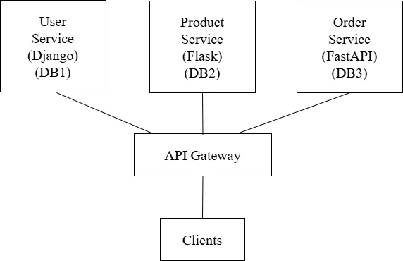

### Monolithic vs. Microservices Architecture

In a monolithic architecture, the entire application is built and deployed as a single unit. All components (UI, business logic, data access) are tightly coupled within one codebase and one deployment artifact. Scaling requires scaling the entire application, even if only one component needs more capacity. A bug in one module can bring down the entire system.

In a microservices architecture, the application is decomposed into independent services. Each service has its own codebase, deployment pipeline, and data store. Services communicate through APIs. Scaling is granular because only the services that need more capacity are scaled. A failure in one service is isolated from the rest.

### Advantages of microservices

1. Independent scaling of services based on their individual resource requirements is possible.
2. Faster development and deployment cycles occur because teams can work on different services in parallel.
3. Technology flexibility allows each service to use the technology stack best suited to its function.
4. Better fault isolation and resilience are achieved.
5. Systems are easier to understand and maintain because each service is focused on a single capability.

### Challenges of microservices

1. Increased operational complexity occurs as managing dozens or hundreds of services requires sophisticated tooling.
2. Network communication overhead and latency between services can increase.
3. Distributed data management introduces complexity in maintaining consistency across services.
4. Monitoring and debugging are more complex across distributed services.
5. Adopting microservices requires a mature DevOps culture and automation capabilities.

---

## 9.3 Infrastructure as Code (IaC)

Infrastructure as Code is the practice of managing and provisioning computing infrastructure (servers, networks, storage, databases, load balancers) through machine-readable configuration files rather than through manual processes or interactive configuration tools.

Instead of an operations engineer manually logging into a cloud console to create servers, configure networking, and set up databases, IaC allows the entire infrastructure to be defined in code files (e.g., Terraform HCL files, YAML, JSON). These files are stored in version control alongside application code, enabling the same software engineering practices such as version control, code review, testing, and CI/CD to be applied to infrastructure management.

### Principles of IaC

1. **Declarative definition:** Infrastructure is described in terms of the desired end state ("I want three web servers behind a load balancer") rather than procedural steps ("first create a server, then install software, then configure the load balancer"). The IaC tool figures out how to achieve the desired state.
2. **Version control:** Infrastructure definitions are stored in Git, enabling full change history, auditability, and the ability to roll back to any previous infrastructure state.
3. **Idempotency:** Applying the same configuration multiple times produces the same result, preventing configuration drift and unintended changes.
4. **Automation:** Infrastructure changes are applied through automated tooling rather than manual commands, eliminating human error and ensuring consistency.

### Benefits of IaC

1. **Consistency:** Every environment (development, staging, production) is provisioned identically from the same code, eliminating configuration drift. This is the gradual divergence between environments that causes "works on my machine" problems.
2. **Speed:** New environments can be provisioned in minutes rather than days or weeks.
3. **Reproducibility:** Entire environments can be destroyed and recreated identically, enabling disaster recovery and cost optimization.
4. **Auditability:** All infrastructure changes are recorded in version control with who made the change, when, and why.
5. **Cost optimization:** Infrastructure can be provisioned and decommissioned on demand, avoiding the waste of idle resources.

### IaC Tools

- **Terraform:** Terraform is an open-source tool by HashiCorp that supports multiple cloud providers with a declarative configuration language.
- **AWS CloudFormation:** AWS CloudFormation is Amazon's native IaC service for defining AWS resources using JSON or YAML templates.
- **Ansible:** Ansible is an agentless configuration management and IaC tool that uses YAML playbooks.
- **Pulumi:** Pulumi is an IaC tool that allows infrastructure definitions in general-purpose programming languages like Python, TypeScript, and Go.

---

## 9.4 AI-Assisted Software Development

AI-assisted software development refers to the use of artificial intelligence, particularly large language models and machine learning techniques, to augment and accelerate various phases of the software development lifecycle. Rather than replacing developers, AI tools act as intelligent assistants or AI pair programmers that help developers write code faster, find bugs earlier, generate tests, and produce documentation.

**How AI assists in software development:**

**1. Code generation and completion:**

AI tools analyze the context of the code being written (surrounding code, comments, function signatures) and suggest completions ranging from single lines to entire functions. For example, a developer writing a function signature and a comment describing its purpose may receive a complete, correct implementation suggested by the AI tool. Tools like GitHub Copilot, Amazon CodeWhisperer, and Cursor use LLMs trained on vast code corpora to provide these suggestions.

**2. Code review and bug detection:**

AI-powered tools can automatically review code changes (pull requests) for potential bugs, security vulnerabilities, code style violations, and anti-patterns. They analyze code at a deeper level than traditional linters by understanding code semantics, not just syntax. Tools like CodeRabbit and SonarQube provide automated code review capabilities.

**3. Test generation:**

AI tools can generate unit tests, integration tests, and edge-case test scenarios for existing code. Given a function, the AI can identify boundary conditions, typical inputs, and error cases, and produce test code covering these scenarios. This significantly reduces the manual effort of writing comprehensive test suites.

**4. Documentation generation:**

AI can generate docstrings, API documentation, README files, and inline comments by analyzing code structure and logic. This helps maintain documentation that stays in sync with the codebase, addressing a common pain point in software projects.

**5. Natural language to code:**

Developers can describe what they want in natural language (e.g., "create a REST endpoint that accepts a JSON payload with name and email fields, validates the email format, and stores the record in the database") and receive working code implementations. This lowers the barrier for less experienced developers and accelerates prototyping.

**6. Debugging and error resolution:**

AI tools can analyze error messages, stack traces, and code context to suggest fixes for bugs. They can identify root causes that might take a human developer significant time to trace through complex codebases.

**Benefits of AI-assisted development:**

1. **Increased productivity:** There is a significant reduction in time spent on boilerplate code, routine debugging, and scaffolding, which allows developers to focus on higher-level design and problem-solving.
2. **Faster learning:** Real-time code suggestions help developers learn new languages, frameworks, and APIs by example.
3. **Improved code quality:** AI-generated tests and automated code review catch issues that might be missed in manual review.
4. **Reduced context switching:** Developers can get answers and code suggestions within their IDE without switching to documentation or search engines.

**Challenges and risks:**

1. **Code quality concerns:** AI-generated code may contain subtle bugs, security vulnerabilities, or inefficiencies that require careful human review. Blindly accepting AI suggestions without review is dangerous.
2. **Intellectual property and licensing:** AI models trained on open-source code may reproduce copyrighted or licensed code snippets, raising legal concerns.
3. **Over-reliance:** Excessive dependence on AI tools can erode a developer's fundamental programming skills and understanding of underlying concepts.
4. **Security risks:** AI-generated code may introduce security vulnerabilities if the model has learned insecure coding patterns from training data.
5. **Hallucination:** AI models can generate plausible-looking but incorrect code, invent non-existent API functions, or produce logically flawed algorithms.

---

## 9.5 Low-Code/No-Code, Green Software Engineering

### Low-Code/No-Code Development

Low-code and no-code platforms are development environments that allow users to create applications through graphical user interfaces, visual modeling, and drag-and-drop components rather than writing traditional hand-coded programs.

**Low-code platforms** provide a visual development environment where most of the application can be built using visual tools (drag-and-drop UI builders, workflow designers, form builders), but developers can still write custom code when needed for complex logic, integrations, or customizations. Low-code platforms are aimed at professional developers who want to accelerate development. Examples include Microsoft Power Apps, OutSystems, and Mendix.

**No-code platforms** take this further by eliminating the need for any programming knowledge entirely. Applications are built purely through visual interfaces, pre-built templates, and configuration. No-code platforms target business users and non-technical professionals ("citizen developers") who want to automate workflows or build simple applications without depending on IT departments. Examples include Airtable, Bubble, and Zapier.

**Benefits of low-code/no-code:**

1. **Faster development:** Applications can be built in days or weeks instead of months, dramatically reducing time-to-market.
2. **Lower cost:** Reduced need for specialized development resources lowers project costs.
3. **Democratization of development:** Business users and domain experts can build applications directly, reducing the backlog on IT departments and bridging the gap between business needs and technology solutions.
4. **Rapid prototyping:** Ideas can be quickly prototyped and validated before committing to full-scale development.
5. **Reduced maintenance burden:** Platform updates, security patches, and infrastructure management are handled by the platform provider.

**Limitations of low-code/no-code:**

1. **Limited customization:** Complex business logic, unique UI requirements, or advanced integrations may be difficult or impossible to implement within the constraints of the platform.
2. **Vendor lock-in:** Applications built on proprietary platforms are tied to that vendor. Migrating to another platform or to custom code can be costly and difficult.
3. **Scalability constraints:** Applications may not scale well for high-traffic, enterprise-grade workloads that demand fine-tuned performance optimization.
4. **Security and governance:** Less visibility into underlying code makes security auditing and compliance more challenging.
5. **Technical debt:** Poorly designed visual workflows ("visual spaghetti") can become as difficult to maintain as poorly written code.

### Green Software Engineering

Green software engineering is an emerging discipline that focuses on designing, developing, deploying, and managing software systems in ways that minimize their environmental impact, primarily their carbon emissions and energy consumption. It recognizes that the ICT sector contributes significantly to global carbon emissions through energy-intensive data centers, network infrastructure, and end-user devices.

The Green Software Foundation (GSF), established in 2021 by organizations including Microsoft, GitHub, Accenture, and ThoughtWorks, defines green software engineering through a set of core principles.

**Principles of green software engineering:**

**1. Energy efficiency:**

Build applications that consume the least amount of energy possible. This involves writing efficient algorithms, minimizing unnecessary computation, reducing idle resource consumption, and optimizing data processing. For example, choosing an O(n log n) algorithm over an O(n²) algorithm for large datasets reduces both execution time and energy consumption.

**2. Carbon awareness:**

Be aware of the carbon intensity of the electricity grid at different times and locations. Schedule energy-intensive workloads (batch processing, model training, large builds) to run when and where the grid is powered by cleaner energy sources (e.g., during sunny or windy periods, or in regions with high renewable energy penetration).

**3. Hardware efficiency:**

Maximize the utilization of existing hardware. Underutilized servers waste embodied carbon (the carbon emitted during manufacturing). Design software to run efficiently on existing hardware rather than requiring frequent upgrades. Extend the useful life of devices and infrastructure.

**4. Measurement:**

Quantify the carbon emissions and energy consumption of software systems. What is not measured cannot be improved. Use tools and frameworks to track the carbon footprint of applications, deployments, and infrastructure.

**Practices for green software engineering:**

1. **Efficient coding:** Write optimized code that minimizes CPU cycles, memory usage, and I/O operations. Avoid unnecessary polling, redundant computations, and resource-intensive background processes.
2. **Right-sizing infrastructure:** Provision only the resources needed. Use auto-scaling to match resource allocation to actual demand rather than provisioning for peak capacity at all times.
3. **Demand shaping:** Design applications to shift workloads to times when carbon-free energy is available. Use event-driven architectures rather than always-on processes.
4. **Data efficiency:** Store and transfer only necessary data. Compress data, archive infrequently accessed data to cold storage, and avoid excessive logging or telemetry that wastes storage and processing.
5. **Sustainable architecture:** Choose architectures that inherently reduce waste. This includes serverless computing where functions execute only when triggered, efficient caching strategies, and CDNs that reduce network traffic.

Green software engineering treats sustainability as a non-functional requirement alongside performance, security, and reliability. This integrates environmental responsibility into the software development lifecycle rather than treating it as an afterthought.

---

---

---

## SOFTWARE REQUIREMENTS SPECIFICATION

## Online Library Management System (OLMS)

### Version 2.0

## 1. Introduction

### 1.1 Purpose

This SRS describes the functional and non-functional requirements for the Online Library Management System (OLMS). It is intended for use by the development team, testers, project managers, and the library administration (client).

### 1.2 Scope

OLMS is a web-based application that automates the core operations of a college library, including cataloging books, managing member registrations, issuing and returning books, tracking overdue items, and generating reports. The system will replace the existing manual register-based process.

### 1.3 Definitions, Acronyms, and Abbreviations

- **OLMS:** Online Library Management System.
- **Member:** A registered student or faculty member who can borrow books.
- **Librarian:** An authorized staff member who manages the system.
- **ISBN:** International Standard Book Number.
- **RBAC:** Role-Based Access Control.

### 1.4 References

- IEEE Std 830-1998, IEEE Recommended Practice for Software Requirements Specifications.
- College Library Policy Document, Version 3.2.

### 1.5 Overview

Section 2 provides an overall description of the product.

Section 3 specifies detailed functional and non-functional requirements compliant with the IEEE Std 830-1998 structural layout, utilizing Use Case specifications for functional behaviors.

<div style="page-break-after: always;"></div>

## 2. Overall Description

### 2.1 Product Perspective

OLMS is a standalone web application. It interfaces with an existing college student database for member verification. It runs on a web server (Apache/Nginx) with a MySQL database backend and is accessed through standard web browsers.

### 2.2 Product Functions

- Book catalog management (add, update, delete, search).
- Member registration and profile management.
- Book issuing and returning.
- Fine calculation for overdue books.
- Reservation of books currently issued to others.
- Report generation (most borrowed books, overdue list, member activity).

### 2.3 User Characteristics

- **Librarian:** The primary administrative user. Expected to have the ability to operate standard web browsers, use peripheral devices (barcode scanners), and perform data entry.
- **Member (Student/Faculty):** Expected to have basic familiarity with web navigation to utilize search functions and web forms.
- **Administrator:** The technical staff responsible for system configuration, server maintenance, and top-level user management.

### 2.4 Constraints

- The system must run on the college's existing Linux server infrastructure.
- The system must comply with the college's data privacy policy.
- Maximum budget: NPR 5,00,000.

### 2.5 Assumptions and Dependencies

- Members already have valid college IDs for authentication.
- The college provides a stable, continuous internet connection for the server.
- The student database REST API is highly available and fully documented.

### 2.6 Apportioning of Requirements

Features such as inter-library loans and e-book licensing are not included in the current version of the system and are deferred to future releases.

<div style="page-break-after: always;"></div>

## 3. Specific Requirements

### 3.1 External Interface Requirements

#### 3.1.1 User Interfaces

The system shall provide a responsive HTML5/CSS3 web interface accessible on standard desktop browsers (Chrome, Firefox, Edge). The librarian dashboard shall display a summary widget for pending returns and overdue alerts upon successful login.

#### 3.1.2 Hardware Interfaces

The system shall interface via USB/Bluetooth with standard barcode scanners to read book ISBNs and member IDs directly into text input fields during issue/return operations.

#### 3.1.3 Software Interfaces

The system shall connect to the college student database via a REST API. The API will accept a `StudentID` parameter and return a JSON payload confirming student enrollment status.

#### 3.1.4 Communications Interfaces

The system shall utilize SMTP over TLS (Port 587) to send email notifications (overdue reminders, reservation availability) to users.

---

### 3.2 Functional Requirements (Use Case Specifications)

#### UC-01: Search Catalog

| Element           | Details                                                                                                                                                                                                                                                             |
| ----------------- | ------------------------------------------------------------------------------------------------------------------------------------------------------------------------------------------------------------------------------------------------------------------- |
| **Actors**        | Member, Librarian                                                                                                                                                                                                                                                   |
| **Precondition**  | User has accessed the OLMS search portal.                                                                                                                                                                                                                           |
| **Main Flow**     | 1. User enters search criteria (Title, Author, ISBN, or Category).<br>2. User submits the search query.<br>3. System queries the catalog database.<br>4. System displays a list of matching books including Title, Author, Availability Status, and Shelf Location. |
| **Exceptions**    | 1. No Match Found: System displays a "No books found matching your criteria" message and suggests checking spelling or broadening the search.                                                                                                                       |
| **Postcondition** | Relevant book information is displayed to the user.                                                                                                                                                                                                                 |
| **Priority**      | Essential                                                                                                                                                                                                                                                           |

#### UC-02: Add New Book

| Element           | Details                                                                                                                                                                                                                                                                                                                        |
| ----------------- | ------------------------------------------------------------------------------------------------------------------------------------------------------------------------------------------------------------------------------------------------------------------------------------------------------------------------------ |
| **Actors**        | Librarian                                                                                                                                                                                                                                                                                                                      |
| **Precondition**  | Librarian is logged in and navigated to the Catalog Management module.                                                                                                                                                                                                                                                         |
| **Main Flow**     | 1. Librarian enters book details (Title, Author, ISBN, Publisher, Edition, Category, Quantity, Shelf Location).<br>2. Librarian submits the form.<br>3. System validates the ISBN against existing records.<br>4. System saves the new book record to the database.<br>5. System displays a "Successfully Added" confirmation. |
| **Exceptions**    | 1. Duplicate ISBN: System halts the save operation, displays "Error: Book with this ISBN already exists," and highlights the conflicting field.                                                                                                                                                                                |
| **Postcondition** | The new book is available in the catalog and can be searched or issued.                                                                                                                                                                                                                                                        |
| **Priority**      | Essential                                                                                                                                                                                                                                                                                                                      |

#### UC-03: Register Member

| Element           | Details                                                                                                                                                                                                                                                                                                                                    |
| ----------------- | ------------------------------------------------------------------------------------------------------------------------------------------------------------------------------------------------------------------------------------------------------------------------------------------------------------------------------------------ |
| **Actors**        | Librarian                                                                                                                                                                                                                                                                                                                                  |
| **Precondition**  | Librarian is logged in and navigated to the Member Management module.                                                                                                                                                                                                                                                                      |
| **Main Flow**     | 1. Librarian enters member details (Name, College ID, Department, Contact Number, Email).<br>2. Librarian submits the registration form.<br>3. System pings the Student Database REST API with the College ID.<br>4. API confirms active enrollment.<br>5. System creates a local Member Profile.<br>6. System displays a success message. |
| **Exceptions**    | 1. Invalid/Inactive ID: The REST API returns 'Inactive' or 'Not Found'. System aborts registration and displays: "Error: Invalid or Inactive College ID."                                                                                                                                                                                  |
| **Postcondition** | Member is successfully registered and granted borrowing privileges.                                                                                                                                                                                                                                                                        |
| **Priority**      | Essential                                                                                                                                                                                                                                                                                                                                  |

#### UC-04: Issue Book

| Element           | Details                                                                                                                                                                                                                                                                                                                                                                                                                             |
| ----------------- | ----------------------------------------------------------------------------------------------------------------------------------------------------------------------------------------------------------------------------------------------------------------------------------------------------------------------------------------------------------------------------------------------------------------------------------- |
| **Actors**        | Librarian                                                                                                                                                                                                                                                                                                                                                                                                                           |
| **Precondition**  | Librarian is logged in; the book is physically present at the desk.                                                                                                                                                                                                                                                                                                                                                                 |
| **Main Flow**     | 1. Librarian inputs/scans the Member ID.<br>2. Librarian inputs/scans the Book ISBN.<br>3. System verifies the Member account is Active.<br>4. System verifies the Member has borrowed fewer than 3 books.<br>5. System verifies the Book is 'Available'.<br>6. System updates book status to 'Issued'.<br>7. System records the Issue Date and sets Due Date (Current Date + 14 days).<br>8. System displays success confirmation. |
| **Exceptions**    | 1. Member Inactive: System displays "Error: Member account is inactive/suspended."<br>2. Limit Exceeded: System displays "Error: Member has reached the maximum borrowing limit of 3 books."<br>3. Book Unavailable: System displays "Error: Book is currently unavailable."                                                                                                                                                        |
| **Postcondition** | The transaction is recorded, and the physical book is handed to the member.                                                                                                                                                                                                                                                                                                                                                         |
| **Priority**      | Essential                                                                                                                                                                                                                                                                                                                                                                                                                           |

#### UC-05: Return Book

| Element           | Details                                                                                                                                                                                                                                                                                                                  |
| ----------------- | ------------------------------------------------------------------------------------------------------------------------------------------------------------------------------------------------------------------------------------------------------------------------------------------------------------------------ |
| **Actors**        | Librarian                                                                                                                                                                                                                                                                                                                |
| **Precondition**  | Librarian is logged in; the physical book is returned to the desk.                                                                                                                                                                                                                                                       |
| **Main Flow**     | 1. Librarian inputs/scans the Book ISBN.<br>2. System retrieves the active transaction record.<br>3. System compares Current Date against Due Date (verifies it is not overdue).<br>4. System closes the transaction record.<br>5. System updates book status to 'Available'.<br>6. System displays return confirmation. |
| **Exceptions**    | 1. Book Overdue: System detects Current Date > Due Date. System calculates fine (Days Overdue × NPR 5), posts the fine amount to the Member Account ledger, alerts the Librarian of the fine, and then proceeds to steps 4-6.                                                                                            |
| **Postcondition** | Book status is 'Available' (triggering any pending reservation emails), and transaction is closed.                                                                                                                                                                                                                       |
| **Priority**      | Essential                                                                                                                                                                                                                                                                                                                |

#### UC-06: Reserve Book

| Element           | Details                                                                                                                                                                                                                                                        |
| ----------------- | -------------------------------------------------------------------------------------------------------------------------------------------------------------------------------------------------------------------------------------------------------------- |
| **Actors**        | Member                                                                                                                                                                                                                                                         |
| **Precondition**  | Member is logged in; the desired book is currently marked as 'Issued'.                                                                                                                                                                                         |
| **Main Flow**     | 1. Member clicks "Reserve Book" on the catalog details page.<br>2. System confirms the book is eligible for reservation.<br>3. System flags the book with a reservation tag linked to the Member ID.<br>4. System displays a "Reservation Successful" message. |
| **Exceptions**    | 1. Queue Full: If the system is configured with a maximum reservation queue and it is full, display "Reservation queue is currently full for this item."                                                                                                       |
| **Postcondition** | Member is added to the reservation queue. When UC-05 (Return Book) is executed on this item, an automated email is triggered.                                                                                                                                  |
| **Priority**      | Conditional: Only applicable when the requested book is currently issued to another member.                                                                                                                                                                    |

---

### 3.3 Performance Requirements

- **PR-01:** The system backend and database shall comfortably support a minimum of 100 concurrent active sessions.
- **PR-02:** Search queries (UC-01) shall execute and render UI results within 2.0 seconds under the peak load of 100 concurrent users.
- **PR-03:** Transactional database commits for Book Issue (UC-04) and Return (UC-05) shall complete within 3.0 seconds under the peak load of 100 concurrent users.

### 3.4 Design Constraints

- **DC-01:** The frontend shall utilize HTML5, CSS3, and vanilla JavaScript.
- **DC-02:** The backend logic shall be built using Python 3.8+ and the Django Web Framework.
- **DC-03:** The primary data store shall be MySQL 8.0+.
- **DC-04:** The system architecture must adhere strictly to the Model-View-Controller (MVC) design pattern.

### 3.5 Software System Attributes

#### 3.5.1 Reliability

The system shall maintain an uptime of 99% during core library operating hours (08:00 to 20:00 NPT).

#### 3.5.2 Security & Authorization

- **Authentication:** All users must authenticate via College ID and password.
- **Data Protection:** All passwords shall be hashed prior to database storage using the `bcrypt` cryptographic algorithm.
- **Session Management:** The system shall automatically terminate user sessions and require re-authentication after 15 minutes of inactivity.
- **Role-Based Access Control (RBAC):**
- _Members_ have read-only access to catalogs and write-access only to their personal reservation queue.
- _Librarians_ have read/write access to catalog management, member profiles, and transaction processing.

#### 3.5.3 Usability

The UI workflow for UC-04 (Issue Book) shall be streamlined so that a newly trained librarian can complete a transaction in under 3 clicks and 2 minutes of active interface time.

#### 3.5.4 Maintainability

The application shall document all internal application programming interfaces (APIs) to facilitate future modular integrations, such as third-party payment gateways for fines or e-book DRM modules.

#### 3.5.5 Portability

The system codebase shall be containerized (e.g., Docker) to ensure it is OS-agnostic and deployable on any standard Linux distribution supporting Python 3.8 and MySQL 8.0.

### 3.6 Other Requirements

#### 3.6.1 Logical Database Requirements

- **DB-01: Core Entities:** The database shall be normalized to at least 3NF, containing distinct relational tables for `Members`, `Books`, `Transactions`, and `Fines`.
- **DB-02: Data Retention:** System logs, transaction histories, and fine ledgers must be retained persistently for a minimum of 3 calendar years to comply with college auditing standards.
- **DB-03: Integrity Constraints:** The system shall restrict the deletion of a `Book` row via foreign key constraints if it is currently tied to an open `Transaction` record.
