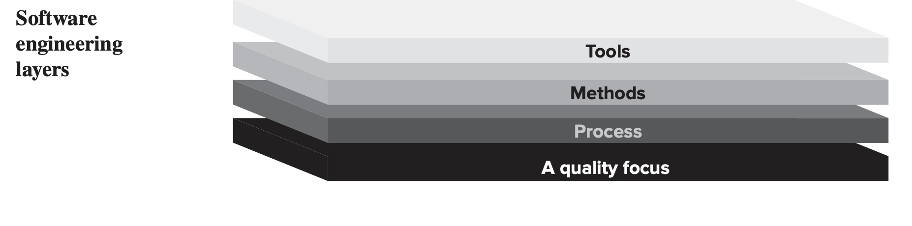
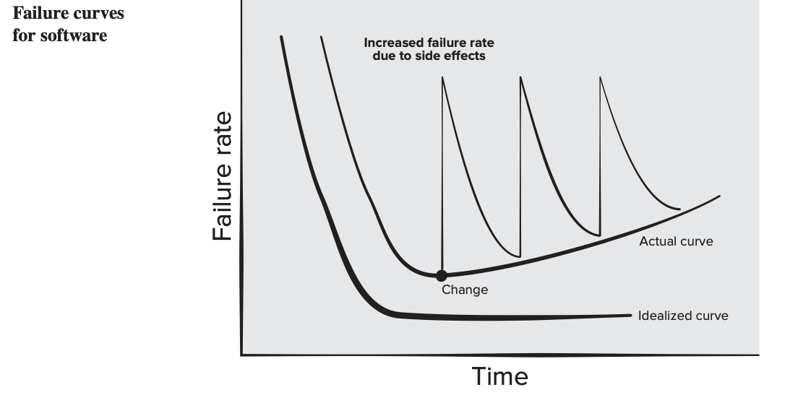

# 1. Introduction

# 1.1 Software and Software Engineering

> **Explain how modern software engineering practices helped overcome the software crisis. [3 marks] (2082 Bhadra - IOE - Old Syllabus Relevant)**

Software is:

(1) instructions (computer programs) that when executed provide desired features, function, and performance

(2) data structures that enable the programs to adequately manipulate information

(3) descriptive information in both hard copy and virtual forms that describes the operation and use of the programs.

Software Engineering (IEEE definition): The application of a systematic, disciplined, quantifiable approach to the development, operation, and maintenance of software; that is, the application of engineering to software.

Software engineering is a layered technology built on four layers (bottom to top):

1. **Quality focus:** It is the bedrock that represents an organizational commitment to continuous quality improvement (e.g., TQM, Six Sigma). Main Goals is to Reduce defects, Improve customer satisfaction, Ensure reliability and maintainability, and Continuously improve development practices. A company may review coding standards regularly, track defect rates, perform quality audits.

2. **Process:** It is the foundation that defines a framework for management control, milestones, and change management. It answers What activities should be done?, In what order?, Who is responsible?, How is progress tracked?

3. **Methods:** They provide the technical how-to's, including communication, requirements analysis, design modeling, construction, testing, and support. This layer answers “How do we actually create the software?”. Examples UML diagrams for design, Object-oriented analysis and design, Database modeling, Unit testing techniques, Design patterns.

4. **Tools:** They provide automated or semi-automated support for process and methods (CASE tools). A team may use Git for source control, Jira for task management, Jenkins for automated deployment, Selenium for testing.

Modern software engineering emerged to address recurring problems: late delivery, cost overruns, unreliable software, and difficulty maintaining existing systems.

**Software Engineering vs. Computer Science**

1. **Computer Science:**

Focuses on the theories, algorithms, and fundamentals of how computers and programming languages work, often independent of business constraints.

2. **Software Engineering:**

Focuses on the practicalities of developing, delivering, and maintaining useful software systems within constraints (e.g., time, budget, customer needs).

---

# 1.2 Nature and Characteristics of Software

> **Define software and list typical software characteristics. [4 marks] (2078 Bhadra - IOE - Old Syllabus Relevant)**
>
> **What are the characteristics of good software? [2 marks] (2081 Bhadra - IOE - Old Syllabus Relevant)**
>
> **Justify: "Software doesn't wear out like hardware components." [5 marks] (2082 Bhadra - IOE - Old Syllabus Relevant)**

Software is a logical element, not a physical one. Its key characteristics that distinguish it from hardware:

**Software is developed or engineered; it is not manufactured:**

Software is not manufactured in the classical sense. Although similarities exist between software development and hardware manufacturing, the two activities are fundamentally different. Software quality is achieved through good design, not through production control.

**Software doesn't "wear out":**

Hardware follows a "bathtub curve" with a high early failure rate (infant mortality), then a steady-state, then increasing failures due to wear. Software has no physical wear. Its failure curve is idealized as a high initial failure rate (undiscovered defects) that drops and flattens as defects are corrected. However, software deteriorates because each change introduces new errors, causing failure rate spikes. Over time, the baseline failure rate rises.

**Software has no spare parts:**

Every failure indicates a design error. Unlike hardware where a worn-out component is replaced with a spare, software maintenance involves fixing design flaws, which is inherently more complex.

**Most software is custom-built:**

It is not assembled from standard components, although the industry is moving toward component-based construction and reuse.

**Characteristics of good software** (quality attributes):

1. **Functionality:**
   The software delivers the required features.
2. **Reliability:**
   The software performs without failure under stated conditions.
3. **Usability:**
   The software is easy for the intended users to learn and operate.
4. **Efficiency:**
   The software makes optimal use of system resources.
5. **Maintainability:**
   The software is easy to modify, correct, and improve.
6. **Portability:**
   The software can operate across different environments.

---

# 1.3 Software Application Domains

Seven broad categories of computer software:

1. **System software:**
   It consists of programs that service other programs (e.g., compilers, OS components, drivers, networking software). It processes complex information structures, often with indeterminate input/output.
2. **Application software:**
   It consists of standalone programs that solve specific business needs (e.g., payroll, inventory). It processes business or technical data for decision making.
3. **Engineering/scientific software:**
   It consists of "number-crunching" programs for scientific computation (e.g., CAD, weather forecasting, stress analysis, data science applications).
4. **Embedded software:**
   It resides within a product or system to control features and functions (e.g., fuel control in automobiles, microwave oven key pad, braking systems).
5. **Product-line software:**
   It is composed of reusable components, designed for use by many customers (e.g., word processors, spreadsheets, inventory control products).
6. **Web/mobile applications:**
   They are network-centric software spanning browser-based apps, cloud computing, service-based computing, and mobile device software.
7. **Artificial intelligence software:**
   Artificial intelligence (AI) software is software designed to simulate human intelligence and make decisions or solve problems that are difficult to solve using normal step-by-step algorithms. AI software can learn from data, recognize patterns, make predictions, reason and decide. It uses heuristics to solve complex problems not amenable to regular computation (e.g., robotics, machine learning, pattern recognition, game playing, decision-making systems).

---

# 1.4 Legacy Software

Legacy software refers to older programs, often developed decades ago, that have been continually modified to meet changing business requirements and computing platforms.

**Characteristics:**

1. It often supports core business functions and is indispensable.
2. It is costly to maintain and risky to evolve.
3. It may have poor quality by modern standards, including inextensible designs, convoluted code, poor or absent documentation, no archived test cases, and poorly managed change history.

**Maintaining / Evolving:**

1. Must be adapted to new computing environments or technology.
2. Must be enhanced to meet new business requirements.
3. Must be extended to work with modern systems or databases.
4. Must be re-architected to remain viable in an evolving environment.

If a legacy system meets users' needs and runs reliably, it does not need to be fixed. But when evolution is needed, it must be reengineered for future viability.

**Lehman’s Laws of Software Evolution:**

When maintaining or evolving legacy systems (or any software), Lehman's laws describe how the system behaves:

1. **Law of Continuing Change:**

A system must be continually adapted, or it becomes progressively less useful.

2. **Law of Increasing Complexity:**

As a system evolves, its structure degrades and complexity increases unless work is done to maintain or simplify it.

---

# 1.5 Software Crisis

> **What is software crisis? Explain with an example. [5 marks] (2068 Chaitra - IOE - Old Syllabus Relevant)**
>
> **What factors have contributed to the software crisis? Suggest possible solutions. [3+3 marks] (2075 Ashwin - IOE - Old Syllabus Relevant)**

The software crisis is a term coined in the late 1960s (at the 1968 NATO conference) to describe the chronic problems in software development, specifically the inability to produce useful, reliable software on time and within budget as systems grew in complexity.

**Causes of the software crisis:**

1. **Increasing complexity:**
   Software requirements grew rapidly in complexity while tools and techniques remained primitive.
2. **Rising demand:**
   The demand for new software outpaced the industry's ability to produce it.
3. **Inadequate techniques:**
   Informal development techniques could not scale to large systems. Early software development was mostly: “Code-first” (start writing code without proper design), Informal (little documentation or planning), Individual-based (dependent on a few programmers’ knowledge).
4. **Poor management:**
   Project management lacked standardized engineering methodologies. Unrealistic Deadlines, Inadequate Quality Assurance.
5. **Maintenance challenges:**
   The cost of maintenance often exceeded the initial development cost.
6. **Shortage of practitioners:**
   There were not enough trained software practitioners to meet the demand.
7. **Poor communication:**
   Poor communication between stakeholders, developers, and users resulted in software that did not actually meet the business requirements.

**Manifestations:**

1. Projects running significantly over budget and past deadlines.
2. Delivered software failing to meet customer requirements.
3. Software that was error-prone, unreliable, and poorly documented.
4. Large projects becoming unmanageable or being cancelled entirely.

**Historical examples:**

1. **IBM OS/360 (1963–65):** It experienced massive delays and cost overruns in creating a unified OS.
2. **Therac-25 (1985–87):** It had software-based safety failures in a radiation therapy machine that caused patient fatalities.
3. **Denver Airport Baggage System (1995):** It suffered from automated baggage system software glitches that delayed airport opening for 16 months.
4. **Ariane 5 Rocket (1996):** It crashed 37 seconds after launch due to an integer overflow in control software.

**Solutions:**

1. Adoption of systematic software engineering practices (process models, methods, tools).
2. Better requirements gathering and management.
3. Use of formal reviews, inspections, and testing strategies.
4. Standards and quality assurance frameworks.
5. Training and education in software engineering principles.

---

# 1.6 Software Myths

Software myths are widely held but false beliefs that lead to mismanagement, unrealistic expectations, and project failures. They are classified into three categories:

### 1. Management Myths

**Myth:** "We already have a book full of standards and procedures for building software. Won't that provide my people with everything they need to know?"
**Reality:** Standards may exist but are often incomplete, outdated, or not actually used. Having a book does not mean the practice is adequate or that practitioners follow it.

**Myth:** "If we get behind schedule, we can add more programmers and catch up."
**Reality:** Adding people to a late project makes it later (Brooks' Law). New staff need time to learn the system, and communication overhead increases quadratically with team size.

**Myth:** "If I decide to outsource the software project, I can just relax and let the vendor build it."
**Reality:** If an organization cannot manage and control software internally, it will invariably struggle when outsourcing. Oversight and involvement remain essential.

### 2. Customer Myths

**Myth:** "A general statement of objectives is sufficient to begin writing programs. We can fill in the details later."
**Reality:** Ambiguous requirements are the primary cause of failed projects. A formal and detailed requirements specification is essential to minimize rework and miscommunication.

**Myth:** "Software requirements continually change, but changes can be easily accommodated because software is flexible."
**Reality:** While software is inherently malleable, the cost of change increases dramatically as development progresses. A change made during design can be 1.5–6× more costly than during requirements; during testing, 60–100× more costly.

### Practitioner (Developer) Myths

**Myth:** "Once we write the program and get it to work, our job is done."
**Reality:** 60–80% of total effort is expended after the first delivery, during maintenance (bug fixing, enhancements, adaptation).

**Myth:** "Until I get the program running, I have no way of assessing its quality."
**Reality:** Quality can be assessed from inception through formal technical reviews, design analysis, and inspections, long before a single line of code is compiled.

### Practitioner (Developer) Myths

**Myth:** "The only deliverable for a successful project is the working program."
**Reality:** Documentation, models, test plans, and design specifications are equally critical deliverables for long-term maintainability and success.

**Myth:** "Software engineering will make us create voluminous and unnecessary documentation and will slow us down."
**Reality:** Software engineering is about creating quality; it often leads to reduced rework, which results in faster delivery.

---

# 1.7 Software Engineering Practice: Essence of Practice, General Principles

### The Essence of Practice

Based on George Polya's problem-solving approach (_How to Solve It_, 1945), software engineering practice follows four essential steps:

**1. Understand the problem** (communication and analysis)

- Collaborate with stakeholders to extract and analyze true requirements
- Who are the stakeholders?
- What are the unknowns? What data, functions, and features are required?
- Can the problem be decomposed into smaller, more manageable problems?
- Can the problem be represented graphically? Can an analysis model be created?

**2. Plan a solution** (modeling and software design)

- Have you seen similar problems before? Are there reusable patterns or existing software?
- Can subproblems be defined with readily apparent solutions?
- Can a design model be created that leads to effective implementation?

**3. Carry out the plan** (code generation)

- Does the solution conform to the design plan? Is the code traceable to the design model?
- Is each component provably correct? Has the code been reviewed?

**4. Examine the result for accuracy** (testing and quality assurance)

- Has a reasonable testing strategy been implemented?
- Does the solution produce results that conform to requirements?
- Has the software been validated against all stakeholder requirements?

### General Principles (Hooker's Seven Principles)

**1. The Reason It All Exists**

A software system exists to provide value to its users. All decisions should be made with this in mind. If something does not add real value, don't do it.

**2. KISS (Keep It Simple, Stupid!)**

All design should be as simple as possible, but no simpler. Simpler designs are easier to understand, maintain, and less error-prone. Simplicity takes thoughtful effort over multiple iterations.

**3. Maintain the Vision**

A clear architectural vision is essential for success. Without conceptual integrity, a system becomes a patchwork of incompatible designs. An empowered architect who holds and enforces the vision helps ensure success.

**4. What You Produce, Others Will Consume**

Always design, code, and document knowing someone else will have to understand and maintain your work. Making their job easier adds value to the system.

**5. Be Open to the Future**

Never design yourself into a corner. Build systems that solve the general problem, not just the specific one. Prepare for changing specifications and evolving platforms.

**6. Plan Ahead for Reuse**

Reuse saves time and effort. Planning for reuse reduces cost and increases the value of both the reusable components and the systems that incorporate them.

**7. Think!**

Clear, complete thought before action almost always produces better results. Thinking helps you recognize when you don't know something and need to research the answer. Applying the first six principles requires intense thought.
