<!-- _class: title-slide -->

# 2. The Software Process

(8 hours, 11 marks)
By Bidur Sapkota

---

# 2.1 Process Framework and Umbrella Activities

> **Explain fundamental activities of the software process. [3 marks] (2082 Bhadra - IOE - Old Syllabus Relevant)**

A software process is a collection of activities, actions, and tasks performed when a work product is to be created. It is not rigid but adaptable to the problem, project, team, and organizational culture.

---

# 2.1 Process Framework and Umbrella Activities

### Framework Activities

A generic process framework defines five framework activities applicable to all software projects regardless of size or complexity:

1. **Communication:** It involves collaborating with stakeholders to understand their objectives and gather requirements that define software features and functions.
2. **Planning:** It involves creating a software project plan that describes technical tasks, risks, resources, work products, and schedule (the project "road map").
3. **Modeling:** It involves creating models (sketches, UML diagrams, architectural representations) to understand requirements and the design that will achieve them.

---

# 2.1 Process Framework and Umbrella Activities

### Framework Activities

4. **Construction:** It involves code generation (manual or automated) combined with testing to uncover errors in the code.
5. **Deployment:** It involves delivering the software (complete or as an increment) to the customer, who evaluates it and provides feedback.

 

These activities are applied iteratively. Each iteration produces a software increment that provides stakeholders with a subset of overall features until the software is complete.

---

# 2.1 Process Framework and Umbrella Activities

### Process Flow

Process flow describes how framework activities are organized with respect to sequence and time. The choice of which process flow to adopt depends heavily on the project's specific requirements, their stability, and the development team's familiarity with the domain. Four types of process flow exist:

 

1. **Linear process flow:** It executes each activity in sequence.
2. **Iterative process flow:** It repeats one or more activities before proceeding to the next.

---

# 2.1 Process Framework and Umbrella Activities

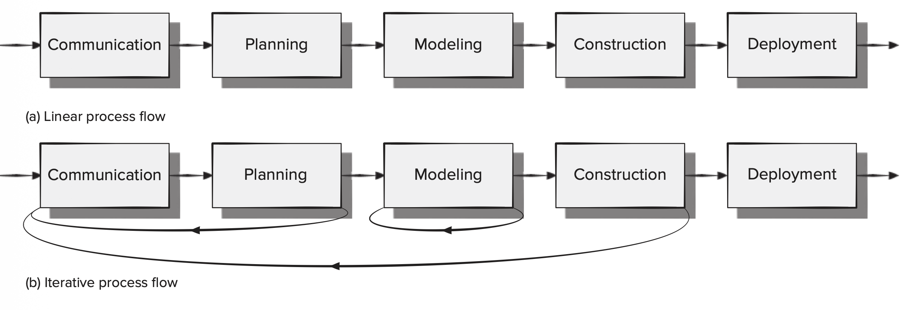

---

# 2.1 Process Framework and Umbrella Activities

### Process Flow

3. **Evolutionary process flow:** It executes activities in a "circular" manner. Each circuit leads to a more complete version of the software.
4. **Parallel process flow:** It executes one or more activities concurrently with others (e.g., modeling for one aspect while constructing another).

---

# 2.1 Process Framework and Umbrella Activities

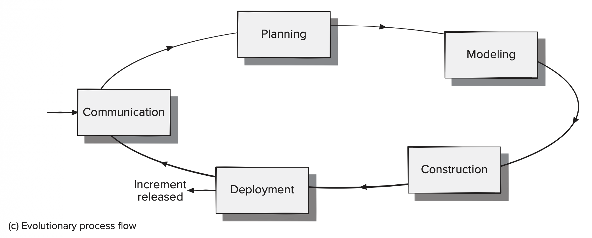

---

# 2.1 Process Framework and Umbrella Activities

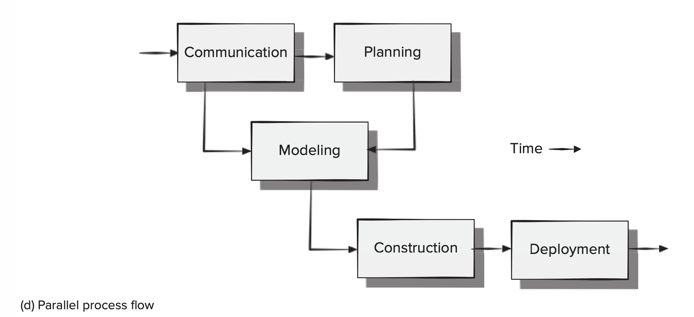

---

# 2.1 Process Framework and Umbrella Activities

### Umbrella Activities

Umbrella activities are applied throughout the software process to manage and control progress, quality, change, and risk:

1. **Software project tracking and control:** It is used to assess progress against the project plan and take corrective action.
2. **Risk management:** It is used to assess risks that may affect the project outcome or product quality.
3. **Software quality assurance:** It involves defining and conducting activities to ensure software quality.

---

# 2.1 Process Framework and Umbrella Activities

### Umbrella Activities

4. **Technical reviews:** They help uncover and remove errors before they propagate to the next activity.
5. **Measurement:** It involves collecting process, project, and product measures to help deliver software that meets stakeholders' needs.
6. **Software configuration management:** It is used to manage the effects of change throughout the process.

---

# 2.1 Process Framework and Umbrella Activities

### Umbrella Activities

7. **Reusability management:** It involves defining criteria for work product reuse and establishing mechanisms for reusable components.
8. **Work product preparation and production:** It involves creating models, documents, logs, forms, and lists.

---

# 2.2 Traditional (Plan-Driven) Process Models

Traditional (prescriptive) process models define a predefined set of process elements and a predictable process workflow. They prescribe framework activities, software engineering actions, tasks, work products, quality assurance, and change control mechanisms. They strive for structure and order in software development.

---

# 2.2 Traditional (Plan-Driven) Process Models

### 2.2.1 Waterfall Model and Its Extensions

> **What is SDLC? Discuss the various stages of the waterfall process model. [2+3 marks] (2081 Baishakh - IOE - Old Syllabus Relevant)**
>
> **Discuss the advantages and disadvantages of the waterfall model. [4 marks] (2079 Bhadra - IOE - Old Syllabus Relevant)**
>
> **Explain why the waterfall model is not suitable when important functionalities need to be delivered in a short time period. [4 marks] (2073 Chaitra - IOE - Old Syllabus Relevant)**

---

# 2.2 Traditional (Plan-Driven) Process Models

The Software Development Life Cycle (SDLC) is a structured sequence of stages in software engineering to develop the intended software product. The waterfall model is the oldest and most classical SDLC paradigm.

The **waterfall model** (also called the linear sequential model), originally proposed by Winston Royce (1970), suggests a systematic, sequential approach to software development flowing through these stages:

1. **Communication:** It covers project initiation and requirements gathering from the customer.
2. **Planning:** It covers estimating, scheduling, and tracking the project.

---

# 2.2 Traditional (Plan-Driven) Process Models

**Waterfall model**

 

3. **Modeling:** It covers analysis and design, including creating representations of the system.
4. **Construction:** It covers code generation and testing.
5. **Deployment:** It covers delivery, support, and feedback.

Each phase must be completed before the next phase begins, and there is little opportunity to revisit earlier phases.

---

# 2.2 Traditional (Plan-Driven) Process Models

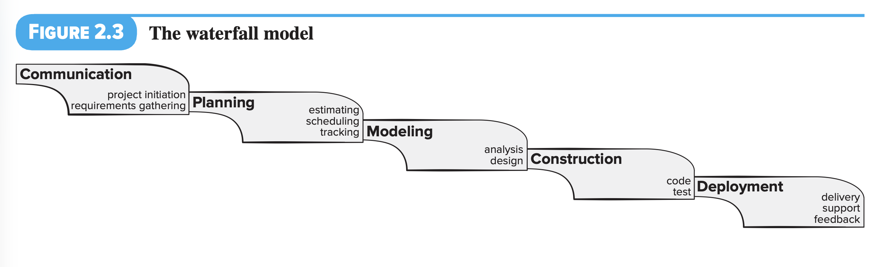

---

# 2.2 Traditional (Plan-Driven) Process Models

**Waterfall model**

 

**Advantages:**

- Simple to understand and easy to plan.
- Works well for small, well-understood projects with stable requirements.
- Analysis and testing are straightforward.
- Clear milestones and deliverables at each phase.

---

# 2.2 Traditional (Plan-Driven) Process Models

**Waterfall model**

 

**Disadvantages:**

- Real projects rarely follow a strictly sequential flow.
- Difficult for the customer to state all requirements explicitly at the beginning.
- A working version of the software is not available until late in the project.
- Major errors may not be detected until the working program is reviewed.
- Does not accommodate change well because the cost of change increases dramatically if discovered late.

---

# 2.2 Traditional (Plan-Driven) Process Models

**Waterfall model**

 

**Disadvantages:**

- Testing occurs late in the process.
- Customer approval is only at the end.

---

# 2.2 Traditional (Plan-Driven) Process Models

**Why waterfall is unsuitable for rapid delivery?**

The waterfall model requires all phases to be completed sequentially. No working software is delivered until the construction phase is complete. If important functionalities must be delivered quickly, this model fails because it offers no mechanism for partial delivery or incremental release. The customer must wait for the entire system to be built before seeing any working functionality.

---

# 2.2 Traditional (Plan-Driven) Process Models

**Extensions of the Waterfall Model:**

 

1. **V-Model:** It associates a testing phase with each development phase (e.g., unit testing validates construction, system testing validates design).
2. **Waterfall with feedback:** It allows limited iteration between adjacent phases, partially addressing the rigidity of the pure waterfall.

---

# 2.2 Traditional (Plan-Driven) Process Models

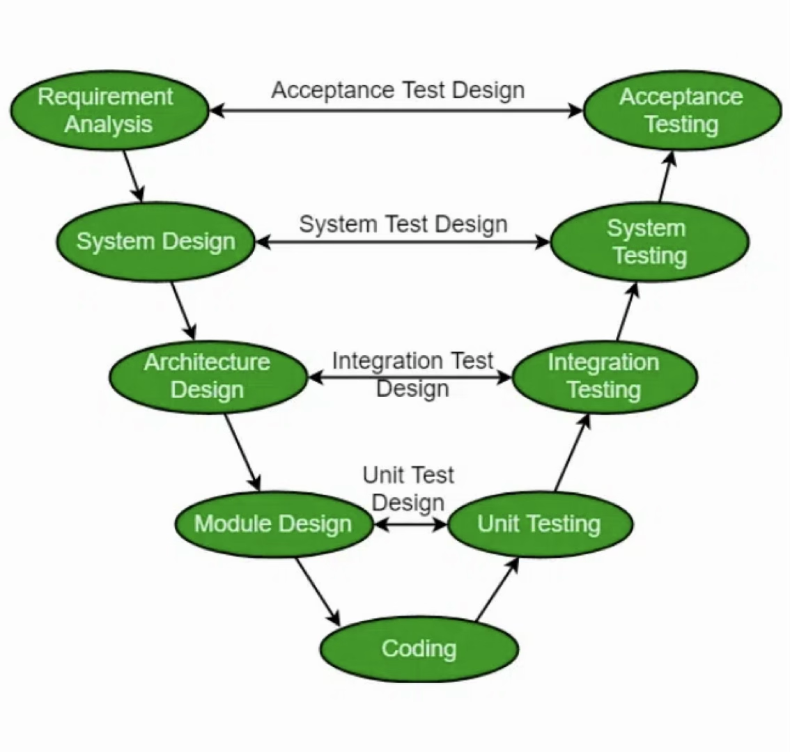

Figure: V-Model

---

# 2.2 Traditional (Plan-Driven) Process Models

### 2.2.2 Incremental Process Model

> **Explain the incremental model with its advantages and disadvantages. [4+3 marks] (2075 Chaitra - IOE - Old Syllabus Relevant)**
>
> **You are leading development of an e-commerce site using the incremental model. How do you implement it? [4 marks] (2082 Bhadra - IOE - Old Syllabus Relevant)**

---

# 2.2 Traditional (Plan-Driven) Process Models

### 2.2.2 Incremental Process Model

The incremental model combines elements of linear and iterative flows. It delivers the software in a series of increments, each providing a portion of the overall functionality. The first increment is often a core product addressing basic requirements; subsequent increments add supplementary features.

---

# 2.2 Traditional (Plan-Driven) Process Models

### 2.2.2 Incremental Process Model

- Requirements are gathered and prioritized.
- The system is divided into increments, each going through its own mini-waterfall cycle.
- Each increment delivers a working, usable product to the customer.
- Customer feedback from each increment informs the planning of the next.

---

# 2.2 Traditional (Plan-Driven) Process Models

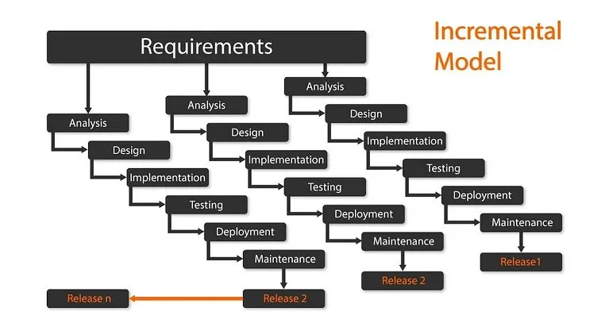

---

# 2.2 Traditional (Plan-Driven) Process Models

### 2.2.2 Incremental Process Model

**Example of E-Commerce Site (Incremental Approach):**

 

**Increment 1:** It covers core functionality including user registration, product catalog browsing, and basic search.

**Increment 2:** It adds shopping cart, checkout process, and online payment integration.

**Increment 3:** It adds user reviews, recommendation engine, and order tracking.

---

# 2.2 Traditional (Plan-Driven) Process Models

### 2.2.2 Incremental Process Model

**Example of E-Commerce Site (Incremental Approach):**

 

**Increment 4:** It adds admin dashboard, analytics, inventory management, and promotional tools.

 

Each increment is fully functional, deployed, tested, and reviewed by stakeholders before proceeding to the next.

---

# 2.2 Traditional (Plan-Driven) Process Models

### 2.2.2 Incremental Process Model

**Advantages:**

- Delivers working software early, providing value to the customer sooner.
- Customer feedback is incorporated after each increment, reducing risk of product rejection.
- Easier to test and debug smaller modules.
- Flexible and easier to accommodate changes in requirements between increments.
- Higher-risk features can be addressed in early increments.
- Lower initial delivery cost.

---

# 2.2 Traditional (Plan-Driven) Process Models

### 2.2.2 Incremental Process Model

**Disadvantages:**

- Requires a clear understanding of the complete system to properly partition into increments.
- Requires careful planning and architectural foresight.
- Total cost may be higher than a single-pass model since each increment has its own full development cycle.
- Integration complexity increases as more increments are added.

---

# 2.2 Traditional (Plan-Driven) Process Models

### 2.2.3 Evolutionary Process Models (Prototyping, Spiral)

#### Prototyping Model

> **Explain the prototyping model with its advantages and disadvantages. [5+2 marks] (2076 Chaitra - IOE - Old Syllabus Relevant)**
>
> **In what types of projects can the prototype process model be used? Explain with an example. [5 marks] (2082 Baishakh - IOE - Old Syllabus Relevant)**

---

# 2.2 Traditional (Plan-Driven) Process Models

#### Prototyping Model

The prototyping model is used when requirements are fuzzy, incomplete, or poorly understood. A prototype is a preliminary version of the software that is built quickly to help stakeholders visualize and refine their requirements.

 

All stakeholders should agree upfront that the prototype is built to define requirements, not as the final product.

---

# 2.2 Traditional (Plan-Driven) Process Models

#### Prototyping Model

**Process:**

1. **Communication:** It involves meeting stakeholders to define overall objectives and identify known requirements, and outlining areas needing further definition.
2. **Quick Plan:** It involves planning a rapid prototyping iteration.
3. **Modeling (Quick Design):** It focuses on aspects visible to end users (e.g., UI layout, output formats).

---

# 2.2 Traditional (Plan-Driven) Process Models

#### Prototyping Model

4. **Construction of Prototype:** It involves building a working prototype quickly, possibly using existing program fragments or rapid application tools.
5. **Deployment and Feedback:** It involves delivering the prototype to stakeholders for evaluation and gathering feedback to refine requirements.
6. **Iteration:** It involves tuning the prototype based on feedback and repeating until requirements are sufficiently understood.

---

# 2.2 Traditional (Plan-Driven) Process Models

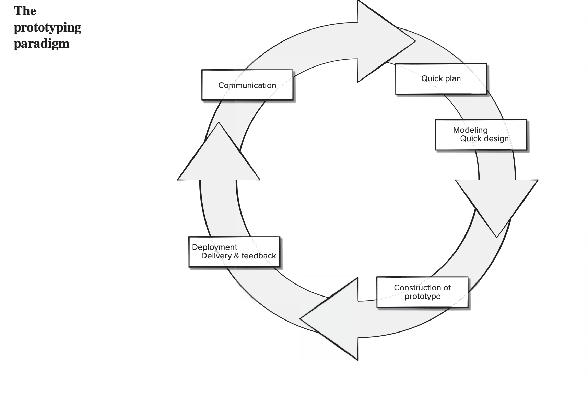

---

# 2.2 Traditional (Plan-Driven) Process Models

**When to use prototyping:**

1. When the customer has general objectives but cannot specify detailed requirements.
2. When the developer is unsure about the form of user interaction, algorithm efficiency, or system behavior.
3. For systems with heavy UI requirements where the user needs to "see and feel" before specifying details.

---

# 2.2 Traditional (Plan-Driven) Process Models

#### Prototyping Model

**Example:**

A travel agency needs a booking application but is unsure about the user interface design. A prototype allows the agency to interact with a preliminary UI, provide feedback on layout and workflow, and progressively refine the design until it meets expectations.

---

# 2.2 Traditional (Plan-Driven) Process Models

#### Prototyping Model

**Advantages:**

- Reduced impact of requirement changes because requirements are refined iteratively.
- Customer is involved early and often.
- Reduces likelihood of product rejection.
- Helps uncover misunderstandings between developers and stakeholders early.
- Works well for small to medium projects.

---

# 2.2 Traditional (Plan-Driven) Process Models

#### Prototyping Model

**Disadvantages:**

- Stakeholders may mistake the prototype for the finished product and expect immediate delivery.
- Developers may make implementation compromises (poor architecture, quick fixes) to get the prototype working, and these become embedded in the final system.
- Work is lost in a throwaway prototype.
- Hard to plan and manage because the number of iterations is unpredictable.

---

# 2.2 Traditional (Plan-Driven) Process Models

#### Spiral Model

> **Explain the spiral model with its advantages and disadvantages. [5 marks] (2068 Chaitra - IOE - Old Syllabus Relevant)**
>
> **How can both the waterfall model and prototyping model be accommodated in the spiral process model? [6 marks] (2078 Kartik - IOE - Old Syllabus Relevant)**
>
> **A travel agency needs software but is unsure about the UI. Would it be proper to use the spiral model? Justify. [6 marks] (2075 Ashwin - IOE - Old Syllabus Relevant)**

---

# 2.2 Traditional (Plan-Driven) Process Models

#### Spiral Model

The spiral model, proposed by Barry Boehm (1988), is an evolutionary process model that couples the iterative nature of prototyping with the controlled, systematic aspects of the waterfall model. Its distinguishing feature is explicit risk analysis at every iteration.

 

Software is developed in a series of evolutionary releases by traversing a spiral path in four quadrants:

1. **Planning:** It involves determining objectives, alternatives, and constraints, estimating costs and schedule, and conducting risk analysis.

---

# 2.2 Traditional (Plan-Driven) Process Models

#### Spiral Model

2. **Risk Analysis:** It involves identifying and resolving risks and creating prototypes to reduce uncertainty.
3. **Construction:** It involves developing and verifying the software (code + test).
4. **Evaluation:** It involves assessing results, obtaining customer feedback, and planning the next iteration.

Each circuit (loop) around the spiral produces a progressively more complete version of the software. The first circuit might produce a product specification or proof-of-concept prototype; subsequent circuits produce increasingly refined and complete versions.

---

# 2.2 Traditional (Plan-Driven) Process Models

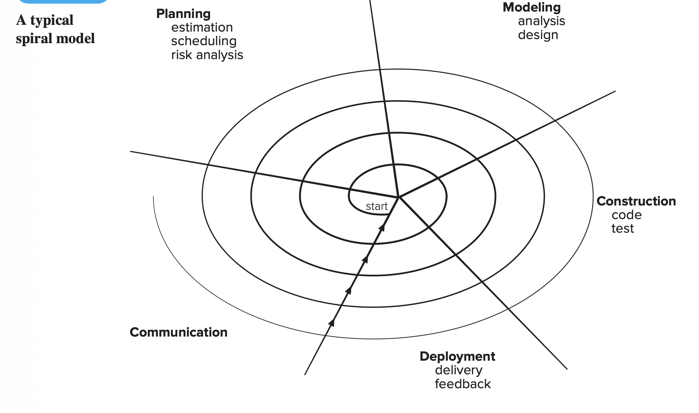

---

# 2.2 Traditional (Plan-Driven) Process Models

#### Spiral Model

**Accommodating waterfall and prototyping within the spiral:**

The spiral model is a meta-model that can incorporate other process models. The first circuit can use a prototyping approach to explore uncertain requirements and refine the UI. Once requirements are stabilized, subsequent circuits can follow a more waterfall-like sequential flow within each loop. Thus, the spiral model uses prototyping for risk reduction and requirement exploration, while using waterfall-like discipline for well-understood portions. Each loop's approach is chosen based on the risk profile of that iteration.

---

# 2.2 Traditional (Plan-Driven) Process Models

#### Spiral Model

**For the travel agency scenario (UI uncertainty):**

The spiral model is appropriate. The first loop would build a UI prototype to resolve the UI design uncertainty (a major risk). Stakeholder feedback would refine the UI requirements. Subsequent loops would address core booking logic, payment integration, and database design with progressively less risk. The risk-driven nature of the spiral ensures that the biggest uncertainty (the UI) is resolved first.

---

# 2.2 Traditional (Plan-Driven) Process Models

#### Spiral Model

**Advantages:**

- Continuous customer involvement throughout the project.
- Development risks are explicitly managed at every iteration.
- Suitable for large, complex, high-risk projects.
- Works well for extensible products that evolve over time.
- Can be applied throughout the entire software lifecycle, including maintenance.

---

# 2.2 Traditional (Plan-Driven) Process Models

#### Spiral Model

**Disadvantages:**

- Risk analysis failures can doom the project.
- May be difficult to convince customers that the evolutionary approach is controllable.
- Requires considerable risk assessment expertise.
- The project may be hard to manage due to evolving scope.
- Not suitable for small, low-risk projects (overhead is disproportionate).

---

# 2.3 Agile and Adaptive Process Models

### 2.3.1 Agile Manifesto and the 12 Principles

The Agile Manifesto (2001) was created by 17 software practitioners. It defines four core values:

1. Individuals and interactions over processes and tools.
2. Working software over comprehensive documentation.
3. Customer collaboration over contract negotiation.
4. Responding to change over following a plan.

_While items on the right have value, Agile values the items on the left more._

---

# 2.3 Agile and Adaptive Process Models

### 2.3.1 Agile Manifesto and the 12 Principles

**The 12 Agile Principles:**

1. **Customer satisfaction** through early and continuous delivery of valuable software.
2. **Welcome changing requirements**, even late in development; agile processes harness change for the customer's competitive advantage.
3. **Deliver working software frequently**, from a couple of weeks to a couple of months, with a preference for the shorter timescale.

---

# 2.3 Agile and Adaptive Process Models

### 2.3.1 Agile Manifesto and the 12 Principles

4. **Business people and developers must work together** daily throughout the project.
5. **Build projects around motivated individuals.** Give them the environment and support they need, and trust them to get the job done.
6. **Face-to-face conversation** is the most efficient and effective method of conveying information within a development team.

---

# 2.3 Agile and Adaptive Process Models

### 2.3.1 Agile Manifesto and the 12 Principles

7. **Working software is the primary measure of progress.**
8. **Sustainable development** requires that sponsors, developers, and users maintain a constant pace indefinitely.
9. **Continuous attention to technical excellence** and good design enhances agility.

---

# 2.3 Agile and Adaptive Process Models

### 2.3.1 Agile Manifesto and the 12 Principles

10. **Simplicity**, which is the art of maximizing the amount of work not done, is essential.
11. **The best architectures, requirements, and designs emerge from self-organizing teams.**
12. **At regular intervals, the team reflects** on how to become more effective, then tunes and adjusts its behavior accordingly.

---

# 2.3 Agile and Adaptive Process Models

### 2.3.2 Agile versus Plan-Driven Development

**Plan-driven (traditional) development:**

- Follows a predefined sequence of phases with detailed upfront planning.
- Emphasizes comprehensive documentation, formal reviews, and milestone-based tracking.
- Requirements are gathered completely before design and construction.

---

# 2.3 Agile and Adaptive Process Models

### 2.3.2 Agile versus Plan-Driven Development

**Plan-driven (traditional) development:**

- Change is managed through formal change control processes.
- Works best when: requirements are stable and well-understood, the project is large and safety/mission-critical, the team is large and possibly distributed, and the organization has a strong process culture.

---

# 2.3 Agile and Adaptive Process Models

### 2.3.2 Agile versus Plan-Driven Development

**Agile development:**

- Emphasizes adaptability, iterative delivery, and continuous feedback.
- Lightweight documentation; the focus is on working software as the primary deliverable.
- Requirements emerge and evolve through continuous customer collaboration.

---

# 2.3 Agile and Adaptive Process Models

### 2.3.2 Agile versus Plan-Driven Development

**Agile development:**

- Change is embraced and accommodated through short iterations.
- Works best when: requirements are volatile or poorly understood, the project is small to medium-sized, the team is small, co-located, and experienced, and rapid delivery is critical.

---

# 2.3 Agile and Adaptive Process Models

### 2.3.2 Agile versus Plan-Driven Development

**Difference in the cost of change:**

In plan-driven development, the cost of change increases exponentially as the project progresses (a change during testing can be 60–100× more costly than during requirements). Agile processes aim to "flatten" this cost-of-change curve through continuous testing, incremental delivery, refactoring, and close customer collaboration.

In practice, many projects benefit from combining elements of both approaches, using agile principles for flexibility while retaining enough planning discipline for coordination and risk management.

---

# 2.3 Agile and Adaptive Process Models

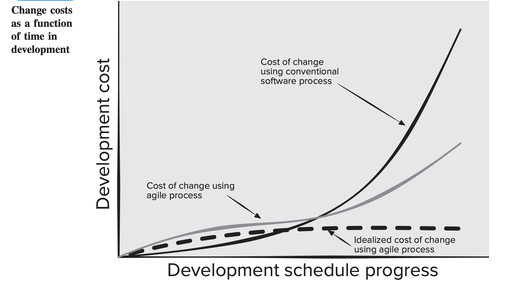

---

# 2.3 Agile and Adaptive Process Models

### 2.3.3 Scrum Framework (Roles, Artifacts, Ceremonies)

Scrum is the most widely used agile framework, conceived by Jeff Sutherland in the early 1990s and formalized by Ken Schwaber and Mike Beedle. Scrum is a lightweight framework in which work is done in time-boxed iterations called sprints (typically 2–4 weeks).

---

# 2.3 Agile and Adaptive Process Models

### 2.3.3 Scrum Framework (Roles, Artifacts, Ceremonies)

**Scrum Roles:**

1. **Product Owner:** This role represents the customer and stakeholders. The Product Owner manages and prioritizes the Product Backlog, defines the goals for each sprint, and is the sole person who decides whether to accept or reject an increment. The Product Owner maximizes the value of the product.

---

# 2.3 Agile and Adaptive Process Models

### 2.3.3 Scrum Framework (Roles, Artifacts, Ceremonies)

**Scrum Roles:**

2. **Scrum Master:** This role serves as a facilitator and coach. The Scrum Master ensures the team follows Scrum practices, removes impediments that block the team's progress, leads the Daily Scrum, and helps the Product Owner manage the backlog effectively. The Scrum Master is not a project manager but a servant-leader.

---

# 2.3 Agile and Adaptive Process Models

### 2.3.3 Scrum Framework (Roles, Artifacts, Ceremonies)

**Scrum Roles:**

3. **Development Team:** It is a small (3–9 people), self-organizing, cross-functional team that does the actual work of designing, building, and testing the software increment. The team collectively decides how to implement the selected backlog items.

---

# 2.3 Agile and Adaptive Process Models

### 2.3.3 Scrum Framework (Roles, Artifacts, Ceremonies)

**Scrum Artifacts:**

1. **Product Backlog:** It is a prioritized, evolving list of all features, functions, requirements, enhancements, and fixes needed in the product. The Product Owner orders items by business value. It is never complete while the product exists.
2. **Sprint Backlog:** It is the subset of Product Backlog items selected for the current sprint, plus the development team's plan for delivering them as a working increment. No new items are added once the sprint begins (unless the sprint is cancelled).

---

# 2.3 Agile and Adaptive Process Models

### 2.3.3 Scrum Framework (Roles, Artifacts, Ceremonies)

**Scrum Artifacts:**

3. **Increment:** It is the sum of all completed Product Backlog items from the current sprint and all previous sprints. It must be in a usable, potentially releasable condition and meet the team's Definition of Done.

---

# 2.3 Agile and Adaptive Process Models

### 2.3.3 Scrum Framework (Roles, Artifacts, Ceremonies)

**Scrum Ceremonies (Events):**

1. **Sprint Planning:** It is held at the start of each sprint. The Product Owner presents the sprint goal and desired features. The development team selects items from the Product Backlog, estimates effort, and creates the Sprint Backlog. The team decides what can be delivered within the sprint time-box.
2. **Daily Scrum (Daily Stand-up):** It is a 15-minute daily meeting where each team member answers: (1) What did I do since the last meeting? (2) What will I do before the next meeting? (3) What obstacles am I facing? The Scrum Master facilitates and works to remove reported impediments.

---

# 2.3 Agile and Adaptive Process Models

### 2.3.3 Scrum Framework (Roles, Artifacts, Ceremonies)

**Scrum Ceremonies (Events):**

3. **Sprint Review:** It is held at the end of the sprint (typically 4 hours for a 4-week sprint). The team demonstrates the completed increment to the Product Owner and stakeholders. The Product Owner accepts or rejects the increment. Feedback may result in new backlog items or reprioritization.
4. **Sprint Retrospective:** It is held after the Sprint Review and before the next Sprint Planning (typically 3 hours for a 4-week sprint). The team reflects on what went well, what could be improved, and commits to specific improvements for the next sprint. This drives continuous process improvement.

---

# 2.3 Agile and Adaptive Process Models

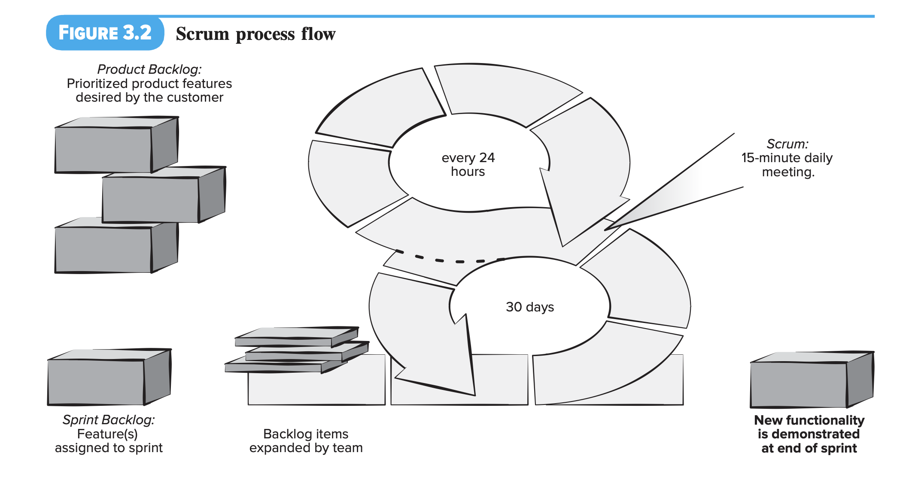

---

# 2.3 Agile and Adaptive Process Models

### 2.3.4 Extreme Programming (XP) Practices

Extreme Programming (XP), created by Kent Beck, is an agile methodology that takes proven software development practices to "extreme" levels. XP is organized around four framework activities: planning, design, coding, and testing.

 

The five core values of XP are Communication, Simplicity, Feedback, Courage, and Respect.

---

# 2.3 Agile and Adaptive Process Models

### 2.3.4 Extreme Programming (XP) Practices

**XP Practices:**

1. **User Stories:** They are requirements captured as short, customer-written narratives describing desired features. Each story is assigned a business value (priority) by the customer and a cost estimate (in development weeks) by the team.
2. **Planning Game:** It is where customers and developers collaborate to decide which stories to include in the next release and in what order. Stories may be ordered by business value or by risk.

---

# 2.3 Agile and Adaptive Process Models

### 2.3.4 Extreme Programming (XP) Practices

3. **Small Releases:** Software is released in small, frequent increments so that customers can evaluate working software early and often.
4. **Simple Design:** It follows the KIS (Keep It Simple) principle. Developers do not add functionality based on speculation about future needs.
5. **Pair Programming:** Two developers work together at one workstation. One writes code (driver), the other reviews each line in real-time (navigator). This provides continuous code review, facilitates knowledge sharing, and improves code quality.

---

# 2.3 Agile and Adaptive Process Models

### 2.3.4 Extreme Programming (XP) Practices

6. **Test-Driven Development (TDD):** Unit tests are written before the code. The cycle is: (1) Red, write a failing test; (2) Green, write just enough code to pass the test; (3) Refactor, improve the code structure while keeping tests passing. This ensures the code is always testable and that developers focus on what must be implemented.
7. **Refactoring:** It means continuously improving the internal structure of existing code without changing its external behavior. This prevents code deterioration, reduces technical debt, and keeps the system maintainable.

---

# 2.3 Agile and Adaptive Process Models

### 2.3.4 Extreme Programming (XP) Practices

8. **Continuous Integration:** Developers integrate their code into the shared repository frequently (multiple times a day). Automated builds and tests run immediately to detect integration errors early.
9. **Collective Code Ownership:** Any developer can change any part of the codebase, preventing knowledge silos and bottlenecks.
10. **Coding Standards:** The team follows agreed-upon coding conventions so the codebase reads as if written by a single person.

---

# 2.3 Agile and Adaptive Process Models

### 2.3.4 Extreme Programming (XP) Practices

11. **Sustainable Pace (40-Hour Week):** XP discourages overtime because a rested team produces higher-quality work.
12. **On-Site Customer:** A customer representative is embedded with the team to answer questions, set priorities, and provide immediate feedback.
13. **Project Velocity:** It is the number of user stories completed per iteration, and it is used to estimate delivery dates for subsequent releases.

---

# 2.3 Agile and Adaptive Process Models

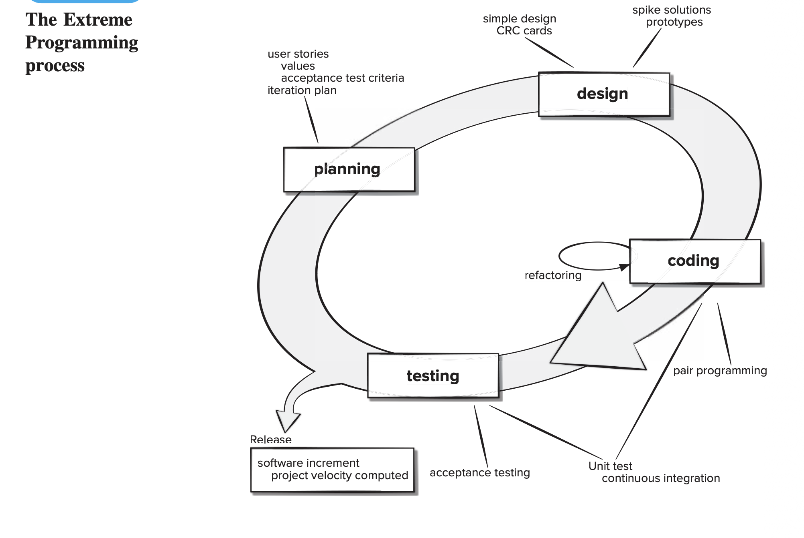

---

# 2.3 Agile and Adaptive Process Models

### 2.3.5 Lean Software Development

Lean Software Development, articulated by Mary and Tom Poppendieck, adapts principles from lean manufacturing (Toyota Production System) to software engineering. It focuses on delivering maximum value with minimum waste.

 

**The Seven Principles of Lean Software Development:**

1. **Eliminate Waste:** Remove anything that does not add value to the customer. In software, waste includes partially done work, unnecessary features, task switching, waiting, handoffs, unnecessary meetings, and defects.

---

# 2.3 Agile and Adaptive Process Models

### 2.3.5 Lean Software Development

**The Seven Principles of Lean Software Development:**

2. **Amplify Learning:** Software development is a discovery process. Use short iterations, frequent feedback loops, and experiments to continuously build knowledge rather than relying on rigid upfront plans.
3. **Decide as Late as Possible:** Delay irreversible decisions until you have the maximum information available. This keeps options open and avoids costly changes based on incomplete knowledge.

---

# 2.3 Agile and Adaptive Process Models

### 2.3.5 Lean Software Development

**The Seven Principles of Lean Software Development:**

4. **Deliver as Fast as Possible:** Reduce the time between identifying a customer need and delivering working software. Rapid delivery provides faster feedback, quicker market response, and lower risk.
5. **Empower the Team:** Trust the people closest to the work to make decisions. Provide them with the tools, authority, and environment to solve problems effectively. Avoid micro-management.

---

# 2.3 Agile and Adaptive Process Models

### 2.3.5 Lean Software Development

**The Seven Principles of Lean Software Development:**

6. **Build Integrity In:** Ensure both conceptual integrity (components work as a cohesive whole) and perceived integrity (the product meets customer expectations). Achieve this through automated testing, continuous integration, and refactoring.
7. **Optimize the Whole:** Focus on improving the entire value stream (the complete sequence of activities required to design, produce, and deliver a product) from concept to delivery, not just individual parts. Avoid sub-optimization where improving one part degrades the overall system.

---

# 2.3 Agile and Adaptive Process Models

### 2.3.5 Lean Software Development

Lean principles complement other agile methods. Kanban, a lean-originated method, visualizes workflow on a board, limits work in progress (WIP), manages flow, makes process policies explicit, creates feedback loops, and encourages collaborative process evolution.

---

# 2.3 Agile and Adaptive Process Models

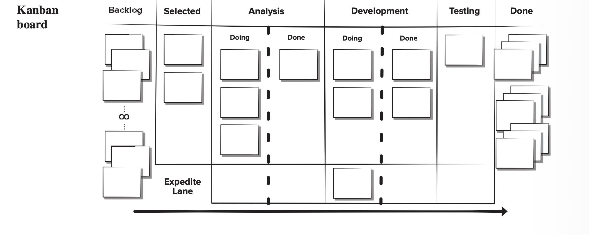

---

# 2.4 Model Selection Considerations

> **Why are different process models used in software development? [2 marks] (2080 Bhadra - IOE - Old Syllabus Relevant)**
>
> **Define software process model. Differentiate the spiral model and incremental model highlighting their advantages and disadvantages. [2+6 marks] (2080 Baishakh - IOE - Old Syllabus Relevant)**
>
> **A client's problem has uncertainties that could lead to loss if not planned. Which model do you suggest? Justify. [5 marks] (2074 Chaitra - IOE - Old Syllabus Relevant)**
>
> **Why do we need to do a feasibility study before accepting any project? [2 marks] (2082 Bhadra - IOE - Old Syllabus Relevant)**

---

# 2.4 Model Selection Considerations

A software process model is a simplified description of a software process, presented from a specific perspective. It defines the sequence of activities, their interdependencies, and how they interact to transform inputs into outputs. Different process models exist because no single model fits every project.

 

Projects differ in size, complexity, requirements stability, risk level, team size, customer involvement, and time constraints. A small internal tool with clear requirements can use a waterfall approach; a complex product with evolving requirements and high uncertainty needs an evolutionary or agile approach.

---

# 2.4 Model Selection Considerations

**Factors for selecting a process model:**

1. **Requirements clarity and stability:** If requirements are well-defined and unlikely to change, plan-driven models such as waterfall work well. If requirements are volatile or unclear, agile or evolutionary models are better suited.
2. **Project size and complexity:** Large, complex projects with high risk favor the spiral model, while small to medium projects favor agile methods such as Scrum and XP.
3. **Risk level:** High-risk projects benefit from the spiral model's explicit risk analysis, whereas low-risk projects can use simpler models.

---

# 2.4 Model Selection Considerations

**Factors for selecting a process model:**

4. **Customer involvement:** If the customer is available and willing to participate continuously, agile methods excel. If customer interaction is limited, plan-driven methods with formal documentation may be necessary.
5. **Time-to-market pressure:** If rapid delivery is critical, incremental or agile models are preferred because they deliver working software early.
6. **Team expertise:** Agile and spiral models require experienced, self-organizing teams, while plan-driven models can work with less experienced teams given strong management.

---

# 2.4 Model Selection Considerations

**Factors for selecting a process model:**

7. **Regulatory and compliance needs:** Safety-critical or regulated domains such as avionics and medical devices may require the documentation rigor of plan-driven models.

 

**For a project with significant uncertainties and risk of loss:** The **spiral model** is most appropriate. Its risk-driven nature ensures that uncertainties are identified and resolved early through prototyping and risk analysis before committing significant resources. Each iteration includes formal risk assessment, and the project can be terminated at any point if the risk is deemed too high, thus limiting potential losses.

---

# 2.4 Model Selection Considerations

**Feasibility study:**

Before accepting any project, a feasibility study assesses whether the project is technically viable, economically justified, and operationally practical. It examines resource availability, cost-benefit analysis, timeline constraints, and potential risks. This prevents the organization from committing to projects that are unlikely to succeed, thereby avoiding wasted resources and financial losses.

---

# 2.4 Model Selection Considerations

| Spiral Model                                                                  | Incremental Model                                                 |
| ----------------------------------------------------------------------------- | ----------------------------------------------------------------- |
| Performs formal risk analysis at every iteration                              | Manages risk informally by prioritizing increments                |
| Customer is involved continuously, especially in planning and risk assessment | Customer provides periodic feedback after each increment          |
| Best suited for large, complex, high-risk projects                            | Best suited for medium projects with generally known requirements |

---

# 2.4 Model Selection Considerations

| Spiral Model                                                                        | Incremental Model                                                            |
| ----------------------------------------------------------------------------------- | ---------------------------------------------------------------------------- |
| Follows an evolutionary flow where each loop revisits all phases with risk analysis | Follows an iterative flow where each increment goes through a mini-lifecycle |
| Changes are incorporated after risk assessment in each loop                         | Changes are easier to accommodate between increments                         |
| Requires moderate documentation including risk reports                              | Documentation varies and can be lightweight                                  |

---

# 2.4 Model Selection Considerations

| Spiral Model                                                           | Incremental Model                                              |
| ---------------------------------------------------------------------- | -------------------------------------------------------------- |
| Requires risk assessment expertise and is expensive for small projects | Requires complete system understanding for proper partitioning |
