<!-- _class: title-slide -->

# 3. Software Requirements Engineering

(6 hours, 8 marks)
By Bidur Sapkota

---

# 3.1 Requirement Engineering Process

> **What is requirement engineering? Explain its steps. [4 marks] (2074 Chaitra - IOE - Old Syllabus Relevant)**
>
> **What do you mean by a software requirements document? [2 marks] (2078 Bhadra - IOE - Old Syllabus Relevant)**
>
> **Explain the requirement engineering process in detail. [6 marks] (2078 Bhadra - IOE - Old Syllabus Relevant)**
>
> **Why is it so difficult to gain a clear understanding of what the customer wants? [3 marks] (2081 Bhadra - IOE - Old Syllabus Relevant)**
>
> **What are the different techniques used for requirements gathering and analysis? Explain any three methods in detail. [7 marks] (2070 Ashad - IOE - Old Syllabus Relevant)**

---

# 3.1 Requirement Engineering Process

**Requirements engineering (RE)** is the broad spectrum of tasks and techniques that lead to an understanding of requirements. It begins during the communication activity and continues into modeling. RE establishes the solid base for design and construction. Without it, the resulting software has a high probability of not meeting customer needs.

---

# 3.1 Requirement Engineering Process

### Seven Tasks of Requirements Engineering

**1. Inception:** Establish a basic understanding of the problem, the people who want a solution, and the nature of the desired solution. At inception, stakeholders are identified, project scope is outlined, and initial communication is established.

**2. Elicitation:** Actively gather requirements from stakeholders. Ask what the system must accomplish, how it fits into business needs, and how it will be used daily. Elicitation also involves understanding business goals (functional and non-functional) and prioritizing them.

---

# 3.1 Requirement Engineering Process

### Seven Tasks of Requirements Engineering

**3. Elaboration:** Develop a refined requirements model that identifies various aspects of software function, behavior, and information. User scenarios from elicitation are parsed to extract analysis classes, attributes, and services. The key is to describe the problem sufficiently for design and then move on without obsessing over unnecessary detail.

---

# 3.1 Requirement Engineering Process

### Seven Tasks of Requirements Engineering

**4. Negotiation:** Reconcile conflicting requirements among stakeholders. Customers and users rank requirements and discuss priority conflicts. The goal is a "win-win" result where both sides achieve some measure of satisfaction. Requirements are eliminated, combined, or modified based on cost, risk, and priority assessment.

**5. Specification:** Document the agreed-upon requirements. A specification can be a written document, graphical models, a formal mathematical model, a collection of usage scenarios, a prototype, or any combination. For large systems, a formal SRS document is used; for smaller products, user stories or use cases may suffice.

---

# 3.1 Requirement Engineering Process

### Seven Tasks of Requirements Engineering

**6. Validation:** Assess the quality of requirements work products. Ensure requirements are stated unambiguously, are consistent, and that omissions and errors are corrected. The primary mechanism is a technical review involving software engineers, customers, users, and other stakeholders.

**7. Management:** Identify, control, and track requirements and changes to requirements throughout the project lifecycle. Requirements change constantly, and management activities ensure that changes are handled systematically (closely related to software configuration management).

---

# 3.1 Requirement Engineering Process

### Why It Is Difficult to Understand Customer Requirements

- Customers may have only a vague idea of what is required.
- Different stakeholders have conflicting opinions and priorities.
- Stakeholders may have unspoken assumptions and interpret meanings differently.
- Requirements are often stated in ambiguous or untestable terms (e.g., "the system should be user-friendly").
- Customers may not know exactly what they want until they see working software.

---

# 3.1 Requirement Engineering Process

### Why It Is Difficult to Understand Customer Requirements

- Project goals may be unclear, and technical knowledge of customers may be limited.
- Requirements continue to change throughout the project.

---

# 3.1 Requirement Engineering Process

### Requirements Gathering Techniques

**Interviews:** They are one-on-one or group sessions where the requirements engineer asks structured or unstructured questions to stakeholders. They are effective for understanding individual perspectives, uncovering implicit needs, and clarifying details. Best combined with other methods.

**Facilitated Meetings (Workshops / JAD Sessions):** They are structured meetings attended by both software engineers and stakeholders. A facilitator controls the meeting. Participants develop lists of objects, services, constraints, and performance criteria. Combined lists are refined through discussion to reach consensus. Rules for preparation and participation are established beforehand.

---

# 3.1 Requirement Engineering Process

### Requirements Gathering Techniques

**Prototyping:** It involves building a preliminary version of the system (or part of it) to help stakeholders visualize and refine requirements. It is particularly useful when requirements are fuzzy or when the UI is a major concern.

**Observation (Ethnography):** It involves observing end users performing their actual work to understand how the existing system is used and identify implicit requirements that users may not articulate. It is useful for understanding workflows and business processes.

---

# 3.1 Requirement Engineering Process

### Requirements Gathering Techniques

**Questionnaires/Surveys:** They are used to collect requirements from a large number of stakeholders simultaneously. They are useful for gathering quantitative data on preferences and priorities.

**Document Analysis:** It involves studying existing documentation (manuals, forms, reports, regulations, legacy system specifications) to understand the problem domain and extract requirements.

---

# 3.1 Requirement Engineering Process

### A Software Requirements Document

A software requirements document (SRD), commonly called the Software Requirements Specification (SRS), is a formal, written understanding of the problem that all parties agree upon. It describes the required informational, functional, and behavioral domains for the system, serves as a contractual basis between customer and developer, and provides the foundation for design, testing, and maintenance.

---

# 3.2 SRS (Structure, Characteristics, Users)

> **What is the importance of the SRS document in software development? [3 marks] (2082 Baishakh - IOE - Old Syllabus Relevant)**
>
> **Identify and document functional as well as non-functional requirements for "issuing a book from a library." [5 marks] (2079 Bhadra - IOE - Old Syllabus Relevant)**

---

# 3.2 SRS (Structure, Characteristics, Users)

### Importance of the SRS

- Provides a clear, shared understanding of what the software must do, eliminating ambiguity between customers, developers, and testers.
- Serves as a contractual agreement between the customer and the development team.
- Acts as the basis for project planning, cost estimation, and scheduling.
- Provides the foundation for system design, implementation, and testing (traceability).

---

# 3.2 SRS (Structure, Characteristics, Users)

### Importance of the SRS

- Serves as a reference for maintenance and future enhancements.
- Reduces the risk of building the wrong product.

---

# 3.2 SRS (Structure, Characteristics, Users)

### SRS Structure (Based on IEEE 830 / ISO/IEC/IEEE 29148)

**Section 1: Introduction.** It covers the purpose of the SRS, scope of the software, definitions/acronyms, references, and document overview.

**Section 2: Overall Description.** It covers product perspective (context within a larger system), product functions (high-level summary), user characteristics (profiles of target users, their expertise), constraints (hardware, software, regulatory), and assumptions/dependencies.

---

# 3.2 SRS (Structure, Characteristics, Users)

### SRS Structure (Based on IEEE 830 / ISO/IEC/IEEE 29148)

**Section 3: Specific Requirements.** It covers functional requirements (detailed descriptions of each function), external interface requirements (user, hardware, software, communication interfaces), performance requirements (response time, throughput), design constraints, and non-functional attributes (reliability, security, maintainability, portability).

---

# 3.2 SRS (Structure, Characteristics, Users)

### Characteristics of a Good SRS

- **Correct:** It accurately represents stakeholder needs.
- **Unambiguous:** Each requirement has only one interpretation.
- **Complete:** It contains all significant requirements with no TBD placeholders.
- **Consistent:** No requirement conflicts with another.
- **Verifiable (Testable):** Every requirement can be tested through an objective process.

---

# 3.2 SRS (Structure, Characteristics, Users)

### Characteristics of a Good SRS

- **Modifiable:** The structure allows easy changes while maintaining consistency.
- **Traceable:** Each requirement can be traced to its source and to corresponding design/test elements.
- **Feasible:** It is achievable within budget, schedule, and technology constraints.

---

# 3.2 SRS (Structure, Characteristics, Users)

### Users of the SRS

- **Customers/Clients:** They verify that the document captures their needs.
- **Project Managers:** They use it for planning, estimation, and tracking.
- **Developers/Designers:** They use it as the basis for design and implementation.
- **Testers/QA:** They derive test cases from requirements to validate the system.
- **Maintenance Engineers:** They reference it for understanding the system during future modifications.

---

# 3.2 SRS (Structure, Characteristics, Users)

### Example: Requirements for "Issuing a Book from a Library"

**Functional Requirements:**

- The system shall allow the librarian to search for a book by title, author, or ISBN.
- The system shall verify the borrower's library membership status before issuing.
- The system shall check if the book is available (not already issued or reserved).
- The system shall record the issue date and calculate the due date (e.g., 14 days from issue).

---

# 3.2 SRS (Structure, Characteristics, Users)

### Example: Requirements for "Issuing a Book from a Library"

**Functional Requirements:**

- The system shall update the book's status to "issued" and associate it with the borrower's account.
- The system shall generate an issue receipt for the borrower.

---

# 3.2 SRS (Structure, Characteristics, Users)

### Example: Requirements for "Issuing a Book from a Library"

**Non-Functional Requirements:**

- **Performance:** The system shall process a book issue transaction within 3 seconds.
- **Usability:** The interface shall be simple enough for a librarian with minimal computer training.
- **Security:** Only authorized librarians shall be able to issue books.

---

# 3.2 SRS (Structure, Characteristics, Users)

### Example: Requirements for "Issuing a Book from a Library"

**Non-Functional Requirements:**

- **Reliability:** The system shall be available during all library operating hours with 99.5% uptime.
- **Maintainability:** The system shall be designed to allow easy addition of new book categories.

---

# 3.2 SRS (Structure, Characteristics, Users)

### Complete SRS Example (IEEE 830 Format) for Online Library Management System

**SOFTWARE REQUIREMENTS SPECIFICATION**
**Online Library Management System (OLMS)**
**Version 1.0**

**1. Introduction**

**1.1 Purpose**
This SRS describes the functional and non-functional requirements for the Online Library Management System (OLMS). It is intended for use by the development team, testers, project managers, and the library administration (client).

---

# 3.2 SRS (Structure, Characteristics, Users)

### Complete SRS Example (IEEE 830 Format) for Online Library Management System

**1.2 Scope**
OLMS is a web-based application that automates the core operations of a college library, including cataloging books, managing member registrations, issuing and returning books, tracking overdue items, and generating reports. The system will replace the existing manual register-based process. It will not handle inter-library loans or e-book licensing in this version.

---

# 3.2 SRS (Structure, Characteristics, Users)

### Complete SRS Example (IEEE 830 Format) for Online Library Management System

**1.3 Definitions, Acronyms, and Abbreviations**

- **OLMS:** It refers to the Online Library Management System.
- **Member:** It refers to a registered student or faculty member who can borrow books.
- **Librarian:** It refers to an authorized staff member who manages the system.
- **ISBN:** It refers to International Standard Book Number.

---

# 3.2 SRS (Structure, Characteristics, Users)

### Complete SRS Example (IEEE 830 Format) for Online Library Management System

**1.4 References**

- IEEE Std 830-1998, IEEE Recommended Practice for Software Requirements Specifications.
- College Library Policy Document, Version 3.2.

---

# 3.2 SRS (Structure, Characteristics, Users)

### Complete SRS Example (IEEE 830 Format) for Online Library Management System

**1.5 Overview**
Section 2 provides an overall description of the product. Section 3 specifies detailed functional and non-functional requirements.

---

# 3.2 SRS (Structure, Characteristics, Users)

### Complete SRS Example (IEEE 830 Format) for Online Library Management System

**2. Overall Description**

**2.1 Product Perspective**
OLMS is a standalone web application. It interfaces with an existing college student database for member verification. It runs on a web server (Apache/Nginx) with a MySQL database backend and is accessed through standard web browsers.

---

# 3.2 SRS (Structure, Characteristics, Users)

### Complete SRS Example (IEEE 830 Format) for Online Library Management System

**2.2 Product Functions (High-Level)**

- Book catalog management (add, update, delete, search).
- Member registration and profile management.
- Book issuing and returning.
- Fine calculation for overdue books.
- Reservation of books currently issued to others.
- Report generation (most borrowed books, overdue list, member activity).

---

# 3.2 SRS (Structure, Characteristics, Users)

### Complete SRS Example (IEEE 830 Format) for Online Library Management System

**2.3 User Characteristics**

- **Librarian:** This user has moderate computer literacy and is the primary user who performs all administrative operations.
- **Member (Student/Faculty):** This user has basic computer literacy and uses the system to search the catalog, view their borrowing history, and reserve books.
- **Administrator:** This user is the technical staff responsible for system configuration and user management.

---

# 3.2 SRS (Structure, Characteristics, Users)

### Complete SRS Example (IEEE 830 Format) for Online Library Management System

**2.4 Constraints**

- The system must run on the college's existing Linux server infrastructure.
- The system must comply with the college's data privacy policy.
- Maximum budget: NPR 5,00,000.

---

# 3.2 SRS (Structure, Characteristics, Users)

### Complete SRS Example (IEEE 830 Format) for Online Library Management System

**2.5 Assumptions and Dependencies**

- Members already have valid college IDs for authentication.
- The college provides a stable internet connection for the server.
- The student database API is available and documented.

---

# 3.2 SRS (Structure, Characteristics, Users)

### Complete SRS Example (IEEE 830 Format) for Online Library Management System

**3. Specific Requirements**

**3.1 Functional Requirements**

**FR-01: Search Book.** The system shall allow members and librarians to search the catalog by title, author, ISBN, or category. Search results shall display book title, author, availability status, and shelf location.

**FR-02: Add New Book.** The system shall allow the librarian to add a new book by entering title, author(s), ISBN, publisher, edition, category, quantity, and shelf location.

---

# 3.2 SRS (Structure, Characteristics, Users)

### Complete SRS Example (IEEE 830 Format) for Online Library Management System

**FR-03: Register Member.** The system shall allow the librarian to register a new member by entering name, college ID, department, contact number, and email. The system shall verify the college ID against the student database.

**FR-04: Issue Book.** The system shall allow the librarian to issue a book to a member. The system shall verify: (a) the member's account is active, (b) the member has not exceeded the borrowing limit (max 3 books), and (c) the book is available. Upon issuing, the system shall record the issue date, set the due date (14 days), and update the book's availability status.

---

# 3.2 SRS (Structure, Characteristics, Users)

### Complete SRS Example (IEEE 830 Format) for Online Library Management System

**FR-05: Return Book.** The system shall allow the librarian to process a book return. If the book is overdue, the system shall automatically calculate the fine (NPR 5 per day). The system shall update the book's status to "available."

**FR-06: Reserve Book.** The system shall allow a member to reserve a book that is currently issued. When the book is returned, the system shall notify the reserving member via email.

---

# 3.2 SRS (Structure, Characteristics, Users)

### Complete SRS Example (IEEE 830 Format) for Online Library Management System

**FR-07: Generate Reports.** The system shall generate the following reports: (a) list of overdue books with member details, (b) most borrowed books in a given period, (c) member borrowing history.

**FR-08: User Login.** The system shall authenticate users (librarian, member, admin) using college ID and password. Passwords shall be hashed before storage.

---

# 3.2 SRS (Structure, Characteristics, Users)

### Complete SRS Example (IEEE 830 Format) for Online Library Management System

**3.2 External Interface Requirements**

**User Interface.** The system shall provide a responsive web interface accessible on desktop browsers (Chrome, Firefox, Edge). The librarian dashboard shall display pending returns and overdue alerts on the home screen.

**Hardware Interface.** The system shall interface with a barcode scanner for reading book ISBNs and member IDs during issue/return operations.

---

# 3.2 SRS (Structure, Characteristics, Users)

### Complete SRS Example (IEEE 830 Format) for Online Library Management System

**Software Interface.** The system shall connect to the college student database via a REST API to verify member registration.

**Communication Interface.** The system shall send email notifications (overdue reminders, reservation availability) via SMTP.

---

# 3.2 SRS (Structure, Characteristics, Users)

### Complete SRS Example (IEEE 830 Format) for Online Library Management System

**3.3 Performance Requirements**

- The system shall support at least 100 concurrent users.
- Search results shall be displayed within 2 seconds.
- Book issue/return transactions shall complete within 3 seconds.

---

# 3.2 SRS (Structure, Characteristics, Users)

### Complete SRS Example (IEEE 830 Format) for Online Library Management System

**3.4 Design Constraints**

- The system shall be developed using HTML/CSS, JavaScript (frontend) and Python/Django (backend) with MySQL database.
- The system shall follow a three-tier architecture (presentation, application, data).

---

# 3.2 SRS (Structure, Characteristics, Users)

### Complete SRS Example (IEEE 830 Format) for Online Library Management System

**3.5 Non-Functional Requirements**

- **Reliability:** The system shall have 99% uptime during library operating hours from 8 AM to 8 PM.
- **Security:** Only authenticated librarians shall issue or return books. All passwords shall be stored using bcrypt hashing. The system shall enforce session timeout after 15 minutes of inactivity.

---

# 3.2 SRS (Structure, Characteristics, Users)

### Complete SRS Example (IEEE 830 Format) for Online Library Management System

- **Usability:** A new librarian shall be able to issue a book within 2 minutes of first use without external assistance.
- **Maintainability:** The codebase shall follow MVC architecture with documented APIs to allow future enhancements such as e-book support.
- **Portability:** The system shall be deployable on any Linux server with Python 3.8+ and MySQL 8.0+.

---

# 3.3 Functional and Non-Functional Requirements

> **Explain functional and non-functional requirements with examples. [6 marks] (2069 Ashad - IOE - Old Syllabus Relevant)**
>
> **Differentiate functional and non-functional requirements. [7 marks] (2069 Chaitra - IOE - Old Syllabus Relevant)**
>
> **Distinguish between user and system requirements. [2 marks] (2079 Bhadra - IOE - Old Syllabus Relevant)**
>
> **Why should an engineer ensure that functional and non-functional needs are in a requirements specification document? [4 marks] (2079 Bhadra - IOE - Old Syllabus Relevant)**

---

# 3.3 Functional and Non-Functional Requirements

> **List and explain functional (any two) and non-functional requirements of an airlines reservation system. [6 marks] (2082 Baishakh - IOE - Old Syllabus Relevant)**
>
> **Explain functional (Order Food, Make Payment) and non-functional (all) requirements of an online food ordering system. [6 marks] (2081 Bhadra - IOE - Old Syllabus Relevant)**
>
> **Prepare functional requirements for an online ticket booking system for a movie theatre. [4 marks] (2082 Bhadra - IOE - Old Syllabus Relevant)**
>
> **List functional and non-functional requirements for a Restaurant Information System. [5 marks] (2068 Chaitra - IOE - Old Syllabus Relevant)**

---

# 3.3 Functional and Non-Functional Requirements

### Functional Requirements

Functional requirements describe what the system must do, including the specific functions, features, services, and behaviors the software must provide. They define the system's response to specific inputs under specific conditions.

**Example:** "The system shall allow users to search flights by origin, destination, and date."

---

# 3.3 Functional and Non-Functional Requirements

### Non-Functional Requirements (NFRs)

Non-functional requirements describe how well the system must perform, including quality attributes, performance characteristics, security constraints, and general system constraints. They constrain the overall functioning of the system rather than defining specific features.

---

# 3.3 Functional and Non-Functional Requirements

**Categories of NFRs:**

- **Performance:** It covers response time, throughput, and capacity (e.g., "The page shall load within 2 seconds under 1000 concurrent users").
- **Reliability:** It covers mean time between failures and availability (e.g., "99.9% uptime").
- **Usability:** It covers ease of use and learnability (e.g., "A new user shall be able to complete registration within 3 minutes without help").
- **Security:** It covers authentication, authorization, and data encryption (e.g., "All passwords shall be stored using bcrypt hashing").

---

# 3.3 Functional and Non-Functional Requirements

**Categories of NFRs:**

- **Maintainability:** It covers ease of modification and modular design.
- **Portability:** It covers the ability to operate across different platforms.
- **Scalability:** It covers the ability to handle growth in users, data, or transactions.

---

# 3.3 Functional and Non-Functional Requirements

### Functional vs. Non-Functional Requirements

| Functional Requirements                 | Non-Functional Requirements                    |
| --------------------------------------- | ---------------------------------------------- |
| Describe what the system does           | Describe how well the system performs          |
| Specify specific features and behaviors | Specify quality attributes and constraints     |
| Example: "User can place an order"      | Example: "Order confirmation within 2 seconds" |

---

# 3.3 Functional and Non-Functional Requirements

| Functional Requirements                                                   | Non-Functional Requirements                                 |
| ------------------------------------------------------------------------- | ----------------------------------------------------------- |
| Tested by executing the function directly                                 | Tested by measuring performance, stress, security, etc.     |
| If absent, the system is incomplete because required features are missing | If absent, the system becomes unreliable, slow, or insecure |
| Documented as use cases, user stories, or feature lists                   | Documented as quality metrics, constraints, or SLA targets  |

---

# 3.3 Functional and Non-Functional Requirements

### Why Both Must Be in the SRS

Functional requirements alone do not guarantee a usable system. A system may perform all required functions but fail if it is too slow, insecure, or difficult to use. Conversely, meeting NFRs without delivering required features is meaningless. Both types are essential for:

- Complete system specification ensures that developers know what to build and to what standard.
- Testing requires both functional test cases and performance/security benchmarks.

---

# 3.3 Functional and Non-Functional Requirements

### Why Both Must Be in the SRS

- Contract enforcement requires stakeholders to have measurable criteria for acceptance.
- Risk reduction is important because missing NFRs often lead to costly rework or system rejection.

---

# 3.3 Functional and Non-Functional Requirements

### User Requirements vs. System Requirements

- **User requirements:** They are high-level statements written in natural language (possibly with diagrams) describing what the system should provide to users and the constraints under which it operates. They are written for customers and managers. Example: "The system should allow customers to book flights."
- **System requirements:** They are detailed, precise descriptions of system functions, services, and constraints. They are written for developers and testers. Example: "The system shall accept origin (IATA code), destination (IATA code), departure date (YYYY-MM-DD), and number of passengers (1–9) as search parameters and return matching flights sorted by price within 3 seconds."

---

# 3.3 Functional and Non-Functional Requirements

### Example: Airlines Reservation System

**Functional Requirements:**

- The system shall allow passengers to search for flights by origin, destination, date, and class.
- The system shall display flight number, departure/arrival times, duration, and price in the search results.
- The system shall allow passengers to select a flight, enter passenger details, and choose a seat.
- The system shall generate a booking confirmation with a PNR number upon confirming the booking.

---

# 3.3 Functional and Non-Functional Requirements

**Non-Functional Requirements:**

- The system shall return search results within 3 seconds.
- The system shall be available 24/7 with 99.9% uptime.
- The system shall encrypt payment information using TLS 1.2 or higher.
- The system shall comply with PCI-DSS standards for payment processing.
- The system shall support at least 10,000 concurrent users.
- The booking process shall be completable within 5 steps.

---

# 3.3 Functional and Non-Functional Requirements

### Example: Online Food Ordering System

**Functional Requirements:**

- The system shall allow the customer to browse the menu and select food items.
- The system shall allow the customer to specify quantity and add customizations (e.g., extra cheese, no onions) for each item.
- The system shall allow the customer to add items to the cart.
- The cart shall display a summary with item-wise and total prices.
- The system shall support multiple payment methods (credit/debit card, digital wallet, cash on delivery).
- The system shall display an order confirmation with an estimated delivery time upon successful payment.

---

# 3.3 Functional and Non-Functional Requirements

**Non-Functional Requirements:**

- The payment transaction shall complete within 5 seconds.
- The system shall transmit all payment data over encrypted connections.
- The system shall store user passwords in hashed format.
- The system shall support a mobile-responsive design.
- The system shall handle order processing without data loss during peak hours.
- The system shall maintain 99.5% uptime during restaurant operating hours.

---

# 3.3 Functional and Non-Functional Requirements

### Example: Online Ticket Booking System for a Movie Theatre

**Functional Requirements:**

- The system shall display currently running movies with showtimes, language, and format (2D/3D).
- The system shall allow users to select a movie, showtime, and preferred seats from a seat map.
- The system shall hold selected seats for a limited time (e.g., 10 minutes) during payment processing.

---

# 3.3 Functional and Non-Functional Requirements

- The system shall process online payment and generate an e-ticket with a unique booking ID and QR code.
- The system shall allow users to cancel a booking up to 2 hours before showtime and process a refund.
- The system shall send booking confirmation and e-ticket via email and SMS.

---

# 3.3 Functional and Non-Functional Requirements

### Example: Restaurant Information System

**Functional Requirements:**

- The system shall allow customers to view the restaurant menu with prices, descriptions, and images.
- The system shall allow customers to place dine-in or takeaway orders.
- The system shall allow waitstaff to update order status (received, preparing, served).
- The system shall generate a bill with itemized charges and applicable taxes.
- The system shall support table reservation with date, time, and party size.

---

# 3.3 Functional and Non-Functional Requirements

**Non-Functional Requirements:**

- The system shall process order placement within 2 seconds.
- The interface shall be operable on tablets used by waitstaff.
- The system shall not lose orders during power failures by using persistent storage.
- The system shall handle customer payment data per PCI-DSS standards.
- The system shall handle peak-hour load without performance degradation.

---

# 3.4 Gathering Requirements Using Use Case Modeling and Scenarios

<style scoped>
 * {
  font-size: 26pt !important;
 }
</style>

> **Prepare a use case diagram for an event management system. [4 marks] (2082 Bhadra - IOE - Old Syllabus Relevant)**
>
> **Draw a use case diagram for an online food ordering system. [5 marks] (2082 Baishakh - IOE - Old Syllabus Relevant)**
>
> **Draw a use case diagram for an online appointment booking app. [5 marks] (2081 Bhadra - IOE - Old Syllabus Relevant)**
>
> **Prepare use case diagrams for an automated ticket issuing system. [5 marks] (2081 Baishakh - IOE - Old Syllabus Relevant)**
>
> **Draw a use case diagram illustrating interactions between a doctor, patients, and prescriptions. [5 marks] (2078 Bhadra - IOE - Old Syllabus Relevant)**

---

# 3.4 Gathering Requirements Using Use Case Modeling and Scenarios

**Scenario:** A specific narrative describing a single path of interaction between an actor and the system. It tells a concrete story of how the system is used.

**Use Case:** A structured, generalized description of how an actor interacts with the system to achieve a specific goal. It includes the main success scenario plus alternate/exception flows. Use cases can be expressed as narrative text (user stories), outlines, template-based descriptions, or UML diagrams.

---

# 3.4 Gathering Requirements Using Use Case Modeling and Scenarios

**Example Scenario: Customer Purchasing a Book:**

1. Customer logs into the bookstore website.
2. Customer searches for "Software Engineering" in the search bar.
3. System displays a list of matching books with titles, authors, prices, and ratings.
4. Customer selects a book and views its details page.
5. Customer clicks "Add to Cart."
6. Customer proceeds to checkout.

---

# 3.4 Gathering Requirements Using Use Case Modeling and Scenarios

**Example Scenario: Customer Purchasing a Book:**

7. Customer enters shipping address and selects payment method.
8. System processes the payment through the payment gateway.
9. System confirms the order and sends a confirmation email.
10. Customer receives the book within the estimated delivery time.

---

# 3.4 Gathering Requirements Using Use Case Modeling and Scenarios

### Writing a Use Case (Template-Based Description)

A formal use case includes: use case name, primary actor, secondary actor, preconditions, main scenario (numbered steps), exceptions/alternate flows, and post conditions.

---

# 3.4 Gathering Requirements Using Use Case Modeling and Scenarios

**Use Case: Purchase a Book:**

| Element           | Details                                            |
| ----------------- | -------------------------------------------------- |
| **Use Case Name** | Purchase a Book                                    |
| **Actor**         | Customer                                           |
| **Precondition**  | Customer has a registered account and is logged in |

---

# 3.4 Gathering Requirements Using Use Case Modeling and Scenarios

<style scoped>
  th,td {
    font-size: 26pt;
  }
</style>

| Element       | Details                                                                                                                                                                                                                                                                                                                                    |
| ------------- | ------------------------------------------------------------------------------------------------------------------------------------------------------------------------------------------------------------------------------------------------------------------------------------------------------------------------------------------ |
| **Main Flow** | 1. Customer searches for a book. <br>2. System displays matching results. <br>3. Customer selects a book. <br>4. Customer adds book to cart. <br>5. Customer proceeds to checkout. <br>6. Customer enters shipping and payment details. <br>7. System validates payment via payment gateway. <br>8. System confirms order and sends email. |

---

# 3.4 Gathering Requirements Using Use Case Modeling and Scenarios

| Element             | Details                                                                                                                                                                                     |
| ------------------- | ------------------------------------------------------------------------------------------------------------------------------------------------------------------------------------------- |
| **Alternate Flows** | A1: Book is out of stock → system displays "Out of Stock" message and suggests similar books. <br>A2: Payment fails → system notifies customer and asks to retry or use a different method. |
| **Postcondition**   | Order is placed, payment is processed, and confirmation email is sent.                                                                                                                      |

---

# 3.4 Gathering Requirements Using Use Case Modeling and Scenarios

**Use Case: Add New Book to Catalog:**

| Element           | Details                                            |
| ----------------- | -------------------------------------------------- |
| **Use Case Name** | Add New Book to Catalog                            |
| **Actor**         | Bookstore Owner                                    |
| **Precondition**  | Bookstore Owner is logged in with admin privileges |

---

# 3.4 Gathering Requirements Using Use Case Modeling and Scenarios

| Element       | Details                                                                                                                                                                                                                                                                                                                     |
| ------------- | --------------------------------------------------------------------------------------------------------------------------------------------------------------------------------------------------------------------------------------------------------------------------------------------------------------------------- |
| **Main Flow** | 1. Owner selects "Add New Book" from the dashboard. <br>2. Owner enters book details (title, author, ISBN, price, description, cover image, stock quantity). <br>3. System validates the input fields. <br>4. System adds the book to the catalog database. <br>5. System displays confirmation: "Book added successfully." |

---

# 3.4 Gathering Requirements Using Use Case Modeling and Scenarios

| Element             | Details                                                                                                                                                      |
| ------------------- | ------------------------------------------------------------------------------------------------------------------------------------------------------------ |
| **Alternate Flows** | A1: ISBN already exists → system notifies owner and offers to update the existing entry. <br>A2: Required fields missing → system highlights missing fields. |
| **Postcondition**   | New book is visible in the catalog and available for purchase.                                                                                               |

---

# 3.4 Gathering Requirements Using Use Case Modeling and Scenarios

### Elements of a Use Case (Diagram-Based Description)

- **Actor:** It is any external entity (person, device, or external system) that communicates with the system. Actors represent roles, not specific individuals. A single user may play multiple roles (and thus be multiple actors).
- **Primary actor:** It directly interacts with and derives benefit from the system.
- **Secondary actor:** It supports the system so primary actors can do their work.
- **Use case:** It is a specific function or service provided by the system, described from the actor's perspective.

---

# 3.4 Gathering Requirements Using Use Case Modeling and Scenarios

### Elements of a Use Case (Diagram-Based Description)

- **System boundary:** It is a rectangle that defines the scope of the system. Actors are outside and use cases are inside.

---

# 3.4 Gathering Requirements Using Use Case Modeling and Scenarios

### Relationships in Use Case Diagrams

- **Association:** It is a solid line connecting an actor to a use case, indicating interaction.
- **Include (<<include>>):** It is represented by a dashed arrow from the base use case to the included use case. The included use case is always executed as part of the base use case. It is used for common, reusable functionality. Example: "Place Order" includes "Verify Login."

---

# 3.4 Gathering Requirements Using Use Case Modeling and Scenarios

### Relationships in Use Case Diagrams

- **Extend (<<extend>>):** It is represented by a dashed arrow from the extending use case to the base use case. The extending use case is executed only under certain conditions. The base use case is complete on its own. Example: "Checkout" may be extended by "Apply Coupon."
- **Generalization:** It is a solid line with a hollow triangle arrowhead, representing inheritance between actors or between use cases.

---

# 3.4 Gathering Requirements Using Use Case Modeling and Scenarios

Use case diagram is drawn with symbols: a rectangle for the system boundary (labeled with the system name), stick figures for actors (outside the boundary), ovals for use cases (inside the boundary), solid lines for associations, and dashed arrows with stereotypes for <<include>> and <<extend>> relationships.

---

# 3.4 Gathering Requirements Using Use Case Modeling and Scenarios

| 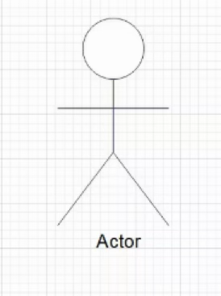 | 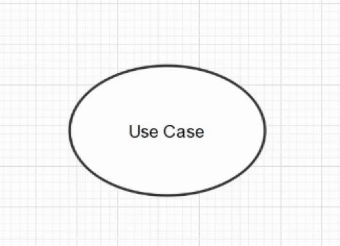 |
| ------------------------------- | ------------------------------------- |

---

# 3.4 Gathering Requirements Using Use Case Modeling and Scenarios

| 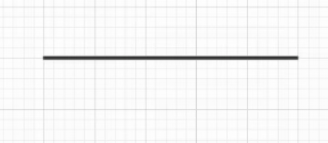 | 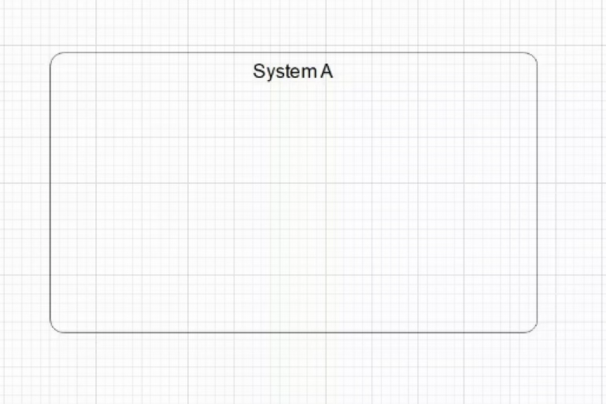 |
| ------------------------------------ | ------------------------------------- |

---

# 3.4 Gathering Requirements Using Use Case Modeling and Scenarios

### Use Case Diagram Examples

**Railway Reservation System:**

---

# 3.4 Gathering Requirements Using Use Case Modeling and Scenarios

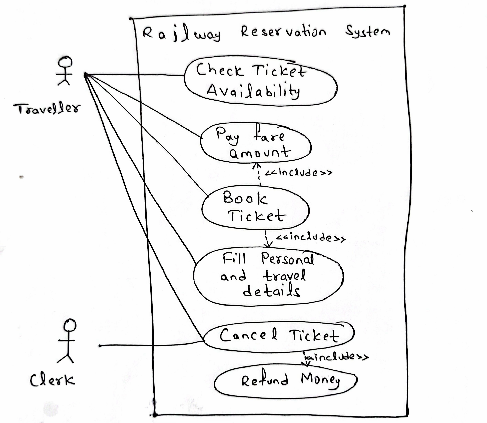

---

# 3.4 Gathering Requirements Using Use Case Modeling and Scenarios

### Use Case Diagram Examples

**Parking Management System:**

---

# 3.4 Gathering Requirements Using Use Case Modeling and Scenarios

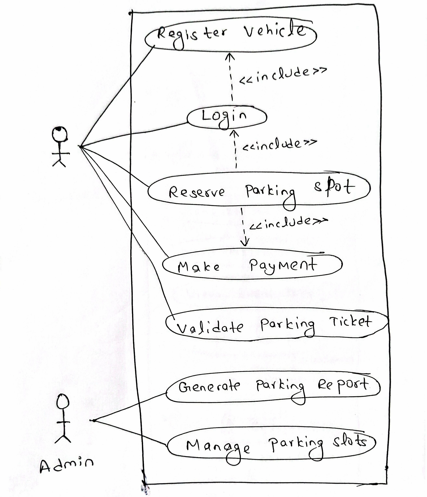

---

# 3.4 Gathering Requirements Using Use Case Modeling and Scenarios

### Use Case Diagram Examples

**Event Management System:**

---

# 3.4 Gathering Requirements Using Use Case Modeling and Scenarios

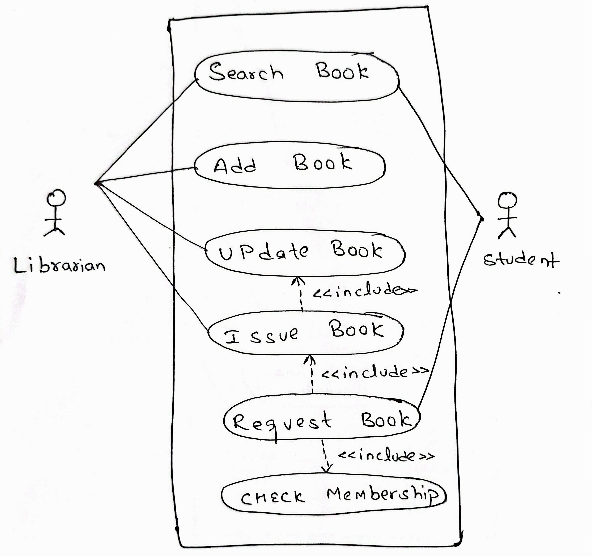

---

# 3.4 Gathering Requirements Using Use Case Modeling and Scenarios

### Use Case Diagram Examples

**Event Management System:**

---

# 3.4 Gathering Requirements Using Use Case Modeling and Scenarios

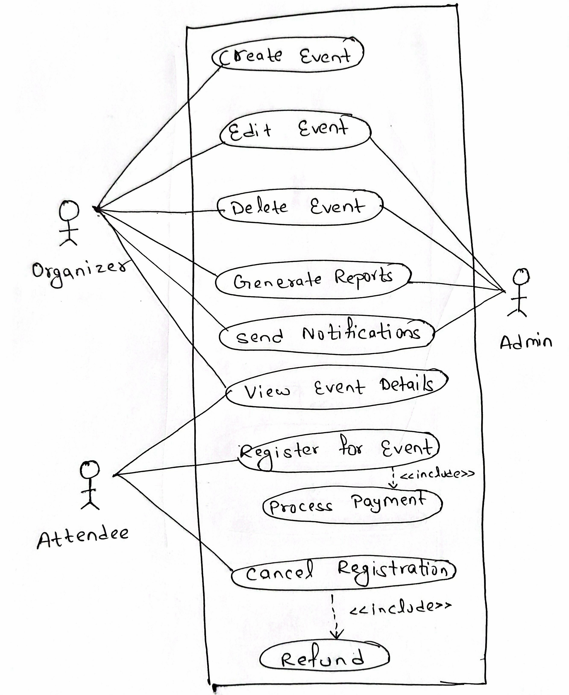

---

# 3.4 Gathering Requirements Using Use Case Modeling and Scenarios

### Use Case Diagram Examples

**Online Food Ordering System:**

---

# 3.4 Gathering Requirements Using Use Case Modeling and Scenarios

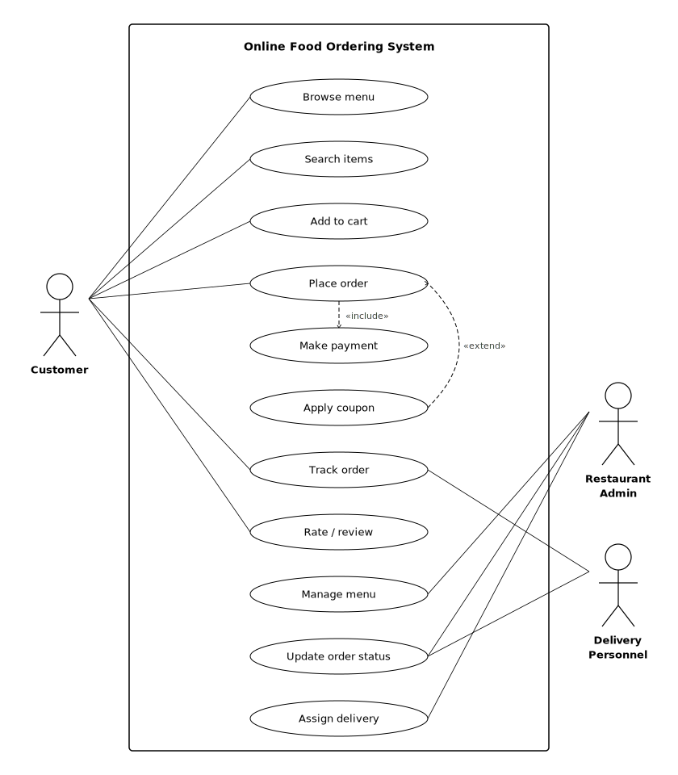

---

# 3.4 Gathering Requirements Using Use Case Modeling and Scenarios

### Use Case Diagram Examples

**Online Appointment Booking System:**

---

# 3.4 Gathering Requirements Using Use Case Modeling and Scenarios

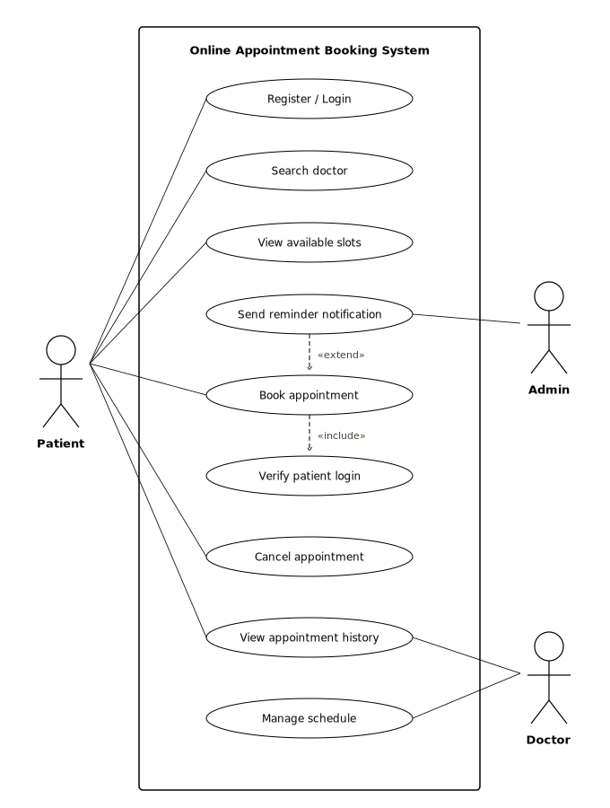

---

# 3.5 Agile Requirements Engineering

### 3.5.1 User Stories and Acceptance Criteria

A user story is a short, informal description of a feature told from the perspective of the user who wants the capability. It serves as a placeholder for conversation rather than a rigid specification.

**Standard Format:**

> As a [type of user], I want [some goal] so that [some reason/benefit].

**Example:** "As a customer, I want to filter products by price range so that I can find items within my budget."

---

# 3.5 Agile Requirements Engineering

**INVEST Criteria for Good User Stories:**

- **I (Independent):** The story is self-contained and not dependent on other stories.
- **N (Negotiable):** Details are open for discussion and the story is not a rigid contract.
- **V (Valuable):** It delivers clear value to the user or business.
- **E (Estimable):** The team can estimate the effort required.
- **S (Small):** It is small enough to be completed within a single sprint.
- **T (Testable):** It has clear criteria that allow verification.

---

# 3.5 Agile Requirements Engineering

**Acceptance Criteria** define the specific conditions that must be satisfied for a user story to be considered complete. They bridge the gap between the user story and the implementation.

**Given-When-Then Format (BDD Style):**

- **Given** [a precondition/context],
- **When** [an action is performed],
- **Then** [an expected result occurs].

<br>

```text
BDD (Behavior-Driven Development) is a software development approach that focuses on describing how a system should
behave from the user's or business's perspective, instead of starting with technical implementation details.
```

---

# 3.5 Agile Requirements Engineering

**Example:**

**Story:** "As a customer, I want to reset my password so that I can regain access if I forget it."

**Acceptance criteria:**

1. Given the user is on the login page, when they click "Forgot Password" and enter a registered email, then a password reset link shall be sent to that email within 1 minute.
2. Given the user clicks the reset link, when they enter a new password meeting complexity rules, then the password shall be updated and a confirmation displayed.
3. Given the user enters an unregistered email, when they submit the form, then an error message "Email not found" shall be displayed.

---

# 3.5 Agile Requirements Engineering

### 3.5.2 Product Backlog Creation and Prioritization

The product backlog is an ordered, evolving list of everything needed in the product, including features, enhancements and bug fixes. It is the single source of requirements for the development team. The Product Owner is responsible for maintaining and prioritizing the backlog.

**Creating the Product Backlog:**

- Gather initial user stories from stakeholders through interviews, workshops, and brainstorming.
- Write each requirement as a user story with acceptance criteria.

---

# 3.5 Agile Requirements Engineering

**Creating the Product Backlog:**

- Estimate effort for each story (using story points or ideal days).
- Order the backlog by priority. Highest-priority items at the top are refined in detail, while lower items remain coarser.

---

# 3.5 Agile Requirements Engineering

**Prioritization Techniques:**

- **MoSCoW Method:** It categorizes items as Must Have (essential, non-negotiable), Should Have (important but not critical for current release), Could Have (desirable if time permits), and Won't Have (explicitly out of scope for now).
- **Business Value vs. Effort:** It prioritizes items that deliver the highest business value relative to their development effort.
- **Risk-Based:** This prioritization addresses high-risk items early to reduce uncertainty.
- **Kano Model:** It classifies features as Basic (expected), Performance (more is better), or Delighters (unexpected positive features).

---

# 3.5 Agile Requirements Engineering

### 3.5.3 Story Mapping Basics

User story mapping, popularized by Jeff Patton, is a visual technique for organizing user stories to provide the "big picture" of the product while maintaining the detail of individual stories. It addresses the limitation of flat backlogs, which often lose context of the overall user experience.

**Structure of a Story Map:**

- **Backbone (horizontal axis):** It contains the high-level user activities arranged left-to-right following the narrative flow of the user journey (the sequence of steps a user takes to achieve a goal).

---

# 3.5 Agile Requirements Engineering

- **Ribs (vertical axis):** They are placed beneath each backbone activity. Specific user tasks and stories are stacked vertically in order of priority (most important at top).
- **Release slices (horizontal lines):** They are drawn across the map to group stories into releases. The topmost slice forms the Minimum Viable Product (MVP) or "walking skeleton."

---

# 3.5 Agile Requirements Engineering

<style scoped>
  img {
    height: 100%;
  }
</style>

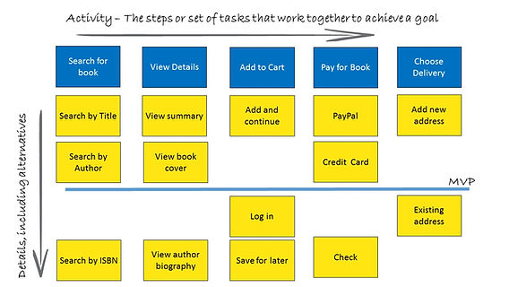

---

# 3.5 Agile Requirements Engineering

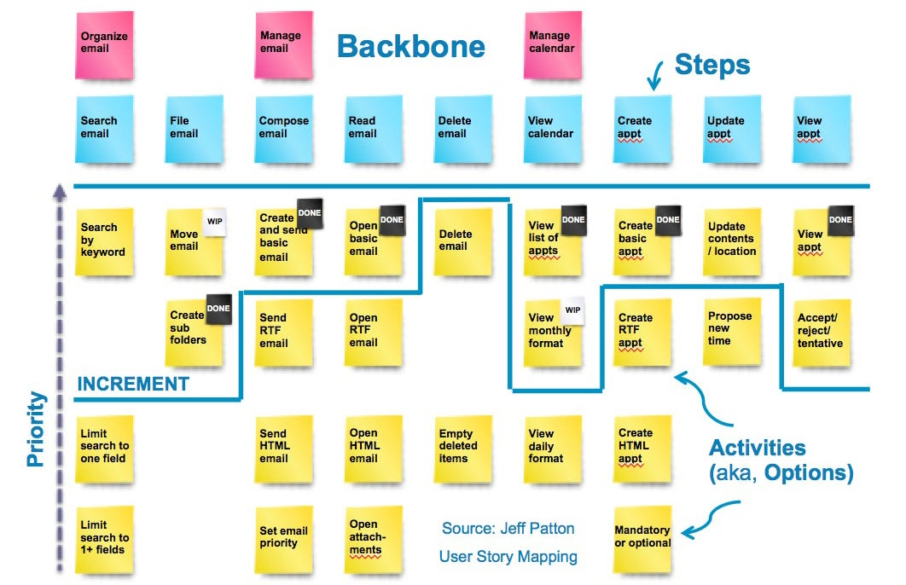

---

# 3.5 Agile Requirements Engineering

**Steps to Create a Story Map:**

- Frame the problem by identifying users and their goals.
- Map the user journey by outlining the main activities (backbone).
- Break down activities into user tasks and specific stories (ribs).
- Prioritize stories vertically under each activity.
- Slice horizontally for release planning.

---

# 3.5 Agile Requirements Engineering

**Benefits:**

- Visualizes the entire product scope and prevents losing sight of the big picture.
- Identifies gaps, dependencies, and missing functionality.
- Facilitates release planning by enabling teams to slice out cohesive, valuable releases.
- Improves communication and shared understanding among team members and stakeholders.

---

# 3.5 Agile Requirements Engineering

### 3.5.4 Continuous Requirements Refinement (Backlog Grooming)

Backlog refinement (also called backlog grooming) is the ongoing process of reviewing, updating, and elaborating product backlog items to ensure they are ready for upcoming sprints. It is not a one-time event but a continuous activity throughout the project.  
Typically, teams dedicate about 10% of sprint capacity to backlog refinement.  
It can occur during a dedicated refinement meeting (mid-sprint) or informally throughout the sprint.  
The Product Owner, development team, and Scrum Master participate.

---

# 3.5 Agile Requirements Engineering

### 3.5.4 Continuous Requirements Refinement (Backlog Grooming)

Ensure that items at the top of the backlog are "ready," meaning they are small enough, well-understood, estimated, and have clear acceptance criteria, so that sprint planning is efficient and the team can begin work immediately.

<br>

**Activities during backlog refinement:**

- **Adding detail:** It involves breaking down large stories (epics) into smaller, implementable user stories.
- **Re-estimating:** It involves updating effort estimates as the team gains more understanding.

---

# 3.5 Agile Requirements Engineering

**Activities during backlog refinement:**

- **Re-prioritizing:** It involves adjusting the order of backlog items based on changing business needs, customer feedback, or new information learned from recent sprints.
- **Removing obsolete items:** It involves deleting stories that are no longer relevant.
- **Adding acceptance criteria:** It involves ensuring each story near the top of the backlog has clear, testable acceptance criteria.
- **Identifying dependencies:** It involves flagging stories that depend on others so the team can plan accordingly.

---

# 3.5 Agile Requirements Engineering

**Refinement vs. Sprint Planning:** Refinement prepares items for future sprints; sprint planning selects and commits to items for the upcoming sprint. Without effective refinement, sprint planning becomes chaotic and time-consuming.
