<!-- _class: title-slide -->

# 5. System Modeling

(9 hours, 12 marks)
By Bidur Sapkota

---

# 5.1 System Modeling

> **Why is system modeling important? [2 marks] (2068 Chaitra - IOE - Old Syllabus Relevant)**

### What Is System Modeling?

System modeling is the process of developing abstract representations (models) of a system. Each model presents a different view or perspective of that system, including its data, its functions, its behavior, or its structure. Models are typically expressed using a standardized graphical notation, most commonly the Unified Modeling Language (UML).

---

# 5.1 System Modeling

System models are used during requirements analysis to help understand the existing system and the requirements for the new system. They are also used during design to describe the system to engineers implementing it. Because models are abstractions, they deliberately omit detail. They are simpler than the reality they represent, allowing stakeholders to focus on specific aspects of the system without being overwhelmed by complexity.

---

# 5.1.1 Need for System Modeling

1. **Clarifies understanding.** Models force stakeholders and developers to think carefully about system requirements, exposing ambiguities, inconsistencies, and gaps that text descriptions alone may hide.
2. **Facilitates communication.** Graphical models serve as a common language between developers, customers, managers, and testers. A well-drawn diagram often conveys structure and flow more effectively than pages of text.
3. **Bridges requirements to design.** The requirements model establishes a foundation upon which architectural, interface, and component-level designs are built. It provides traceability from customer needs through design to implementation.

---

# 5.1.1 Need for System Modeling

4. **Supports analysis and validation.** Models can be reviewed, checked against requirements, and validated before any code is written, catching errors when they are least expensive to fix.
5. **Documents the system.** Models serve as long-term documentation that supports maintenance and evolution of the software.

<br>

The requirements model must achieve three primary objectives:
(1) describe what the customer requires,
(2) establish a basis for creating the software design, and
(3) define a set of requirements that can be validated once the software is built.

---

# 5.1.2 Role of Abstractions in Managing Complexity

<style scoped>
    li, p {
        font-size: 27pt;
    }
</style>

**Abstraction** is the fundamental mechanism used to manage complexity in system modeling. Complex real-world systems involve thousands of interacting elements such as users, devices, data, rules, and functions. Attempting to model everything simultaneously is impossible. Abstraction works by:

1. **Hiding unnecessary detail.** At each level of modeling, only the information relevant to that level's purpose is shown. For example, a context diagram hides internal processes; a class diagram hides algorithmic detail.
2. **Separating concerns.** Different models address different concerns: use cases capture functional interactions, class diagrams capture data structures, activity diagrams capture flow of control, and state diagrams capture behavior. No single model attempts to capture everything.

---

# 5.1.2 Role of Abstractions in Managing Complexity

3. **Enabling hierarchical decomposition.** Complex systems are modeled top-down. A single high-level abstraction (e.g., "the entire system" in a context diagram) is progressively decomposed into finer-grained components. This allows engineers to manage each piece independently.
4. **Supporting multiple viewpoints.** Different stakeholders need different views of the same system. A customer needs a use-case view; an architect needs a structural view; a tester needs a behavioral view. Abstraction enables the creation of multiple complementary models, each targeted at a specific audience.

---

# 5.1.2 Role of Abstractions in Managing Complexity

The five key principles of requirements modeling:

**Principle 1:** The information domain (data flowing in, out, and stored within the system) must be represented and understood.

**Principle 2:** The functions the software performs must be defined, including both user-visible functions and internal processing.

**Principle 3:** The software's behavior (as a consequence of external events) must be represented.

**Principle 4:** Models of information, function, and behavior must be partitioned hierarchically to uncover detail in a layered fashion.

**Principle 5:** The analysis should move from essential (problem-domain) information toward implementation detail.

---

# 5.2 Process Modeling Using DFD

> **Design Level-0 and Level-1 DFD for an Examination Management System. [5 marks] (2082 Bhadra - IOE - Old Syllabus Relevant)**
>
> **Draw Level-0 and Level-1 DFD of a Student Attendance Management System. [6 marks] (2082 Baishakh - IOE - Old Syllabus Relevant)**
>
> **Design Level-0 and Level-1 DFD for an Airline Ticketing System. [7 marks] (2081 Bhadra - IOE - Old Syllabus Relevant)**
>
> **Develop a Context diagram and Level-1 DFD for an online food ordering system. [3+5 marks] (2081 Baishakh - IOE - Old Syllabus Relevant)**
>
> **Draw Level-0 and Level-1 DFD for an online shopping system. [3+5 marks] (2079 Bhadra - IOE - Old Syllabus Relevant)**

---

# 5.2 Process Modeling Using DFD

### What Is a Data Flow Diagram (DFD)?

A Data Flow Diagram (DFD) is a graphical representation that models how data moves through a system. It shows the inputs, outputs, processes (transformations), and data stores involved in a system without prescribing implementation details. DFDs are a core technique of structured analysis and focus on what the system does with data, not how it does it.

---

# 5.2 Process Modeling Using DFD

### DFD Notation (Symbols)

There are two common notations. The Yourdon-DeMarco notation is most commonly used in academic settings:

A **Process** is represented as a circle (Yourdon-DeMarco) or a rounded rectangle (Gane-Sarson). A process transforms incoming data flows into outgoing data flows. Processes are named with verbs (e.g., "Validate Order," "Calculate Total").

A **Data Flow** is represented as a named arrow. It shows the direction and path of data movement between processes, data stores, and external entities. Data flows are named with nouns (e.g., "order details," "payment confirmation").

---

# 5.2 Process Modeling Using DFD

A **Data Store** is represented as two parallel horizontal lines (Yourdon-DeMarco) or an open-ended rectangle (Gane-Sarson). It represents data at rest, such as a file, a database table, or any repository where data is stored for later use. Data stores are named with nouns (e.g., "Customer Database," "Order File").

An **External Entity** is represented as a rectangle. It represents a source or destination of data that is outside the system boundary. External entities are people, organizations, devices, or other systems that interact with the system. They are named with nouns (e.g., "Customer," "Bank," "Sensor").

---

# 5.2 Process Modeling Using DFD

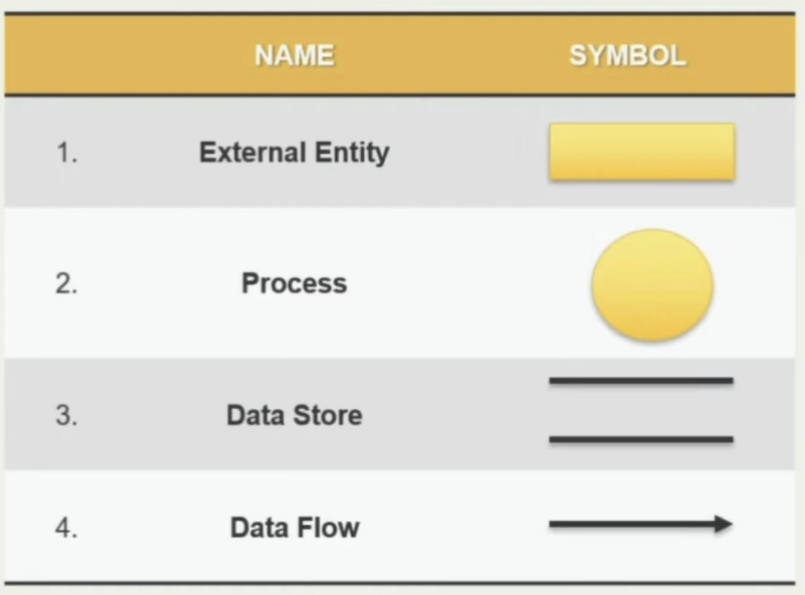

---

# 5.2 Process Modeling Using DFD

### Levels of DFD

DFDs are organized hierarchically into levels, each providing progressively more detail:

**Context Diagram (Level-0 DFD):** The highest-level view of the system. The entire system is represented as a single process (a single circle or rounded rectangle). External entities are shown around it, and data flows between the system and external entities are drawn as labeled arrows. No internal processes or data stores are shown. The context diagram establishes the system boundary, defining what is inside the system and what is outside.

---

# 5.2 Process Modeling Using DFD

**Level-1 DFD:** Decomposes the single process from the context diagram into its major sub-processes. Shows the main functional areas of the system, the data flows between them, the data stores used to hold information, and the interactions with external entities. Each sub-process in a Level-1 DFD can be further decomposed into a Level-2 DFD, and so on, until each process represents a single, simple, atomic function.

**Level-2+ DFDs:** Further decompose individual processes from Level-1 into more granular detail. They are not always necessary. Decomposition stops when each process is simple enough to be described in a short process specification (minispec).

---

# 5.2 Process Modeling Using DFD

### Rules for Drawing DFDs

- Every process must have at least one input data flow and at least one output data flow (no "black holes" or "miracles").
- Data cannot flow directly between two external entities. It must pass through at least one process.
- Data cannot flow directly between two data stores. It must pass through at least one process.
- Data cannot flow directly from an external entity to a data store (or vice versa). It must pass through a process.

---

# 5.2 Process Modeling Using DFD

### Rules for Drawing DFDs

- Each process, data flow, data store, and external entity must be named.
- All data flows entering/leaving a parent process must also appear in its child (decomposed) diagram. The parent and child diagrams must be consistent.

---

# 5.2 Process Modeling Using DFD

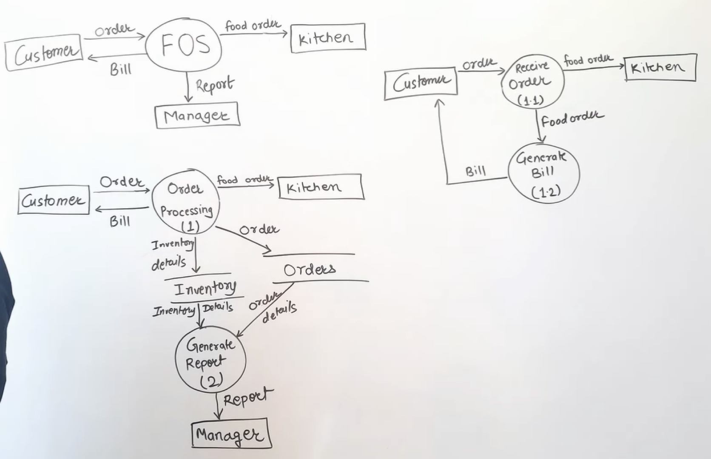

---

# 5.2 Process Modeling Using DFD


---

# 5.2 Process Modeling Using DFD


---

# 5.3 Scenario-Based Analysis

> **Prepare a use case diagram for an event management system. [4 marks] (2082 Bhadra - IOE - Old Syllabus Relevant)**
>
> **Draw a use case diagram for an online food ordering system. [5 marks] (2082 Baishakh - IOE - Old Syllabus Relevant)**
>
> **Draw a use case diagram for an online appointment booking app. [5 marks] (2081 Bhadra - IOE - Old Syllabus Relevant)**
>
> **Prepare use case diagrams for an automated ticket issuing system. [5 marks] (2081 Baishakh - IOE - Old Syllabus Relevant)**
>
> **Draw a use case diagram illustrating interactions between a doctor, patients, and prescriptions. [5 marks] (2078 Bhadra - IOE - Old Syllabus Relevant)**

---

# 5.3.1 Concept of Scenarios

A scenario is a specific sequence of actions and interactions between an actor and a system that accomplishes a particular goal. Scenarios describe the system from the user's point of view and answer the question: "How will the system be used?"

<br>

Scenarios are the foundation of scenario-based modeling. The primary tool for capturing scenarios is the use case. A use case describes a specific usage scenario, serving as a "contract for behavior," in straightforward language from the perspective of a defined actor. Use cases are often the first part of the requirements model to be developed because they directly capture user expectations.

---

# 5.3.1 Concept of Scenarios

Scenarios serve multiple purposes: they help stakeholders validate that the system will meet their needs, they provide developers with clear functional expectations, they drive the identification of classes and objects, and they form the basis for test case development.

<br>

### 5.3.2 Use-Case Descriptions and Diagrams

Covered in 3.4

---

# 5.4 Behavioral and Structural Modeling

### 5.4.1 Activity Diagrams

A UML activity diagram models the flow of control or data from one activity to another within a system or a specific use case. It is similar to a flowchart but with support for parallel (concurrent) behavior. Activity diagrams are particularly useful for modeling complex processing logic, workflows, and business processes.

---

# 5.4.1 Activity Diagrams

<style scoped>
    img {
        height: 200pt !important;
    }
</style>

| 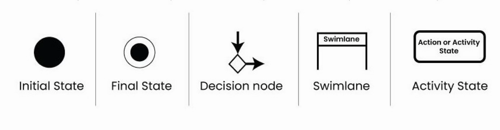 |
| ---------------------------------------------------------------------------------- |
| 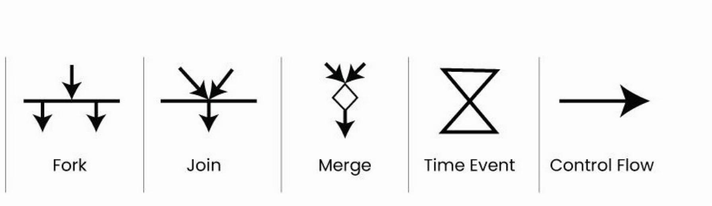 |

---

# 5.4.1 Activity Diagrams

#### Elements of an Activity Diagram

The **initial node** is a filled black circle. It represents the starting point of the activity flow. Every activity diagram has exactly one initial node.

An **activity (action) node** is a rounded rectangle containing the name of the activity or action. It represents a single step in the process and is named with a verb phrase (e.g., "Validate Password," "Send Notification").

A **flow (edge)** is an arrow connecting activity nodes. It shows the sequence in which activities are performed. Control flows from one activity to the next along the arrow.

---

# 5.4.1 Activity Diagrams

#### Elements of an Activity Diagram

A **decision node** is a diamond with one incoming flow and two or more outgoing flows. Each outgoing flow has a guard condition (written in square brackets, e.g., [password valid], [password invalid]) that determines which path the control follows. Exactly one guard condition must be true at any decision point.

A **merge node** is a diamond with two or more incoming flows and one outgoing flow. It brings together alternative paths that were separated by a previous decision node. It does not synchronize and simply passes through whatever flow arrives.

---

# 5.4.1 Activity Diagrams

#### Elements of an Activity Diagram

A **fork node** is a thick horizontal (or vertical) bar with one incoming flow and multiple outgoing flows. It splits the control flow into two or more concurrent (parallel) activities that execute simultaneously.

A **join node** is a thick horizontal (or vertical) bar with multiple incoming flows and one outgoing flow. It synchronizes concurrent activities. The outgoing flow is not triggered until all incoming parallel flows have completed.

The **final node** is a filled black circle inside a hollow circle (bullseye). It represents the end of the activity flow.

---

# 5.4.1 Activity Diagrams

**Process Order - Acitvity Diagram**

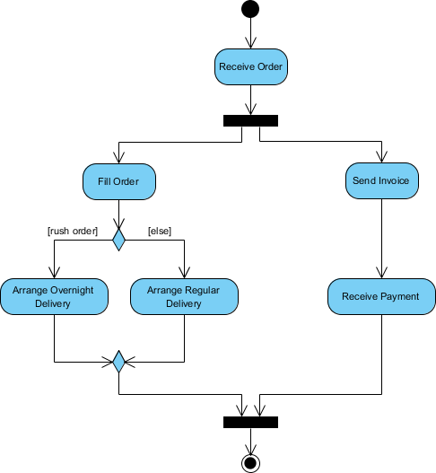

---

# 5.4.1 Activity Diagrams

**Activity Diagram for Emotion based music player**

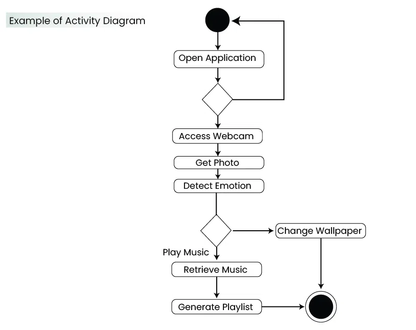

---

# Swimlane Diagrams (Activity Partitions)

A **swimlane diagram** is a variation of the activity diagram that partitions activities by the entity (actor, department, class, or system component) responsible for performing them. The diagram is divided into vertical (or horizontal) bands called swimlanes, each labeled with the responsible entity. Activities are placed in the swimlane of the entity that performs them. Arrows crossing swimlane boundaries indicate handoffs between entities.

<br>

Swimlane diagrams answer the question "who does what?" and are especially useful for modeling business processes involving multiple actors or departments.

---

# Swimlane Diagrams (Activity Partitions)

**Purchasing an Product from Ecommerce**

---

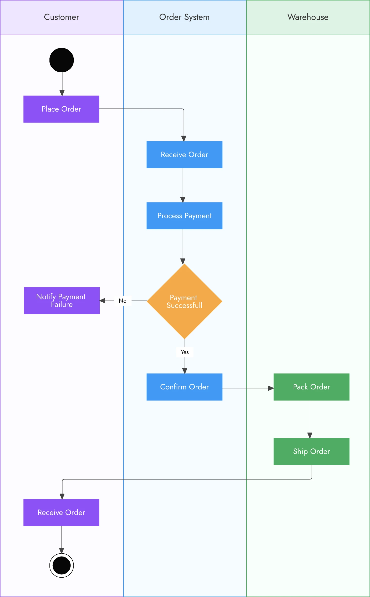

---

# 5.4.2 Class-Based Modeling

Class-based modeling represents the objects (things) that the system will manipulate, the attributes (data) that describe those objects, the operations (behaviors) that can be applied to those objects, and the relationships between objects.

#### Identifying Analysis Classes

The primary technique for identifying classes is the grammatical parse, which involves examining use cases or processing narratives and extracting nouns and noun phrases as candidate classes. The process:

1. Underline every noun and noun phrase in the use case or processing narrative.
2. List all nouns as potential classes.

---

# 5.4.2 Class-Based Modeling

#### Identifying Analysis Classes

3. Eliminate duplicates, synonyms, and nouns that are clearly attributes rather than classes.
4. Apply selection criteria to determine which potential classes should be included in the model.

---

# 5.4.2 Class-Based Modeling

**Selection criteria for classes** (Coad and Yourdon):

- **Retained information:** The system must remember information about the class for it to function.
- **Needed services:** The class must have identifiable operations that change the values of its attributes.
- **Multiple attributes:** A class with only a single attribute is probably better represented as an attribute of another class.
- **Common attributes:** A set of attributes can be defined that apply to all instances of the class.

---

# 5.4.2 Class-Based Modeling

- **Common operations:** A set of operations can be defined that apply to all instances of the class.
- **Essential requirements:** External entities that produce or consume information essential to the system should almost always be defined as classes.

<br>

**Categories of analysis classes:** External entities (other systems, devices, people), Things (reports, displays, signals), Occurrences/events (OrderPlaced or BookIssued), Roles (Student or Librarian), Organizational units (departments, teams, branches), Places (warehouses or classrooms), Structures (sensors, vehicles, buildings).

---

# 5.4.2 Class-Based Modeling

#### Attributes and Operations

**Attributes** describe the properties of a class. They are the data items that define the class in the context of the problem. Attributes are identified by asking: "What data items fully define this class?" For example, a `Sensor` class might have attributes: `sensorID`, `sensorType`, `location`, `status`.

**Operations** define the behavior of a class. They are the actions that can be performed on or by instances of the class. Operations are identified by extracting verbs from use cases and processing narratives. Operations generally fall into four categories: (1) data manipulation (add, delete, format, select), (2) computation, (3) state inquiry, and (4) event monitoring.

---

# 5.4.2 Class-Based Modeling

| MyClass                                                          |
| ---------------------------------------------------------------- |
| -attribute1: int<br>-attribute2: float<br>#attribute3: Circle    |
| +operation1(a : bool, b: int): String<br>+operation2(): Circle\* |

---

# 5.4.2 Class-Based Modeling

#### UML Class Diagrams

A UML class diagram shows classes, their attributes and operations, and the relationships between classes. Each class is represented as a rectangle divided into three compartments:

- The **top compartment** contains the class name (capitalized, e.g., `Customer`).
- The **middle compartment** contains the attributes (e.g., `-customerID: int`, `+name: String`, `-email: String`).
- The **bottom compartment** contains the operations (e.g., `+placeOrder()`, `+getProfile()`, `+updateAddress()`).

---

# 5.4.2 Class-Based Modeling

#### Relationships Between Classes

**Association** is the most general relationship. It is a structural connection between two classes indicating they collaborate or hold references to each other. It is drawn as a solid line between classes and can be labeled with a role name and multiplicity (e.g., `1`, `0..1`, `1..*`, `0..*`).

```java
class Student {
    void enrollIn(Course course) { } // Student uses Course
}
```

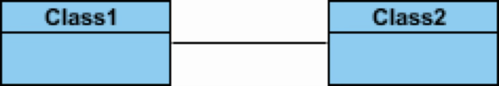

---

# 5.4.2 Class-Based Modeling

**Aggregation** is a "whole-part" relationship where the part can exist independently of the whole. It is drawn as a solid line with a hollow diamond at the "whole" end. Example: A `Department` has `Employees`, but employees can exist without the department.

```java
class Department {
    List<Employee> employees; // Department has employees
}
```

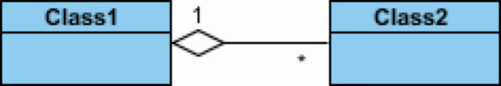

---

# 5.4.2 Class-Based Modeling

#### Relationships Between Classes

**Composition** is a stronger form of aggregation where the part cannot exist without the whole. If the whole is destroyed, its parts are also destroyed. It is drawn as a solid line with a filled (solid) diamond at the "whole" end. Example: A `House` is composed of `Rooms`. If the house is demolished, the rooms cease to exist.

```java
class House {
    private Room room = new Room(); // Room cannot exist without House
}
```

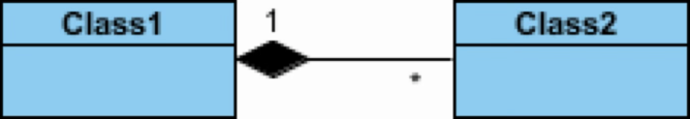

---

# 5.4.2 Class-Based Modeling

#### Relationships Between Classes

**Generalization (Inheritance)** is an "is-a" relationship where a subclass inherits attributes and operations from a superclass. The subclass is a specialized version of the superclass. It is drawn as a solid line with an unfilled (hollow) triangular arrowhead pointing from subclass to superclass. Example: `SavingsAccount` and `CheckingAccount` are subclasses of `BankAccount`.

```java
class Animal { }
class Dog extends Animal { } // Dog is an Animal
```

---

# 5.4.2 Class-Based Modeling

#### Relationships Between Classes

**Generalization (Inheritance)**

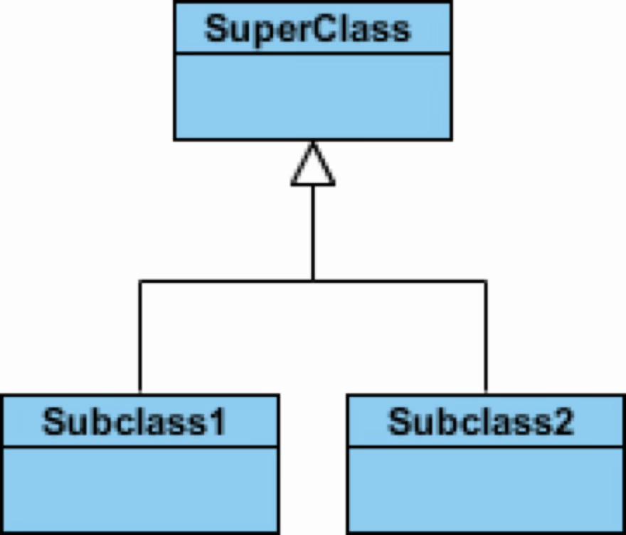

---

# 5.4.2 Class-Based Modeling

#### Relationships Between Classes

**Dependency** is a weaker relationship where one class depends on another (e.g., uses it as a parameter in an operation). It is drawn as a dashed arrow from the dependent class to the class it depends on.

```java
class OrderProcessor {
    void process(Order order) {
        PaymentGateway gateway = new PaymentGateway(); // Temporary dependency
        gateway.charge(order.getAmount());
    }
}
```

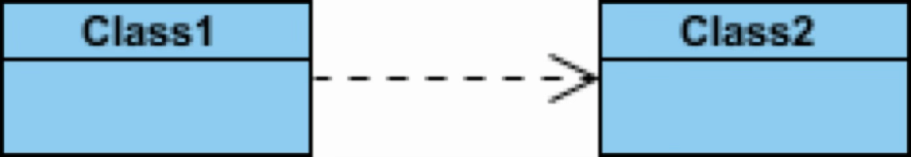

---

# 5.4.2 Class-Based Modeling

#### Multiplicity

Multiplicity specifies how many instances of one class can be associated with a single instance of another class:

- `1` means exactly one.
- `0..1` means zero or one (optional).
- `1..*` means one or more (at least one).
- `0..*` or `*` means zero or more (any number).

Example: A `Customer` places `0..*` Orders (a customer may have no orders or many orders). Each `Order` belongs to exactly `1` Customer.

---

# 5.4.2 Class-Based Modeling

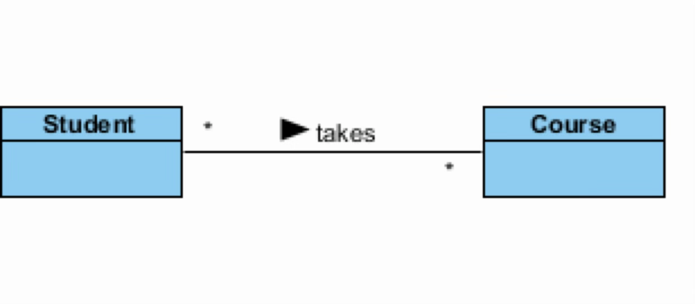

---

# 5.4.2 Class-Based Modeling

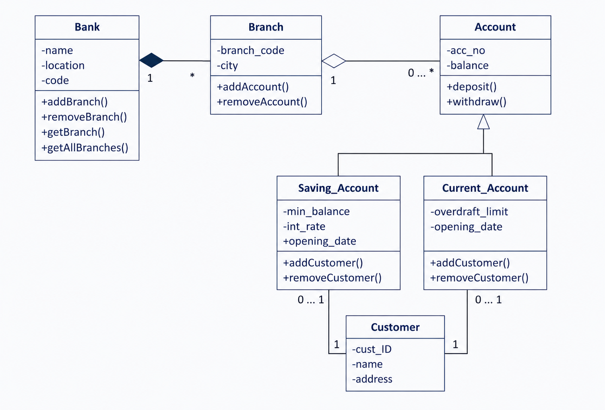

---

# 5.4.2 Class-Based Modeling

#### Class-Responsibility-Collaborator (CRC) Modeling

CRC modeling is a simple technique for identifying and organizing classes. Each class is represented on an index card with three sections:

- **Class name** (top)
- **Responsibilities** (left side) list the attributes the class maintains and the operations it performs.
- **Collaborators** (right side) list other classes that provide information or actions needed to fulfill a responsibility.

---

# 5.4.2 Class-Based Modeling

#### Class-Responsibility-Collaborator (CRC) Modeling

CRC cards are useful for brainstorming classes and for role-playing reviews. In a role-playing review, a group of reviewers each holds cards for different classes and walks through use cases to verify that all responsibilities are assigned and all collaborations work correctly.

<br>

**Example: CRC (Class-Responsibility-Collaborator) design for Online E-Commerce Shopping System**

---

# Class-Responsibility-Collaborator (CRC) Modeling

<table>
  <tr>
    <th colspan="2">Class: Customer</th>
  </tr>
  <tr>
    <td colspan="2">
      Represents a registered user who navigates the store, alters profiles, and purchases goods.
    </td>
  </tr>
  <tr>
    <th>Responsibility</th>
    <th>Collaborator</th>
  </tr>
  <tr>
    <td>Maintains contact info, shipping, and billing addresses</td>
    <td></td>
  </tr>
  <tr>
    <td>Reviews previous transaction logs and receipts</td>
    <td>Order</td>
  </tr>
    <tr>
    <td>Initiates the checkout sequence</td>
    <td>ShoppingCart, Order</td>
  </tr>
</table>

---

# Class-Responsibility-Collaborator (CRC) Modeling

<table>
  <tr>
    <th colspan="2">Class: ShoppingCart</th>
  </tr>
  <tr>
    <td colspan="2">
      Manages the temporary list of items selected by a customer for potential purchase.
    </td>
  </tr>
  <tr>
    <th>Responsibility</th>
    <th>Collaborator</th>
  </tr>
  <tr>
    <td>Adds a product and tracking its quantity</td>
    <td>Product</td>
  </tr>
  <tr>
    <td>Removes a product from the current selection</td>
    <td>Product</td>
  </tr>
  <tr>
    <td>Calculates the subtotal cost of all items inside</td>
    <td>Product</td>
  </tr>
  <tr>
    <td>Empties all contents after a successful checkout</td>
    <td>Order</td>
  </tr>
</table>

---

# Class-Responsibility-Collaborator (CRC) Modeling

<table>
  <tr>
    <th colspan="2">Class: Order</th>
  </tr>
  <tr>
    <td colspan="2">
      Represents a finalized purchase transaction and tracks its fulfillment status.
    </td>
  </tr>
  <tr>
    <th>Responsibility</th>
    <th>Collaborator</th>
  </tr>
  <tr>
    <td>Compiles final purchase items from the cart</td>
    <td>ShoppingCart</td>
  </tr>
  <tr>
    <td>Authorizes and completes financial transaction</td>
    <td>PaymentGateway</td>
  </tr>
  <tr>
    <td>Requests reduction of available warehouse stock</td>
    <td>Product</td>
  </tr>
  <tr>
    <td>Records the delivery location and buyer profile</td>
    <td>Customer</td>
  </tr>
</table>

---

# Class-Responsibility-Collaborator (CRC) Modeling

<table>
  <tr>
    <th colspan="2">Class: Product</th>
  </tr>
  <tr>
    <td colspan="2">
      Defines a specific item available for sale, including its core details and pricing.
    </td>
  </tr>
  <tr>
    <th>Responsibility</th>
    <th>Collaborator</th>
  </tr>
  <tr>
    <td>Supplies retail price, name, and description</td>
    <td></td>
  </tr>
  <tr>
    <td>Verifies if requested quantities are in stock</td>
    <td></td>
  </tr>
  <tr>
    <td>Updates internal inventory counts after order changes</td>
    <td></td>
  </tr>
</table>
